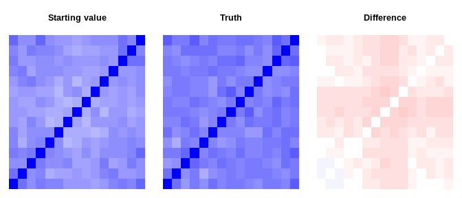

<!-- README.md is generated from README.Rmd. Please edit that file -->

# mdgc

TODO: The goal of mdgc is to …

## Example

``` r
library(mdgc)

# simulates a data set and puts into a format to pass to C++
#
# Args: 
#   n: number of observations. 
#   p: number of variables. 
# 
# Returns: 
#   Simluated mask data set in the format needed to pass to C++.
sim_dat <- function(n, p = 4){
  # get the covariance matrix
  Sb <- diag(p)
  Sb[lower.tri(Sb)] <- Sb[upper.tri(Sb)] <- .5
  Sb <- Sb / p / 5
  Sig <- cov2cor(drop(rWishart(1L, 5L * p, Sb)))
  
  # draw the observations
  Z <- truth <- crossprod(chol(Sig), matrix(rnorm(n * p), p))
  
  # mask 
  is_mask <- matrix(runif(n * p) < .33, p)
  is_int <- ceiling(p / 3):p
  is_mask[is_int, ] <- is_mask[is_int, ] & Z[is_int, ] < 0
  
  Z[ is_int, ][is_mask[ is_int, ]] <- 0
  Z[-is_int, ][is_mask[-is_int, ]] <- NA_real_
  
  # create matrix in the Z format to pass to c++
  lower <- matrix(-Inf, p, n)
  upper <- Z
  # codes are: 
  #  0: latent Z is observed (upper is the observed point).
  #  1: latent Z can be anything.. 
  #  2: latent Z is in an interval. 
  code <- matrix(0L, p, n)
  code[-is_int, ][is_mask[-is_int, ]] <- 1L 
  code[ is_int, ][is_mask[ is_int, ]] <- 2L 
  
  list(lower = lower, upper = upper, code = code, Sigma = Sig, 
       truth = truth)
}

set.seed(2)
p <- 15L
dat <- sim_dat(2000L, p = p)
dat$lower[, 1:5]
#>       [,1] [,2] [,3] [,4] [,5]
#>  [1,] -Inf -Inf -Inf -Inf -Inf
#>  [2,] -Inf -Inf -Inf -Inf -Inf
#>  [3,] -Inf -Inf -Inf -Inf -Inf
#>  [4,] -Inf -Inf -Inf -Inf -Inf
#>  [5,] -Inf -Inf -Inf -Inf -Inf
#>  [6,] -Inf -Inf -Inf -Inf -Inf
#>  [7,] -Inf -Inf -Inf -Inf -Inf
#>  [8,] -Inf -Inf -Inf -Inf -Inf
#>  [9,] -Inf -Inf -Inf -Inf -Inf
#> [10,] -Inf -Inf -Inf -Inf -Inf
#> [11,] -Inf -Inf -Inf -Inf -Inf
#> [12,] -Inf -Inf -Inf -Inf -Inf
#> [13,] -Inf -Inf -Inf -Inf -Inf
#> [14,] -Inf -Inf -Inf -Inf -Inf
#> [15,] -Inf -Inf -Inf -Inf -Inf
dat$upper[, 1:5]
#>         [,1]    [,2]  [,3]   [,4]    [,5]
#>  [1,] -0.367 -0.7334    NA  0.897 -1.8727
#>  [2,] -1.431  1.4377    NA     NA -2.7109
#>  [3,]     NA  0.4762 -1.67     NA -0.8421
#>  [4,] -2.598  2.1653 -2.34 -0.250      NA
#>  [5,] -1.781  1.3680 -1.20  1.775  0.7809
#>  [6,] -1.172  0.2892 -2.01  0.230  0.0000
#>  [7,] -2.277 -0.2717 -2.08  0.342 -0.3497
#>  [8,] -1.541  0.6310 -2.20  1.410 -1.5887
#>  [9,] -1.380  0.7548 -2.36  1.187  0.0000
#> [10,]  0.000 -0.3765 -1.91  0.375  0.0607
#> [11,] -1.011  0.0349 -2.60  0.261  0.0000
#> [12,] -0.370  0.4684  0.00  0.000  0.3963
#> [13,] -1.346  1.2315 -1.76 -0.790 -1.5000
#> [14,]  0.000 -0.9943  0.00  0.246 -1.2516
#> [15,] -1.903  0.8470 -1.64 -1.161 -0.0939
dat$code [, 1:5]
#>       [,1] [,2] [,3] [,4] [,5]
#>  [1,]    0    0    1    0    0
#>  [2,]    0    0    1    1    0
#>  [3,]    1    0    0    1    0
#>  [4,]    0    0    0    0    1
#>  [5,]    0    0    0    0    0
#>  [6,]    0    0    0    0    2
#>  [7,]    0    0    0    0    0
#>  [8,]    0    0    0    0    0
#>  [9,]    0    0    0    0    2
#> [10,]    2    0    0    0    0
#> [11,]    0    0    0    0    2
#> [12,]    0    0    2    2    0
#> [13,]    0    0    0    0    0
#> [14,]    2    0    2    0    0
#> [15,]    0    0    0    0    0
dat$truth[, 1:5]
#>         [,1]    [,2]   [,3]   [,4]    [,5]
#>  [1,] -0.367 -0.7334 -1.688  0.897 -1.8727
#>  [2,] -1.431  1.4377 -0.817  1.323 -2.7109
#>  [3,] -1.884  0.4762 -1.671 -1.275 -0.8421
#>  [4,] -2.598  2.1653 -2.343 -0.250 -0.4971
#>  [5,] -1.781  1.3680 -1.198  1.775  0.7809
#>  [6,] -1.172  0.2892 -2.013  0.230 -1.7725
#>  [7,] -2.277 -0.2717 -2.083  0.342 -0.3497
#>  [8,] -1.541  0.6310 -2.198  1.410 -1.5887
#>  [9,] -1.380  0.7548 -2.362  1.187 -0.9730
#> [10,] -0.960 -0.3765 -1.912  0.375  0.0607
#> [11,] -1.011  0.0349 -2.604  0.261 -0.1402
#> [12,] -0.370  0.4684 -0.981 -0.445  0.3963
#> [13,] -1.346  1.2315 -1.761 -0.790 -1.5000
#> [14,] -0.741 -0.9943 -2.671  0.246 -1.2516
#> [15,] -1.903  0.8470 -1.638 -1.161 -0.0939

#####
# get pointers to objects in C++
ptr <- mdgc:::get_log_lm_terms(lower = dat$lower, upper = dat$upper, 
                               code = dat$code)

# approximates the log marginal likelihood function
#
# Args: 
#   vcov: correlation matrix
#   releps: relative error for each term. 
#   n_threads: number of threads. 
#   comp_derivs: logical for whether to approximate the gradient. 
#   indices: integer vector with which terms to include. 
#   do_reorder: logical for whether to use heuristic variable reordering.
log_ml <- function(vcov, releps = 1e-2, n_threads = 1L, comp_derivs = FALSE, 
                   indices = 0:(NCOL(dat$lower) - 1L), do_reorder = TRUE)
  mdgc:::eval_log_lm_terms(
    ptr = ptr, vcov = vcov, indices = indices, 
    maxpts = 100000L, abseps = -1, releps = releps, n_threads = n_threads, 
    comp_derivs = comp_derivs, do_reorder = do_reorder)

# print the approximate log marginal likelihood at the true parameters
set.seed(1)
print(log_ml(dat$Sigma), digits = 7)
#> [1] -30273.89

# check standard error
sd(replicate(20, log_ml(dat$Sigma, n_threads = 4L)))
#> [1] 0.00655

# without reordering
print(log_ml(dat$Sigma, n_threads = 4L, do_reorder = FALSE), digits = 7)
#> [1] -30273.89

# check standard error
sd(replicate(20, log_ml(dat$Sigma, n_threads = 4L, do_reorder = FALSE)))
#> [1] 0.011

# check computation time
library(microbenchmark)
microbenchmark(
  `1 thread                 ` = 
    log_ml(dat$Sigma), 
  `1 thread  (w/o rordering)` = 
    log_ml(dat$Sigma, do_reorder = FALSE), 
  `2 threads                ` = 
    log_ml(dat$Sigma                    , n_threads = 2L),
  `2 threads (w/o rordering)` = 
    log_ml(dat$Sigma, do_reorder = FALSE, n_threads = 2L),
  `4 threads                ` = 
    log_ml(dat$Sigma                    , n_threads = 4L), 
  `4 threads (w/o rordering)` = 
    log_ml(dat$Sigma, do_reorder = FALSE, n_threads = 4L), 
  times = 5)
#> Unit: milliseconds
#>                       expr   min    lq  mean median    uq   max neval
#>  1 thread                  124.2 124.3 124.9  125.1 125.3 125.6     5
#>  1 thread  (w/o rordering) 122.4 123.1 123.5  123.6 124.1 124.2     5
#>  2 threads                  63.5  63.5  63.6   63.5  63.7  63.8     5
#>  2 threads (w/o rordering)  62.7  62.8  63.3   63.5  63.6  64.2     5
#>  4 threads                  32.2  32.4  32.6   32.6  32.6  33.0     5
#>  4 threads (w/o rordering)  32.6  32.9  33.1   33.2  33.3  33.3     5

#####
# we can also get an approximation of the gradient
t1 <- log_ml(dat$Sigma, comp_derivs = TRUE)
t2 <- log_ml(dat$Sigma, comp_derivs = TRUE, n_threads = 4L)
all.equal(t1, t2, tolerance = 1e-2)
#> [1] TRUE

microbenchmark(
  `1 thread                 ` = 
    log_ml(dat$Sigma, comp_derivs = TRUE), 
  `1 thread  (w/o rordering)` = 
    log_ml(dat$Sigma, comp_derivs = TRUE, do_reorder = FALSE), 
  `2 threads                ` = 
    log_ml(dat$Sigma, comp_derivs = TRUE                    , n_threads = 2L),
  `2 threads (w/o rordering)` = 
    log_ml(dat$Sigma, comp_derivs = TRUE, do_reorder = FALSE, n_threads = 2L),
  `4 threads                ` = 
    log_ml(dat$Sigma, comp_derivs = TRUE                    , n_threads = 4L), 
  `4 threads (w/o rordering)` = 
    log_ml(dat$Sigma, comp_derivs = TRUE, do_reorder = FALSE, n_threads = 4L), 
  times = 5)
#> Unit: milliseconds
#>                       expr min  lq mean median   uq  max neval
#>  1 thread                  991 993  998    999 1002 1005     5
#>  1 thread  (w/o rordering) 947 950  963    959  971  988     5
#>  2 threads                 493 494  502    500  510  512     5
#>  2 threads (w/o rordering) 483 497  497    500  502  505     5
#>  4 threads                 257 262  265    264  266  274     5
#>  4 threads (w/o rordering) 249 257  259    257  258  273     5

# we create a wrapper function which takes in a log-Cholesky decomposition
# 
# Args:
#   par: p (p + 1) / 2 elements in the log-Cholesky decomposition.
get_lchol_inv <- function(par){
  # use log-cholesky parametrization
  p <- (sqrt(8 * length(par) + 1) - 1) / 2
  L <- matrix(0, p, p)
  L[lower.tri(L, TRUE)] <- par
  diag(L) <- exp(diag(L))
  tcrossprod(L)
}

# creates the log-Cholesky decomposition. 
# 
# Args: 
#   par: positive definite matrix to decompose
get_lchol <- function(par){
  lSig <- t(chol(par))
  diag(lSig) <- log(diag(lSig))
  lSig[lower.tri(lSig, TRUE)]
}

Jac_dum <- matrixcalc::commutation.matrix(p)
diag(Jac_dum) <- diag(Jac_dum) + 1

# computes the approximate log marginal likelihood. 
#
# Args:
#   par: log-Cholesky decomposition.
#   seed: seed to use.  
#   comp_derivs: logical for whether to approximate the gradient. 
#   n_threads: number of threads. 
#   releps: relative error for each term.
#   indices: integer vector with which terms to include. 
par_fn <- function(par, seed = NULL, comp_derivs = FALSE, 
                   n_threads = 1L, releps = 1e-2, 
                   indices = 0:(NCOL(dat$lower) - 1L)){
  if(!is.null(seed))
    set.seed(seed)
  Arg <- get_lchol_inv(par)
  
  res <- log_ml(Arg, comp_derivs = comp_derivs, indices = indices,
                n_threads = n_threads, releps = releps)
  log_ml <- c(res)
  if(comp_derivs){
    gr <- attr(res, "grad")
    tmp <- matrix(0, p, p)
    tmp[lower.tri(tmp, TRUE)] <- par
    diag(tmp) <- exp(diag(tmp))
    gr <- (c(gr) %*% Jac_dum) %*% (tmp %x% diag(p))
    gr <- gr[, lower.tri(tmp, TRUE)]
    idx_diag <- c(1L, 1L + cumsum(NCOL(tmp):2)) 
    gr[idx_diag] <- gr[idx_diag] * diag(tmp)
      
    attr(log_ml, "grad") <- gr
    
  }
  
  log_ml
}

# check that the function gives the correct log marginal likelihood
# approximation and gradient approximation.
lSig <- get_lchol(dat$Sigma)
r1 <- par_fn(lSig, comp_derivs = TRUE, n_threads = 4L, releps = 1e-3)
r2 <- numDeriv::jacobian(par_fn, lSig, seed = 1L, n_threads = 4L)
all.equal(attr(r1, "grad"), drop(r2), tolerance = 1e-3)
#> [1] TRUE

#####
# performs gradient descent. 
# 
# Args: 
#   val: starting value. 
#   step_start: starting value for the step length. 
#   n_threads: number of threads to use. 
#   maxit: maximum number of iteration. 
#   eps: convergence threshold to use. 
#   seed: seed to use.
naiv_gradient_descent <- function(val, step_start, n_threads = 4L, 
                                  maxit = 10L, eps = 1e-3, seed = 1L){
  fun_vals <- step_sizes <- rep(NA_real_, maxit)
  
  for(i in 1:maxit){
    gr <- par_fn(val, comp_derivs = TRUE, n_threads = n_threads, 
                 seed = seed)
    fun_vals[i] <- prev_fun <- c(gr)
    dir <- attr(gr, "grad")
    step <- step_start
    if(sqrt(sum(dir^2)) < eps)
      break
    
    max_j <- 11L
    for(j in 1:max_j){
      if(j == max_j)
        warning("Failed to find a decrease")
      new_val <- val + step * dir
      new_val <- get_lchol(cov2cor(get_lchol_inv(new_val)))
      new_fun <- par_fn(new_val, comp_derivs = FALSE, n_threads = n_threads, 
                        seed = seed)
      if(new_fun > prev_fun){
        val <- new_val
        break
      }
      step <- step / 2
    }
    
    step_sizes[i] <- step
  }
  
  list(result = get_lchol_inv(val), logml = prev_fun, 
       nit = i, step_sizes = step_sizes, fun_vals = fun_vals)
}

# estimate model parameters
start_val <- numeric(p * (p + 1) / 2)
system.time(res <- naiv_gradient_descent(val = start_val, step_start = .001, 
                                         maxit = 20L, eps = 1e-2))
#>    user  system elapsed 
#>   29.55    0.00    7.47

# compare estimates with truth
norm(res$result - dat$Sigma)
#> [1] 0.309
res$result
#>        [,1]  [,2]  [,3]  [,4]  [,5]  [,6]  [,7]  [,8]  [,9] [,10] [,11] [,12]
#>  [1,] 1.000 0.381 0.412 0.358 0.274 0.433 0.361 0.428 0.464 0.316 0.499 0.411
#>  [2,] 0.381 1.000 0.344 0.269 0.530 0.435 0.182 0.498 0.470 0.324 0.264 0.338
#>  [3,] 0.412 0.344 1.000 0.335 0.219 0.533 0.386 0.398 0.420 0.553 0.535 0.496
#>  [4,] 0.358 0.269 0.335 1.000 0.431 0.318 0.280 0.342 0.496 0.340 0.338 0.393
#>  [5,] 0.274 0.530 0.219 0.431 1.000 0.506 0.351 0.379 0.428 0.449 0.344 0.351
#>  [6,] 0.433 0.435 0.533 0.318 0.506 1.000 0.446 0.350 0.466 0.444 0.494 0.453
#>  [7,] 0.361 0.182 0.386 0.280 0.351 0.446 1.000 0.298 0.388 0.273 0.371 0.369
#>  [8,] 0.428 0.498 0.398 0.342 0.379 0.350 0.298 1.000 0.450 0.377 0.250 0.340
#>  [9,] 0.464 0.470 0.420 0.496 0.428 0.466 0.388 0.450 1.000 0.459 0.370 0.356
#> [10,] 0.316 0.324 0.553 0.340 0.449 0.444 0.273 0.377 0.459 1.000 0.439 0.366
#> [11,] 0.499 0.264 0.535 0.338 0.344 0.494 0.371 0.250 0.370 0.439 1.000 0.559
#> [12,] 0.411 0.338 0.496 0.393 0.351 0.453 0.369 0.340 0.356 0.366 0.559 1.000
#> [13,] 0.404 0.508 0.462 0.298 0.497 0.530 0.309 0.428 0.449 0.493 0.502 0.483
#> [14,] 0.550 0.454 0.414 0.352 0.496 0.551 0.392 0.380 0.397 0.557 0.579 0.606
#> [15,] 0.523 0.412 0.530 0.418 0.513 0.519 0.432 0.395 0.432 0.484 0.501 0.542
#>       [,13] [,14] [,15]
#>  [1,] 0.404 0.550 0.523
#>  [2,] 0.508 0.454 0.412
#>  [3,] 0.462 0.414 0.530
#>  [4,] 0.298 0.352 0.418
#>  [5,] 0.497 0.496 0.513
#>  [6,] 0.530 0.551 0.519
#>  [7,] 0.309 0.392 0.432
#>  [8,] 0.428 0.380 0.395
#>  [9,] 0.449 0.397 0.432
#> [10,] 0.493 0.557 0.484
#> [11,] 0.502 0.579 0.501
#> [12,] 0.483 0.606 0.542
#> [13,] 1.000 0.512 0.611
#> [14,] 0.512 1.000 0.574
#> [15,] 0.611 0.574 1.000
dat$Sigma
#>        [,1]  [,2]  [,3]  [,4]  [,5]  [,6]  [,7]  [,8]  [,9] [,10] [,11] [,12]
#>  [1,] 1.000 0.404 0.400 0.364 0.344 0.461 0.393 0.443 0.458 0.336 0.514 0.424
#>  [2,] 0.404 1.000 0.343 0.255 0.532 0.438 0.189 0.483 0.460 0.306 0.274 0.361
#>  [3,] 0.400 0.343 1.000 0.336 0.209 0.543 0.369 0.401 0.410 0.546 0.548 0.503
#>  [4,] 0.364 0.255 0.336 1.000 0.429 0.330 0.293 0.321 0.484 0.340 0.349 0.360
#>  [5,] 0.344 0.532 0.209 0.429 1.000 0.490 0.339 0.396 0.447 0.445 0.349 0.360
#>  [6,] 0.461 0.438 0.543 0.330 0.490 1.000 0.423 0.355 0.450 0.426 0.514 0.450
#>  [7,] 0.393 0.189 0.369 0.293 0.339 0.423 1.000 0.275 0.365 0.233 0.354 0.348
#>  [8,] 0.443 0.483 0.401 0.321 0.396 0.355 0.275 1.000 0.459 0.375 0.267 0.357
#>  [9,] 0.458 0.460 0.410 0.484 0.447 0.450 0.365 0.459 1.000 0.480 0.391 0.369
#> [10,] 0.336 0.306 0.546 0.340 0.445 0.426 0.233 0.375 0.480 1.000 0.440 0.373
#> [11,] 0.514 0.274 0.548 0.349 0.349 0.514 0.354 0.267 0.391 0.440 1.000 0.567
#> [12,] 0.424 0.361 0.503 0.360 0.360 0.450 0.348 0.357 0.369 0.373 0.567 1.000
#> [13,] 0.420 0.511 0.444 0.275 0.504 0.545 0.286 0.428 0.458 0.485 0.501 0.489
#> [14,] 0.583 0.448 0.419 0.353 0.519 0.536 0.382 0.394 0.423 0.559 0.570 0.616
#> [15,] 0.544 0.424 0.540 0.404 0.504 0.526 0.423 0.411 0.442 0.481 0.499 0.537
#>       [,13] [,14] [,15]
#>  [1,] 0.420 0.583 0.544
#>  [2,] 0.511 0.448 0.424
#>  [3,] 0.444 0.419 0.540
#>  [4,] 0.275 0.353 0.404
#>  [5,] 0.504 0.519 0.504
#>  [6,] 0.545 0.536 0.526
#>  [7,] 0.286 0.382 0.423
#>  [8,] 0.428 0.394 0.411
#>  [9,] 0.458 0.423 0.442
#> [10,] 0.485 0.559 0.481
#> [11,] 0.501 0.570 0.499
#> [12,] 0.489 0.616 0.537
#> [13,] 1.000 0.535 0.615
#> [14,] 0.535 1.000 0.578
#> [15,] 0.615 0.578 1.000

# or plot both of them and compare
do_plot <- function(x, main){
  sc <- colorRampPalette(c("Red", "White", "Blue"))(50)
  image(x, main = main, col = sc, zlim = c(-1, 1), xaxt = "n", yaxt = "n", 
        bty = "n")
}
par(mfcol = c(1, 2), mar  = c(1, 1, 4, 1))
do_plot(res$result, "Estimates")
do_plot(dat$Sigma, "Truth")
```


``` r

res$fun_vals # log marginal likelihood estimates at each iteration
#>  [1] -36569 -32300 -31737 -31250 -31164 -30892 -30412 -30385 -30298 -30263
#> [11] -30254 -30249 -30244 -30241 -30240 -30238 -30237 -30236 -30235 -30235

#####
# performs stochastic gradient descent instead (using ADAM).
# 
# Args: 
#   val: starting value. 
#   batch_size: number of observations in each batch. 
#   n_threads: number of threads to use. 
#   maxit: maximum number of iteration. 
#   seed: seed to use.
#   epsilon, alpha, beta_1, beta_2: ADAM parameters.
adam <- function(val, batch_size, n_threads = 4L, maxit = 10L, 
                 seed = 1L, epsilon = 1e-8, alpha = .001, beta_1 = .9, 
                 beta_2 = .999){
  indices <- sample(0:(NCOL(dat$lower) - 1L), replace = FALSE)
  blocks <- tapply(indices, (seq_along(indices) - 1L) %/% batch_size, 
                   identity, simplify = FALSE)
  
  n_blocks <- length(blocks)
  n_par <- length(val)
  m <- v <- numeric(n_par)
  fun_vals <- numeric(maxit)
  estimates <- matrix(NA_real_, n_par, maxit)
  i <- -1L
  
  for(k in 1:maxit){
    for(ii in 1:n_blocks){
      i <- i + 1L
      idx_b <- (i %% n_blocks) + 1L
      m_old <- m
      v_old <- v
      res <- par_fn(val, comp_derivs = TRUE, n_threads = n_threads, 
                    seed = seed, indices = blocks[[idx_b]])
      fun_vals[(i %/% n_blocks) + 1L] <- 
        fun_vals[(i %/% n_blocks) + 1L] + c(res)
      
      gr <- attr(res, "grad")
      
      m <- beta_1 * m_old + (1 - beta_1) * gr
      v <- beta_2 * v_old + (1 - beta_2) * gr^2
      
      m_hat <- m / (1 - beta_1^(i + 1))
      v_hat <- v / (1 - beta_2^(i + 1))
      
      val <- val + alpha * m_hat / (sqrt(v_hat) + epsilon)
      val <- get_lchol(cov2cor(get_lchol_inv(val)))
    }
    
    estimates[, k] <- val
  }
  
  list(result = get_lchol_inv(val), fun_vals = fun_vals, 
       estimates = estimates)
}

# estimate the model parameters
set.seed(1)
system.time(res_adam  <- adam(
  val = start_val, alpha = 2e-2, maxit = 10L, batch_size = 200L))
#>    user  system elapsed 
#>  12.358   0.003   3.155

# compare estimates with the truth
norm(res_adam$result - dat$Sigma)
#> [1] 0.287
res_adam$result
#>        [,1]  [,2]  [,3]  [,4]  [,5]  [,6]  [,7]  [,8]  [,9] [,10] [,11] [,12]
#>  [1,] 1.000 0.392 0.434 0.380 0.293 0.444 0.371 0.436 0.475 0.332 0.512 0.431
#>  [2,] 0.392 1.000 0.357 0.283 0.533 0.438 0.191 0.500 0.475 0.327 0.269 0.347
#>  [3,] 0.434 0.357 1.000 0.345 0.230 0.538 0.387 0.407 0.430 0.554 0.539 0.502
#>  [4,] 0.380 0.283 0.345 1.000 0.431 0.322 0.283 0.353 0.502 0.340 0.340 0.392
#>  [5,] 0.293 0.533 0.230 0.431 1.000 0.509 0.359 0.383 0.426 0.450 0.348 0.356
#>  [6,] 0.444 0.438 0.538 0.322 0.509 1.000 0.448 0.349 0.467 0.446 0.494 0.456
#>  [7,] 0.371 0.191 0.387 0.283 0.359 0.448 1.000 0.301 0.392 0.275 0.376 0.373
#>  [8,] 0.436 0.500 0.407 0.353 0.383 0.349 0.301 1.000 0.455 0.379 0.254 0.345
#>  [9,] 0.475 0.475 0.430 0.502 0.426 0.467 0.392 0.455 1.000 0.464 0.374 0.359
#> [10,] 0.332 0.327 0.554 0.340 0.450 0.446 0.275 0.379 0.464 1.000 0.441 0.363
#> [11,] 0.512 0.269 0.539 0.340 0.348 0.494 0.376 0.254 0.374 0.441 1.000 0.562
#> [12,] 0.431 0.347 0.502 0.392 0.356 0.456 0.373 0.345 0.359 0.363 0.562 1.000
#> [13,] 0.418 0.511 0.467 0.300 0.499 0.531 0.310 0.433 0.451 0.494 0.503 0.482
#> [14,] 0.563 0.463 0.423 0.356 0.500 0.554 0.396 0.384 0.400 0.558 0.582 0.608
#> [15,] 0.536 0.416 0.534 0.422 0.512 0.516 0.433 0.396 0.434 0.481 0.501 0.545
#>       [,13] [,14] [,15]
#>  [1,] 0.418 0.563 0.536
#>  [2,] 0.511 0.463 0.416
#>  [3,] 0.467 0.423 0.534
#>  [4,] 0.300 0.356 0.422
#>  [5,] 0.499 0.500 0.512
#>  [6,] 0.531 0.554 0.516
#>  [7,] 0.310 0.396 0.433
#>  [8,] 0.433 0.384 0.396
#>  [9,] 0.451 0.400 0.434
#> [10,] 0.494 0.558 0.481
#> [11,] 0.503 0.582 0.501
#> [12,] 0.482 0.608 0.545
#> [13,] 1.000 0.515 0.609
#> [14,] 0.515 1.000 0.573
#> [15,] 0.609 0.573 1.000
dat$Sigma
#>        [,1]  [,2]  [,3]  [,4]  [,5]  [,6]  [,7]  [,8]  [,9] [,10] [,11] [,12]
#>  [1,] 1.000 0.404 0.400 0.364 0.344 0.461 0.393 0.443 0.458 0.336 0.514 0.424
#>  [2,] 0.404 1.000 0.343 0.255 0.532 0.438 0.189 0.483 0.460 0.306 0.274 0.361
#>  [3,] 0.400 0.343 1.000 0.336 0.209 0.543 0.369 0.401 0.410 0.546 0.548 0.503
#>  [4,] 0.364 0.255 0.336 1.000 0.429 0.330 0.293 0.321 0.484 0.340 0.349 0.360
#>  [5,] 0.344 0.532 0.209 0.429 1.000 0.490 0.339 0.396 0.447 0.445 0.349 0.360
#>  [6,] 0.461 0.438 0.543 0.330 0.490 1.000 0.423 0.355 0.450 0.426 0.514 0.450
#>  [7,] 0.393 0.189 0.369 0.293 0.339 0.423 1.000 0.275 0.365 0.233 0.354 0.348
#>  [8,] 0.443 0.483 0.401 0.321 0.396 0.355 0.275 1.000 0.459 0.375 0.267 0.357
#>  [9,] 0.458 0.460 0.410 0.484 0.447 0.450 0.365 0.459 1.000 0.480 0.391 0.369
#> [10,] 0.336 0.306 0.546 0.340 0.445 0.426 0.233 0.375 0.480 1.000 0.440 0.373
#> [11,] 0.514 0.274 0.548 0.349 0.349 0.514 0.354 0.267 0.391 0.440 1.000 0.567
#> [12,] 0.424 0.361 0.503 0.360 0.360 0.450 0.348 0.357 0.369 0.373 0.567 1.000
#> [13,] 0.420 0.511 0.444 0.275 0.504 0.545 0.286 0.428 0.458 0.485 0.501 0.489
#> [14,] 0.583 0.448 0.419 0.353 0.519 0.536 0.382 0.394 0.423 0.559 0.570 0.616
#> [15,] 0.544 0.424 0.540 0.404 0.504 0.526 0.423 0.411 0.442 0.481 0.499 0.537
#>       [,13] [,14] [,15]
#>  [1,] 0.420 0.583 0.544
#>  [2,] 0.511 0.448 0.424
#>  [3,] 0.444 0.419 0.540
#>  [4,] 0.275 0.353 0.404
#>  [5,] 0.504 0.519 0.504
#>  [6,] 0.545 0.536 0.526
#>  [7,] 0.286 0.382 0.423
#>  [8,] 0.428 0.394 0.411
#>  [9,] 0.458 0.423 0.442
#> [10,] 0.485 0.559 0.481
#> [11,] 0.501 0.570 0.499
#> [12,] 0.489 0.616 0.537
#> [13,] 1.000 0.535 0.615
#> [14,] 0.535 1.000 0.578
#> [15,] 0.615 0.578 1.000

# use plot instead
par(mfcol = c(1, 2), mar  = c(1, 1, 4, 1))
do_plot(res_adam$result, "Estimates (ADAM)")
do_plot(dat$Sigma, "Truth")
```


``` r

# look at the maximum log marginal likelihood both at the end and after 
# each iteration
log_ml(res_adam$result)
#> [1] -30236
apply(res_adam$estimates, 2L, function(x) log_ml(get_lchol_inv(x)))
#>  [1] -31566 -30650 -30501 -30334 -30270 -30250 -30240 -30237 -30236 -30236
res_adam$fun_vals # likely lower bounds on the log-marginal likelihood
#>  [1] -33488 -31034 -30593 -30456 -30321 -30281 -30267 -30264 -30264 -30263

# we can use better starting values. E.g. something heuristic like: 
#   - transform back into the [0, 1] scale. 
#   - take the middle of the interval and map back. 
#   - compute the partial correlations. 
get_z_hat <- function(lower, upper, code){
  out <- mapply(function(l, u, co){
    if(co <= 1)
      return(u)
    
    a <- if(is.infinite(l)) 0 else pnorm(l)
    b <- if(is.infinite(u)) 1 else pnorm(u)
    qnorm((a + b) / 2)
  }, l = lower, u = upper, c = code)
  dim(out) <- dim(lower)
  out
}
tmp <- get_z_hat(dat$lower, dat$upper, dat$code)

# we also have a C++ function to do this which is faster
all.equal(tmp, mdgc:::get_z_hat(
  dat$lower, dat$upper, dat$code, n_threads = 4L))
#> [1] TRUE

# the latter is faster but both are fast
microbenchmark(
  `R version  ` = get_z_hat(dat$lower, dat$upper, dat$code), 
  `C++ verison` = mdgc:::get_z_hat(
  dat$lower, dat$upper, dat$code, n_threads = 4L), times = 10)
#> Unit: microseconds
#>         expr   min    lq  mean median    uq   max neval
#>  R version   41646 43722 47225  46441 50911 53825    10
#>  C++ verison   147   149   166    159   183   198    10

# then we can compute an approximation of the covariance matrix as follows
system.time(chat <- cov2cor(cov(t(tmp), use = "pairwise.complete.obs")))
#>    user  system elapsed 
#>   0.001   0.000   0.001

# the starting value is already quite close
par(mfcol = c(1, 2), mar  = c(1, 1, 4, 1))
norm(chat - dat$Sigma)
#> [1] 0.367
do_plot(chat, "Starting value")
do_plot(dat$Sigma, "Truth")
```


``` r

# run ADAM again 
start_val <- get_lchol(chat)
set.seed(1)
system.time(res_adam  <- adam(
  val = start_val, alpha = 2e-2, maxit = 5L, batch_size = 200L))
#>    user  system elapsed 
#>   6.777   0.012   1.719

# plot estimate
par(mfcol = c(1, 2), mar  = c(1, 1, 4, 1))
norm(res_adam$result - dat$Sigma)
#> [1] 0.306
do_plot(res_adam$result, "Estimates (ADAM)")
do_plot(dat$Sigma, "Truth")
```



``` r

# check log marginal likelihood like before
log_ml(res_adam$result)
#> [1] -30236
apply(res_adam$estimates, 2L, function(x) log_ml(get_lchol_inv(x)))
#> [1] -30269 -30251 -30239 -30237 -30236
res_adam$fun_vals # likely lower bounds on the log-marginal likelihood
#> [1] -30403 -30275 -30290 -30271 -30266
```
