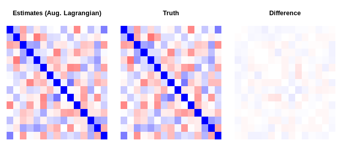
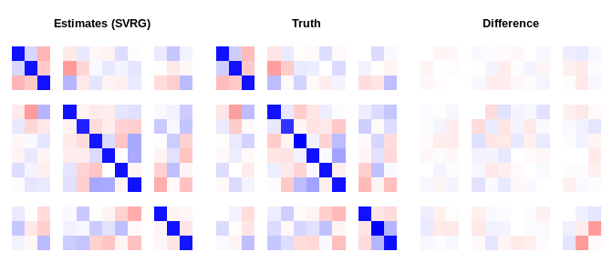

# mdgc

[](https://travis-ci.org/boennecd/mdgc)

This package contains a marginal likelihood approach to estimating the
model discussed by Hoff (2007) and Zhao and Udell (2019). That is, a
missing data approach where one uses Gaussian copulas in the latter
case. We have modified the Fortran code by Genz and Bretz (2002) to
supply an approximation of the gradient for the log marginal likelihood
and to use an approximation of the marginal likelihood similar to the
CDF approximation in Genz and Bretz (2002). We have also used the same
Fortran code to perform the imputation conditional on a covariance
matrix and the observed data. Slides from a presentation on the packages
is provided at
[rpubs.com/boennecd/Gaussian-copula-KTH](https://rpubs.com/boennecd/Gaussian-copula-KTH)
and paper has not been published yet.

Importantly, we also extend the model used by Zhao and Udell (2019) to
support multinomial variables. Thus, our model supports both continuous,
binary, ordinal, and multinomial variables which makes it applicable to
a large number of data sets.

The package can be useful for a lot of other models. For instance, the
methods are directly applicable to other Gaussian copula models and some
mixed effect models. All methods are implemented in C++, support
computation in parallel, and should easily be able to be ported to other
languages.

## Installation

The packages can be installed from Github by calling:

``` r
remotes::install_github("boennecd/mdgc")
```

## The Model

We observe four types of variables for each observation: continuous,
binary, ordinal, and multinomial variables. Let  be a K dimensional vector for the i’th observation. The
variables
 are continuous if , binary if  with probability

of being true, ordinal if  with

levels and borders ,
and multinomial if  with

levels. , , , and  are mutually exclusive.

We assume that there is a latent variable  which is multivariate normally distributed such that:

<!-- $$ -->

<!-- \begin{align*} -->

<!-- \vec Z_i & \sim N\left(\vec\mu, -->

<!--   \Sigma\right) \nonumber\\ -->

<!-- X_{ij} &= f_j(Z_{ih(j)}) & j &\in \mathcal C \\ -->

<!-- X_{ij} &= \begin{cases} -->

<!--   1 & Z_{ij} > \underbrace{-\Phi^{-1}(p_{j})}_{\mu_{h(j)}} \\ -->

<!--   0 & \text{otherwise}   -->

<!-- \end{cases} & j &\in \mathcal B \\ -->

<!-- X_{ij} &= k\Leftrightarrow \alpha_{jk} < Z_{ih(j)} \leq \alpha_{j,k + 1} -->

<!--   & j &\in \mathcal O\wedge k = 0,\dots m_j -1 \\ -->

<!-- X_{ij} &= k \Leftrightarrow Z_{i,h(j) + k} \geq -->

<!--   \max(Z_{ih(j)},\cdots,Z_{i,h(j) + m_j - 1}) -->

<!--   & j&\in \mathcal M \wedge k = 0,\dots m_j -1 -->

<!-- \end{align*} -->

<!-- $$ -->

  
![\\begin{align\*} \\vec Z\_i & \\sim N\\left(\\vec\\mu, \\Sigma\\right)
\\nonumber\\\\ X\_{ij} &= f\_j(Z\_{ih(j)}) & j &\\in \\mathcal C \\\\
X\_{ij} &= 1\_{\\{Z\_{ih(j)} \>
\\underbrace{-\\Phi^{-1}(p\_{j})}\_{\\mu\_{h(j)}}\\}} & j &\\in
\\mathcal B \\\\ X\_{ij} &= k\\Leftrightarrow \\alpha\_{jk} \<
Z\_{ih(j)} \\leq \\alpha\_{j,k + 1} & j &\\in \\mathcal O\\wedge k
= 0,\\dots m\_j -1 \\\\ X\_{ij} &= k \\Leftrightarrow Z\_{i,h(j) + k}
\\geq \\max(Z\_{ih(j)},\\cdots,Z\_{i,h(j) + m\_j - 1}) & j&\\in
\\mathcal M \\wedge k = 0,\\dots m\_j -1
\\end{align\*}](https://render.githubusercontent.com/render/math?math=%5Cbegin%7Balign%2A%7D%20%20%5Cvec%20Z_i%20%26%20%5Csim%20N%5Cleft%28%5Cvec%5Cmu%2C%20%20%20%20%5CSigma%5Cright%29%20%5Cnonumber%5C%5C%20%20X_%7Bij%7D%20%26%3D%20f_j%28Z_%7Bih%28j%29%7D%29%20%26%20j%20%26%5Cin%20%5Cmathcal%20C%20%5C%5C%20%20X_%7Bij%7D%20%26%3D%201_%7B%5C%7BZ_%7Bih%28j%29%7D%20%3E%20%5Cunderbrace%7B-%5CPhi%5E%7B-1%7D%28p_%7Bj%7D%29%7D_%7B%5Cmu_%7Bh%28j%29%7D%7D%5C%7D%7D%20%26%20j%20%26%5Cin%20%5Cmathcal%20B%20%5C%5C%20%20X_%7Bij%7D%20%26%3D%20k%5CLeftrightarrow%20%5Calpha_%7Bjk%7D%20%3C%20Z_%7Bih%28j%29%7D%20%5Cleq%20%5Calpha_%7Bj%2Ck%20%2B%201%7D%20%20%20%20%26%20j%20%26%5Cin%20%5Cmathcal%20O%5Cwedge%20k%20%3D%200%2C%5Cdots%20m_j%20-1%20%5C%5C%20%20X_%7Bij%7D%20%26%3D%20k%20%5CLeftrightarrow%20Z_%7Bi%2Ch%28j%29%20%2B%20k%7D%20%5Cgeq%20%20%20%20%5Cmax%28Z_%7Bih%28j%29%7D%2C%5Ccdots%2CZ_%7Bi%2Ch%28j%29%20%2B%20m_j%20-%201%7D%29%20%20%20%20%26%20j%26%5Cin%20%5Cmathcal%20M%20%5Cwedge%20k%20%3D%200%2C%5Cdots%20m_j%20-1%20%20%5Cend%7Balign%2A%7D
"\\begin{align*}  \\vec Z_i & \\sim N\\left(\\vec\\mu,    \\Sigma\\right) \\nonumber\\\\  X_{ij} &= f_j(Z_{ih(j)}) & j &\\in \\mathcal C \\\\  X_{ij} &= 1_{\\{Z_{ih(j)} \> \\underbrace{-\\Phi^{-1}(p_{j})}_{\\mu_{h(j)}}\\}} & j &\\in \\mathcal B \\\\  X_{ij} &= k\\Leftrightarrow \\alpha_{jk} \< Z_{ih(j)} \\leq \\alpha_{j,k + 1}    & j &\\in \\mathcal O\\wedge k = 0,\\dots m_j -1 \\\\  X_{ij} &= k \\Leftrightarrow Z_{i,h(j) + k} \\geq    \\max(Z_{ih(j)},\\cdots,Z_{i,h(j) + m_j - 1})    & j&\\in \\mathcal M \\wedge k = 0,\\dots m_j -1  \\end{align*}")  

where
 is one if the condition in the subscript is true and
zero otherwise,
") is a map to the index of the first latent variable associated
with the j’th variable in  and

is a bijective function. We only estimate some of the means, the
, and some of the covariance parameters. Furthermore, we set
} = 0") if  and assume that the variable is uncorrelated with
all the other ’s.

In principle, we could use other distributions than a multivariate
normal distribution for . However, the multivariate normal distribution has the
advantage that it is very easy to marginalize which is convenient when
we have to estimate the model with missing entries and it is also has
some computational advantages for approximating the log marginal
likelihood as similar intractable problem have been thoroughly studied.

## Examples

Below, we provide an example similar to Zhao and Udell (2019 Section
7.1). The authors use a data set with a random correlation matrix, 5
continuous variables, 5 binary variables, and 5 ordinal variables with 5
levels. There is a total of 2000 observations and 30% of the variables
are missing completely at random.

To summarize Zhao and Udell (2019) results, they show that their
approximate EM algorithm converges in what seems to be 20-25 seconds
(this is with a pure R implementation to be fair) while it takes more
than 150 seconds for the MCMC algorithm used by Hoff (2007). These
figures should be kept in mind when looking at the results below.
Importantly, Zhao and Udell (2019) use an approximation in the E-step of
an EM algorithm which is fast but might be crude in some settings. Using
a potentially arbitrarily precise approximation of the log marginal
likelihood is useful if this can be done quickly enough.

We will provide a [quick example](#quick-example) and [an even shorter
example](#an-even-shorter-example) where we show how to use the methods
in the package to estimate the correlation matrix and to perform the
imputation. We then show a [simulation study](#simulation-study) where
we compare with the method suggested by Zhao and Udell (2019).

The last section called [adding multinomial
variables](#adding-multinomial-variables) covers data sets which also
have multinomial variables.

## Quick Example

We first simulate a data set and provide an example which shows how to
use the package. The [an even shorter example](#an-even-shorter-example)
section shows a shorter example then what is shown here. You may want to
see this first if you just want to perform some quick imputation.

``` r
# load the packages we need
library(bench)
library(mdgc)
library(missForest, quietly = TRUE)
#> randomForest 4.6-14
#> Type rfNews() to see new features/changes/bug fixes.
# remotes::install_github("udellgroup/mixedgcImp", ref = "5ad6d523d")
library(mixedgcImp)
```

``` r
# simulates a data set and mask some of the data.
#
# Args: 
#   n: number of observations. 
#   p: number of variables. 
#   n_lvls: number of levels for the ordinal variables. 
# 
# Returns: 
#   Simulated masked data, the true data, and true covariance matrix. 
sim_dat <- function(n, p = 3L, n_lvls = 5L){
  # get the covariance matrix
  Sig <- cov2cor(drop(rWishart(1L, p, diag(p))))
    
  # draw the observations
  truth <- matrix(rnorm(n * p), n) %*% chol(Sig)
  
  # determine the type
  n_rep <- floor((p + 3 - 1) / 3)
  type <- rep(1:3, each = n_rep)[1:p]
  is_con <- type == 1L
  is_bin <- type == 2L
  is_ord <- type == 3L
  col_nam <- c(outer(1:n_rep, c("C", "B", "O"), 
                     function(x, y) paste0(y, x)))[1:p]
  
  # sample which are masked data 
  is_mask <- matrix(runif(n * p) < .3, n)
  
  # make sure we have no rows with all missing data
  while(any(all_nans <- rowSums(is_mask) == NCOL(is_mask)))
    is_mask[all_nans, ] <- runif(sum(all_nans) * p) < .3
  
  # create observed data
  truth_obs <- data.frame(truth)
  colnames(truth_obs) <- col_nam
  truth_obs[, is_con] <- qexp(pnorm(as.matrix(truth_obs[, is_con])))
  
  bs_border <- 0
  truth_obs[, is_bin] <- 
    truth_obs[, is_bin] > rep(bs_border, each = NROW(truth_obs))
  
  bs_ord <- qnorm(seq(0, 1, length.out = n_lvls + 1L))
  truth_obs[, is_ord] <- as.integer(cut(truth[, is_ord], breaks = bs_ord))
  for(i in which(is_ord)){
    truth_obs[, i] <- ordered(truth_obs[, i])
    levels(truth_obs[, i]) <- 
      LETTERS[seq_len(length(unique(truth_obs[, i])))]
  }

  # mask the data
  seen_obs <- truth_obs
  seen_obs[is_mask] <- NA
  
  list(truth = truth, truth_obs = truth_obs, seen_obs = seen_obs, 
       Sigma = Sig)
}

# simulate and show the data
set.seed(1)
p <- 15L
dat <- sim_dat(2000L, p = p)

# how an observed data set could look
head(dat$seen_obs)
#>      C1    C2    C3     C4       C5    B1    B2    B3    B4    B5   O1   O2
#> 1 0.237 0.693 0.798 0.0666       NA FALSE FALSE FALSE FALSE  TRUE    E    C
#> 2 0.142    NA    NA 0.0927 0.000152 FALSE    NA  TRUE    NA    NA    E    B
#> 3    NA 0.748 0.629 0.4280       NA    NA  TRUE    NA    NA  TRUE <NA>    A
#> 4 2.702    NA    NA 2.1776 1.700870 FALSE  TRUE  TRUE    NA  TRUE    A <NA>
#> 5 0.925    NA 0.205 0.6046 0.171311  TRUE  TRUE FALSE FALSE FALSE    E    B
#> 6 0.115    NA 1.341     NA       NA FALSE  TRUE  TRUE    NA    NA    E <NA>
#>     O3 O4   O5
#> 1    B  B <NA>
#> 2    A  A    C
#> 3 <NA>  C    E
#> 4    D  B <NA>
#> 5 <NA>  D <NA>
#> 6    A  B <NA>

# assign objects needed for model estimation
mdgc_obj <- get_mdgc(dat$seen_obs)
log_ml_ptr <- get_mdgc_log_ml(mdgc_obj)
start_val <- mdgc_start_value(mdgc_obj)

# this is very fast so we can neglect this when we consider the computation 
# time
mark(`Setup time` = {
  mdgc_obj <- get_mdgc(dat$seen_obs)
  log_ml_ptr <- get_mdgc_log_ml(mdgc_obj)
  start_val <- mdgc_start_value(mdgc_obj)
}, min_iterations = 10)
#> # A tibble: 1 x 6
#>   expression      min   median `itr/sec` mem_alloc `gc/sec`
#>   <bch:expr> <bch:tm> <bch:tm>     <dbl> <bch:byt>    <dbl>
#> 1 Setup time     16ms   16.6ms      59.3    9.57MB     18.9

# fit the model using three different methods
set.seed(60941821)
system.time(
  fit_Lagran_start <- mdgc_fit(
    ptr = log_ml_ptr, vcov = start_val, mea = mdgc_obj$means, 
    n_threads = 4L, maxit = 100L, method = "aug_Lagran", rel_eps = 1e-3, 
    maxpts = 200L))
#>    user  system elapsed 
#> 170.783   0.004  42.701
system.time(
  fit_Lagran <- mdgc_fit(
    ptr = log_ml_ptr, vcov = fit_Lagran_start$result$vcov, 
    mea = fit_Lagran_start$result$mea, 
    n_threads = 4L, maxit = 100L, method = "aug_Lagran", rel_eps = 1e-3, 
    maxpts = 5000L, mu = fit_Lagran_start$mu, 
    lambda = fit_Lagran_start$lambda))
#>    user  system elapsed 
#>   39.31    0.00    9.89

system.time(
  fit_adam <- mdgc_fit(
    ptr = log_ml_ptr, vcov = start_val, mea = mdgc_obj$means, 
    n_threads = 4L, lr = 1e-3, maxit = 25L, batch_size = 100L, 
    method = "adam", rel_eps = 1e-3, maxpts = 5000L))
#>    user  system elapsed 
#>    40.8     0.0    10.2

set.seed(fit_seed <- 19570958L)
system.time(
  fit_svrg <- mdgc_fit(
    ptr = log_ml_ptr, vcov = start_val, mea = mdgc_obj$means, 
    n_threads = 4L, lr = 1e-3, maxit = 25L, batch_size = 100L, 
    method = "svrg", verbose = TRUE, rel_eps = 1e-3, maxpts = 5000L))
#> End of iteration    1 with learning rate 0.00100000
#> Log marginal likelihood approximation is    -23439.04
#> Previous approximate gradient norm was        3446.50
#> 
#> End of iteration    2 with learning rate 0.00098000
#> Log marginal likelihood approximation is    -23388.66
#> Previous approximate gradient norm was        1736.96
#> 
#> End of iteration    3 with learning rate 0.00096040
#> Log marginal likelihood approximation is    -23366.80
#> Previous approximate gradient norm was        1149.42
#> 
#> End of iteration    4 with learning rate 0.00094119
#> Log marginal likelihood approximation is    -23355.07
#> Previous approximate gradient norm was         846.52
#> 
#> End of iteration    5 with learning rate 0.00092237
#> Log marginal likelihood approximation is    -23348.13
#> Previous approximate gradient norm was         665.70
#> 
#> End of iteration    6 with learning rate 0.00090392
#> Log marginal likelihood approximation is    -23343.76
#> Previous approximate gradient norm was         547.47
#> 
#> End of iteration    7 with learning rate 0.00088584
#> Log marginal likelihood approximation is    -23340.79
#> Previous approximate gradient norm was         468.29
#> 
#> End of iteration    8 with learning rate 0.00086813
#> Log marginal likelihood approximation is    -23338.65
#> Previous approximate gradient norm was         411.70
#> 
#> End of iteration    9 with learning rate 0.00085076
#> Log marginal likelihood approximation is    -23337.10
#> Previous approximate gradient norm was         370.40
#> 
#> End of iteration   10 with learning rate 0.00083375
#> Log marginal likelihood approximation is    -23335.93
#> Previous approximate gradient norm was         337.65
#> 
#> End of iteration   11 with learning rate 0.00081707
#> Log marginal likelihood approximation is    -23335.04
#> Previous approximate gradient norm was         315.33
#> 
#> End of iteration   12 with learning rate 0.00080073
#> Log marginal likelihood approximation is    -23334.31
#> Previous approximate gradient norm was         297.13
#> 
#> End of iteration   13 with learning rate 0.00078472
#> Log marginal likelihood approximation is    -23333.74
#> Previous approximate gradient norm was         282.12
#> 
#> End of iteration   14 with learning rate 0.00076902
#> Log marginal likelihood approximation is    -23333.26
#> Previous approximate gradient norm was         268.49
#> 
#> End of iteration   15 with learning rate 0.00075364
#> Log marginal likelihood approximation is    -23332.87
#> Previous approximate gradient norm was         257.65
#> 
#> End of iteration   16 with learning rate 0.00073857
#> Log marginal likelihood approximation is    -23332.52
#> Previous approximate gradient norm was         248.55
#> 
#> End of iteration   17 with learning rate 0.00072380
#> Log marginal likelihood approximation is    -23332.11
#> Previous approximate gradient norm was         286.73
#> 
#> End of iteration   18 with learning rate 0.00070932
#> Log marginal likelihood approximation is    -23331.84
#> Previous approximate gradient norm was         258.94
#> 
#> End of iteration   19 with learning rate 0.00069514
#> Log marginal likelihood approximation is    -23331.63
#> Previous approximate gradient norm was         249.91
#> 
#> End of iteration   20 with learning rate 0.00068123
#> Log marginal likelihood approximation is    -23331.45
#> Previous approximate gradient norm was         245.01
#> 
#> End of iteration   21 with learning rate 0.00066761
#> Log marginal likelihood approximation is    -23331.32
#> Previous approximate gradient norm was         253.90
#> 
#> End of iteration   22 with learning rate 0.00065426
#> Log marginal likelihood approximation is    -23331.19
#> Previous approximate gradient norm was         237.19
#> 
#> End of iteration   23 with learning rate 0.00064117
#> Log marginal likelihood approximation is    -23331.06
#> Previous approximate gradient norm was         231.98
#> 
#> End of iteration   24 with learning rate 0.00062835
#> Log marginal likelihood approximation is    -23331.02
#> Previous approximate gradient norm was         233.14
#>    user  system elapsed 
#>    71.1     0.0    17.8

# compare the log marginal likelihood 
print(rbind(
  `Augmented Lagrangian` = 
    mdgc_log_ml(vcov = fit_Lagran$result$vcov, mea = fit_Lagran$result$mea, 
                ptr = log_ml_ptr, rel_eps = 1e-3),
  ADAM = 
    mdgc_log_ml(vcov = fit_adam$result$vcov  , mea = fit_adam$result$mea, 
                ptr = log_ml_ptr, rel_eps = 1e-3),
  SVRG =
    mdgc_log_ml(vcov = fit_svrg$result$vcov  , mea = fit_svrg$result$mea, 
                ptr = log_ml_ptr, rel_eps = 1e-3),
  Truth = 
    mdgc_log_ml(vcov = dat$Sigma             , mea = numeric(5), 
                ptr = log_ml_ptr, rel_eps = 1e-3)),
  digits = 10)
#>                              [,1]
#> Augmented Lagrangian -23330.35309
#> ADAM                 -23348.77931
#> SVRG                 -23330.83777
#> Truth                -23384.11648

# we can use an approximation in the method
set.seed(fit_seed)
system.time(
  fit_svrg_aprx <- mdgc_fit(
    ptr = log_ml_ptr, vcov = start_val, mea = mdgc_obj$means, 
    n_threads = 4L, lr = 1e-3, maxit = 25L, batch_size = 100L, 
    method = "svrg", rel_eps = 1e-3, maxpts = 5000L, use_aprx = TRUE))
#>    user  system elapsed 
#>    47.8     0.0    11.9

# essentially the same estimates
norm(fit_svrg_aprx$result$vcov - fit_svrg$result$vcov, "F") 
#> [1] 9e-08
sd(fit_svrg_aprx$result$mea - fit_svrg$result$mea)
#> [1] 2.35e-09

# compare the estimated correlation matrix with the true value
do_plot <- function(est, truth, main){
  par_old <- par(mfcol = c(1, 3), mar  = c(1, 1, 4, 1))
  on.exit(par(par_old))
  sc <- colorRampPalette(c("Red", "White", "Blue"))(201)
  
  f <- function(x, main)
    image(x[, NCOL(x):1], main = main, col = sc, zlim = c(-1, 1), 
          xaxt = "n", yaxt = "n", bty = "n")
  f(est, main)
  f(truth, "Truth")
  f(est - truth, "Difference")
}

do_plot(fit_Lagran$result$vcov, dat$Sigma, "Estimates (Aug. Lagrangian)")
```



``` r
do_plot(fit_adam  $result$vcov, dat$Sigma, "Estimates (ADAM)")
```


``` r
do_plot(fit_svrg  $result$vcov, dat$Sigma, "Estimates (SVRG)")
```


``` r

norm(fit_Lagran$result$vcov - dat$Sigma, "F")
#> [1] 0.486
norm(fit_adam  $result$vcov - dat$Sigma, "F")
#> [1] 0.504
norm(fit_svrg  $result$vcov - dat$Sigma, "F")
#> [1] 0.488

# perform the imputation
system.time(imp_res <- mdgc_impute(
  mdgc_obj, fit_svrg$result$vcov, mea = fit_svrg$result$mea, rel_eps = 1e-3, 
  maxit = 10000L, n_threads = 4L))
#>    user  system elapsed 
#>   18.03    0.00    4.93

# look at the result for one of the observations
imp_res[2L]
#> [[1]]
#> [[1]]$C1
#> [1] 0.142
#> 
#> [[1]]$C2
#> [1] 2.08
#> 
#> [[1]]$C3
#> [1] 0.249
#> 
#> [[1]]$C4
#> [1] 0.0927
#> 
#> [[1]]$C5
#> [1] 0.000152
#> 
#> [[1]]$B1
#> FALSE  TRUE 
#>     1     0 
#> 
#> [[1]]$B2
#> FALSE  TRUE 
#> 0.192 0.808 
#> 
#> [[1]]$B3
#> FALSE  TRUE 
#>     0     1 
#> 
#> [[1]]$B4
#> FALSE  TRUE 
#>  0.81  0.19 
#> 
#> [[1]]$B5
#> FALSE  TRUE 
#> 0.251 0.749 
#> 
#> [[1]]$O1
#> A B C D E 
#> 0 0 0 0 1 
#> 
#> [[1]]$O2
#> A B C D E 
#> 0 1 0 0 0 
#> 
#> [[1]]$O3
#> A B C D E 
#> 1 0 0 0 0 
#> 
#> [[1]]$O4
#> A B C D E 
#> 1 0 0 0 0 
#> 
#> [[1]]$O5
#> A B C D E 
#> 0 0 1 0 0

# compare with the observed and true data
rbind(truth = dat$truth_obs[2L, ], observed = dat$seen_obs[2L, ])
#>             C1   C2    C3     C4       C5    B1   B2   B3    B4   B5 O1 O2 O3
#> truth    0.142 2.63 0.338 0.0927 0.000152 FALSE TRUE TRUE FALSE TRUE  E  B  A
#> observed 0.142   NA    NA 0.0927 0.000152 FALSE   NA TRUE    NA   NA  E  B  A
#>          O4 O5
#> truth     A  C
#> observed  A  C

# we can threshold the data like this
threshold <- function(org_data, imputed){
  # checks
  stopifnot(NROW(org_data) == length(imputed), 
            is.list(imputed), is.data.frame(org_data))
  
  # threshold
  is_cont <- which(sapply(org_data, is.numeric))
  is_bin  <- which(sapply(org_data, is.logical)) 
  is_ord  <- which(sapply(org_data, is.ordered))
  stopifnot(
    length(is_cont) + length(is_bin) + length(is_ord) == NCOL(org_data))
  is_cat <- c(is_bin, is_ord)
  
  trans_to_df <- function(x){
    if(is.matrix(x))
      as.data.frame(t(x))
    else
      as.data.frame(  x )
  }
  
  out_cont <- trans_to_df(sapply(imputed, function(x) unlist(x[is_cont])))
  out_cat <- trans_to_df(sapply(imputed, function(x) 
    sapply(x[is_cat], which.max)))
  out <- cbind(out_cont, out_cat)
  
  # set factor levels etc. 
  out <- out[, order(c(is_cont, is_bin, is_ord))]
  if(length(is_bin) > 0)
    out[, is_bin] <- out[, is_bin] > 1L
  if(length(is_ord) > 0)
    for(i in is_ord)
      out[[i]] <- ordered(
        unlist(out[[i]]), labels = levels(org_data[, i]))
  
  colnames(out) <- colnames(org_data)
  out
}
thresh_dat <- threshold(dat$seen_obs, imp_res)

# compare thresholded data with observed and true data
head(thresh_dat)
#>      C1    C2    C3     C4       C5    B1    B2    B3    B4    B5 O1 O2 O3 O4
#> 1 0.237 0.693 0.798 0.0666 1.216453 FALSE FALSE FALSE FALSE  TRUE  E  C  B  B
#> 2 0.142 2.083 0.249 0.0927 0.000152 FALSE  TRUE  TRUE FALSE  TRUE  E  B  A  A
#> 3 1.301 0.748 0.629 0.4280 0.572416 FALSE  TRUE  TRUE  TRUE  TRUE  E  A  E  C
#> 4 2.702 0.775 1.128 2.1776 1.700870 FALSE  TRUE  TRUE  TRUE  TRUE  A  B  D  B
#> 5 0.925 0.908 0.205 0.6046 0.171311  TRUE  TRUE FALSE FALSE FALSE  E  B  D  D
#> 6 0.115 1.063 1.341 0.2399 0.238408 FALSE  TRUE  TRUE FALSE  TRUE  E  A  A  B
#>   O5
#> 1  D
#> 2  C
#> 3  E
#> 4  E
#> 5  E
#> 6  B
head(dat$seen_obs)  # observed data
#>      C1    C2    C3     C4       C5    B1    B2    B3    B4    B5   O1   O2
#> 1 0.237 0.693 0.798 0.0666       NA FALSE FALSE FALSE FALSE  TRUE    E    C
#> 2 0.142    NA    NA 0.0927 0.000152 FALSE    NA  TRUE    NA    NA    E    B
#> 3    NA 0.748 0.629 0.4280       NA    NA  TRUE    NA    NA  TRUE <NA>    A
#> 4 2.702    NA    NA 2.1776 1.700870 FALSE  TRUE  TRUE    NA  TRUE    A <NA>
#> 5 0.925    NA 0.205 0.6046 0.171311  TRUE  TRUE FALSE FALSE FALSE    E    B
#> 6 0.115    NA 1.341     NA       NA FALSE  TRUE  TRUE    NA    NA    E <NA>
#>     O3 O4   O5
#> 1    B  B <NA>
#> 2    A  A    C
#> 3 <NA>  C    E
#> 4    D  B <NA>
#> 5 <NA>  D <NA>
#> 6    A  B <NA>
head(dat$truth_obs) # true data
#>      C1    C2    C3     C4       C5    B1    B2    B3    B4    B5 O1 O2 O3 O4
#> 1 0.237 0.693 0.798 0.0666 0.950476 FALSE FALSE FALSE FALSE  TRUE  E  C  B  B
#> 2 0.142 2.630 0.338 0.0927 0.000152 FALSE  TRUE  TRUE FALSE  TRUE  E  B  A  A
#> 3 2.864 0.748 0.629 0.4280 1.341650 FALSE  TRUE  TRUE FALSE  TRUE  C  A  D  C
#> 4 2.702 1.153 0.459 2.1776 1.700870 FALSE  TRUE  TRUE  TRUE  TRUE  A  C  D  B
#> 5 0.925 0.365 0.205 0.6046 0.171311  TRUE  TRUE FALSE FALSE FALSE  E  B  B  D
#> 6 0.115 0.563 1.341 0.7184 0.306274 FALSE  TRUE  TRUE FALSE  TRUE  E  A  A  B
#>   O5
#> 1  E
#> 2  C
#> 3  E
#> 4  E
#> 5  E
#> 6  B

# compare correct categories
get_classif_error <- function(impu_dat, truth = dat$truth_obs, 
                              observed = dat$seen_obs){
  is_cat <- sapply(truth, function(x)
    is.logical(x) || is.ordered(x))
  is_match <- impu_dat[, is_cat] == truth[, is_cat]
  is_match[!is.na(observed[, is_cat])] <- NA_integer_
  1 - colMeans(is_match, na.rm = TRUE)
}
get_classif_error(thresh_dat)
#>    B1    B2    B3    B4    B5    O1    O2    O3    O4    O5 
#> 0.274 0.297 0.226 0.320 0.286 0.566 0.637 0.616 0.600 0.550

# compute RMSE
get_rmse <- function(impu_dat, truth = dat$truth_obs,
                     observed = dat$seen_obs){
  is_con <- sapply(truth, is.numeric)
  err <- as.matrix(impu_dat[, is_con] - truth[, is_con])
  err[!is.na(observed[, is_con])] <- NA_real_
  sqrt(colMeans(err^2, na.rm = TRUE))
}
get_rmse(thresh_dat)
#>    C1    C2    C3    C4    C5 
#> 0.644 0.784 0.652 0.795 0.746

# we can compare this with missForest
miss_forest_arg <- dat$seen_obs
is_log <- sapply(miss_forest_arg, is.logical)
miss_forest_arg[, is_log] <- lapply(miss_forest_arg[, is_log], as.factor)
set.seed(1)
system.time(miss_res <- missForest(miss_forest_arg))
#>   missForest iteration 1 in progress...done!
#>   missForest iteration 2 in progress...done!
#>   missForest iteration 3 in progress...done!
#>   missForest iteration 4 in progress...done!
#>   missForest iteration 5 in progress...done!
#>   missForest iteration 6 in progress...done!
#>   missForest iteration 7 in progress...done!
#>   missForest iteration 8 in progress...done!
#>   missForest iteration 9 in progress...done!
#>    user  system elapsed 
#>  46.422   0.076  46.499

# turn binary variables back to logicals
miss_res$ximp[, is_log] <- lapply(
  miss_res$ximp[, is_log], function(x) as.integer(x) > 1L)

rbind(mdgc       = get_classif_error(thresh_dat),
      missForest = get_classif_error(miss_res$ximp))
#>               B1    B2    B3    B4    B5    O1    O2    O3    O4    O5
#> mdgc       0.274 0.297 0.226 0.320 0.286 0.566 0.637 0.616 0.600 0.550
#> missForest 0.315 0.340 0.304 0.371 0.319 0.651 0.726 0.680 0.673 0.612
rbind(mdgc       = get_rmse(thresh_dat),
      missForest = get_rmse(miss_res$ximp))
#>               C1    C2    C3    C4    C5
#> mdgc       0.644 0.784 0.652 0.795 0.746
#> missForest 0.806 0.848 0.755 0.845 0.842
```

## An Even Shorter Example

Here is an example where we use the `mdgc` function to do the model
estimation and the imputation:

``` r
# have a data set with missing continuous, binary, and ordinal variables
head(dat$seen_obs)
#>      C1    C2    C3     C4       C5    B1    B2    B3    B4    B5   O1   O2
#> 1 0.237 0.693 0.798 0.0666       NA FALSE FALSE FALSE FALSE  TRUE    E    C
#> 2 0.142    NA    NA 0.0927 0.000152 FALSE    NA  TRUE    NA    NA    E    B
#> 3    NA 0.748 0.629 0.4280       NA    NA  TRUE    NA    NA  TRUE <NA>    A
#> 4 2.702    NA    NA 2.1776 1.700870 FALSE  TRUE  TRUE    NA  TRUE    A <NA>
#> 5 0.925    NA 0.205 0.6046 0.171311  TRUE  TRUE FALSE FALSE FALSE    E    B
#> 6 0.115    NA 1.341     NA       NA FALSE  TRUE  TRUE    NA    NA    E <NA>
#>     O3 O4   O5
#> 1    B  B <NA>
#> 2    A  A    C
#> 3 <NA>  C    E
#> 4    D  B <NA>
#> 5 <NA>  D <NA>
#> 6    A  B <NA>
  
# perform the estimation and imputation
set.seed(1)
system.time(res <- mdgc(dat$seen_obs, verbose = TRUE, maxpts = 5000L, 
                        n_threads = 4L, maxit = 25L, use_aprx = TRUE))
#> Estimating the model...
#> End of iteration    1 with learning rate 0.00100000
#> Log marginal likelihood approximation is    -23441.64
#> Previous approximate gradient norm was        3444.23
#> 
#> End of iteration    2 with learning rate 0.00098000
#> Log marginal likelihood approximation is    -23389.38
#> Previous approximate gradient norm was        1782.50
#> 
#> End of iteration    3 with learning rate 0.00096040
#> Log marginal likelihood approximation is    -23366.99
#> Previous approximate gradient norm was        1157.05
#> 
#> End of iteration    4 with learning rate 0.00094119
#> Log marginal likelihood approximation is    -23355.16
#> Previous approximate gradient norm was         849.85
#> 
#> End of iteration    5 with learning rate 0.00092237
#> Log marginal likelihood approximation is    -23348.19
#> Previous approximate gradient norm was         667.85
#> 
#> End of iteration    6 with learning rate 0.00090392
#> Log marginal likelihood approximation is    -23343.80
#> Previous approximate gradient norm was         548.25
#> 
#> End of iteration    7 with learning rate 0.00088584
#> Log marginal likelihood approximation is    -23340.81
#> Previous approximate gradient norm was         469.87
#> 
#> End of iteration    8 with learning rate 0.00086813
#> Log marginal likelihood approximation is    -23338.67
#> Previous approximate gradient norm was         412.60
#> 
#> End of iteration    9 with learning rate 0.00085076
#> Log marginal likelihood approximation is    -23337.12
#> Previous approximate gradient norm was         370.90
#> 
#> End of iteration   10 with learning rate 0.00083375
#> Log marginal likelihood approximation is    -23335.95
#> Previous approximate gradient norm was         337.75
#> 
#> End of iteration   11 with learning rate 0.00081707
#> Log marginal likelihood approximation is    -23335.04
#> Previous approximate gradient norm was         315.68
#> 
#> End of iteration   12 with learning rate 0.00080073
#> Log marginal likelihood approximation is    -23334.32
#> Previous approximate gradient norm was         296.75
#> 
#> End of iteration   13 with learning rate 0.00078472
#> Log marginal likelihood approximation is    -23333.75
#> Previous approximate gradient norm was         281.62
#> 
#> End of iteration   14 with learning rate 0.00076902
#> Log marginal likelihood approximation is    -23333.27
#> Previous approximate gradient norm was         268.38
#> 
#> Performing imputation...
#>    user  system elapsed 
#>   18.84    0.00    5.18

# compare the estimated correlation matrix with the truth
norm(dat$Sigma - res$vcov, "F") / norm(dat$Sigma, "F")
#> [1] 0.0956

# compute the classifcation error and RMSE
get_classif_error(res$ximp)
#>    B1    B2    B3    B4    B5    O1    O2    O3    O4    O5 
#> 0.272 0.297 0.225 0.318 0.289 0.576 0.637 0.626 0.602 0.541
get_rmse(res$ximp)
#>    C1    C2    C3    C4    C5 
#> 0.644 0.784 0.652 0.795 0.746
```

We can compare this with the `mixedgcImp` which uses the method
described in Zhao and Udell (2019):

``` r
# turn the data to a format that can be based
dat_pass <- dat$seen_obs
is_cat <- sapply(dat_pass, function(x) is.logical(x) | is.ordered(x))
dat_pass[, is_cat] <- lapply(dat_pass[, is_cat], as.integer)

system.time(imp_apr_em <- impute_mixedgc(dat_pass, eps = 1e-4))
#>    user  system elapsed 
#>      20       0      20

# compare the estimated correlation matrix with the truth
get_rel_err <- function(est, keep = seq_len(NROW(truth)), truth = dat$Sigma)
  norm(truth[keep, keep] - est[keep, keep], "F") / 
  norm(truth, "F")

c(mdgc                     = get_rel_err(res$vcov), 
  mixedgcImp               = get_rel_err(imp_apr_em$R), 
  `mdgc bin/ordered`       = get_rel_err(res$vcov    , is_cat),
  `mixedgcImp bin/ordered` = get_rel_err(imp_apr_em$R, is_cat),
  `mdgc continuous`        = get_rel_err(res$vcov    , !is_cat),
  `mixedgcImp continuous`  = get_rel_err(imp_apr_em$R, !is_cat))
#>                   mdgc             mixedgcImp       mdgc bin/ordered 
#>                 0.0956                 0.1243                 0.0743 
#> mixedgcImp bin/ordered        mdgc continuous  mixedgcImp continuous 
#>                 0.1083                 0.0242                 0.0257

# compare the classifcation error and RMSE
imp_apr_res <- as.data.frame(imp_apr_em$Ximp)
is_bin <- sapply(dat$seen_obs, is.logical)
imp_apr_res[, is_bin] <- lapply(imp_apr_res[, is_bin], `>`, e2 = 0)
is_ord <- sapply(dat$seen_obs, is.ordered)
imp_apr_res[, is_ord] <- mapply(function(x, idx)
  ordered(x, labels = levels(dat$seen_obs[[idx]])), 
  x = imp_apr_res[, is_ord], i = which(is_ord), SIMPLIFY = FALSE)

rbind(mdgc       = get_classif_error(res$ximp),
      mixedgcImp = get_classif_error(imp_apr_res))
#>               B1    B2    B3    B4    B5    O1    O2    O3    O4    O5
#> mdgc       0.272 0.297 0.225 0.318 0.289 0.576 0.637 0.626 0.602 0.541
#> mixedgcImp 0.281 0.328 0.232 0.320 0.288 0.626 0.694 0.688 0.609 0.556
rbind(mdgc       = get_rmse(res$ximp),
      mixedgcImp = get_rmse(imp_apr_res))
#>               C1    C2    C3    C4    C5
#> mdgc       0.644 0.784 0.652 0.795 0.746
#> mixedgcImp 0.645 0.789 0.655 0.810 0.755
```

## Simulation Study

We will perform a simulation study in this section to compare different
methods in terms of their computation time and performance. We first
perform the simulation.

``` r
# the seeds we will use
seeds <- c(293498804L, 311878062L, 370718465L, 577520465L, 336825034L, 661670751L, 750947065L, 255824398L, 281823005L, 721186455L, 251974931L, 643568686L, 273097364L, 328663824L, 490259480L, 517126385L, 651705963L, 43381670L, 503505882L, 609251792L, 643001919L, 244401725L, 983414550L, 850590318L, 714971434L, 469416928L, 237089923L, 131313381L, 689679752L, 344399119L, 330840537L, 6287534L, 735760574L, 477353355L, 579527946L, 83409653L, 710142087L, 830103443L, 94094987L, 422058348L, 117889526L, 259750108L, 180244429L, 762680168L, 112163383L, 10802048L, 440434442L, 747282444L, 736836365L, 837303896L, 50697895L, 231661028L, 872653438L, 297024405L, 719108161L, 201103881L, 485890767L, 852715172L, 542126886L, 155221223L, 18987375L, 203133067L, 460377933L, 949381283L, 589083178L, 820719063L, 543339683L, 154667703L, 480316186L, 310795921L, 287317945L, 30587393L, 381290126L, 178269809L, 939854883L, 660119506L, 825302990L, 764135140L, 433746745L, 173637986L, 100446967L, 333304121L, 225525537L, 443031789L, 587486506L, 245392609L, 469144801L, 44073812L, 462948652L, 226692940L, 165285895L, 546908869L, 550076645L, 872290900L, 452044364L, 620131127L, 600097817L, 787537854L, 15915195L, 64220696L)

# gather or compute the results (you may skip this)
res <- lapply(seeds, function(s){
  file_name <- file.path("sim-res", sprintf("seed-%d.RDS", s))
  
  if(file.exists(file_name)){
    message(sprintf("Reading '%s'", file_name))
    out <- readRDS(file_name)
  } else { 
    message(sprintf("Running '%s'", file_name))
    
    # simulate the data
    set.seed(s)
    dat <- sim_dat(2000L, p = 15L)
    
    # fit models and impute
    mdgc_time <- system.time(
      mdgc_res <- mdgc(dat$seen_obs, verbose = FALSE, maxpts = 5000L, 
                        n_threads = 4L, maxit = 25L, use_aprx = TRUE))
    
    dat_pass <- dat$seen_obs
    is_cat <- sapply(dat_pass, function(x) is.logical(x) | is.ordered(x))
    dat_pass[, is_cat] <- lapply(dat_pass[, is_cat], as.integer)
    mixedgc_time <- 
      system.time(mixedgc_res <- impute_mixedgc(dat_pass, eps = 1e-4))
    
    miss_forest_arg <- dat$seen_obs
    is_log <- sapply(miss_forest_arg, is.logical)
    miss_forest_arg[, is_log] <- lapply(
      miss_forest_arg[, is_log], as.factor)
    sink(tempfile())
    miss_time <- system.time(
      miss_res <- missForest(miss_forest_arg, verbose = FALSE))
    sink()
    
    miss_res$ximp[, is_log] <- lapply(
      miss_res$ximp[, is_log], function(x) as.integer(x) > 1L)
    
    # impute using the other estimate
    mdgc_obj <- get_mdgc(dat$seen_obs)
    impu_mixedgc_est <- mdgc_impute(mdgc_obj, mixedgc_res$R, mdgc_obj$means)
    impu_mixedgc_est <- threshold(dat$seen_obs, impu_mixedgc_est)
    
    # gather output for the correlation matrix estimates
    vcov_res <- list(truth = dat$Sigma, mdgc = mdgc_res$vcov, 
                     mixedgc = mixedgc_res$R)
    get_rel_err <- function(est, truth, keep = seq_len(NROW(truth)))
      norm(truth[keep, keep] - est[keep, keep], "F") / norm(truth, "F")
    
    vcov_res <- within(vcov_res, {
      mdgc_rel_err    = get_rel_err(mdgc   , truth)
      mixedgc_rel_err = get_rel_err(mixedgc, truth)
    })
    
    # gather the estimated means
    mea_ests <- list(marginal = mdgc_obj$means, 
                     joint    = mdgc_res$mea)
    
    # gather output for the imputation 
    mixedgc_imp_res <- as.data.frame(mixedgc_res$Ximp)
    is_bin <- sapply(dat$seen_obs, is.logical)
    mixedgc_imp_res[, is_bin] <- 
      lapply(mixedgc_imp_res[, is_bin, drop = FALSE], `>`, e2 = 0)
    is_ord <- sapply(dat$seen_obs, is.ordered)
    mixedgc_imp_res[, is_ord] <- mapply(function(x, idx)
      ordered(x, labels = levels(dat$seen_obs[[idx]])), 
      x = mixedgc_imp_res[, is_ord, drop = FALSE], 
      i = which(is_ord), SIMPLIFY = FALSE)
    
    get_bin_err <- function(x){
      . <- function(z) z[, is_bin, drop = FALSE]
      get_classif_error(
        .(x), truth = .(dat$truth_obs), observed = .(dat$seen_obs))
    }
    get_ord_err <- function(x){
      . <- function(z) z[, is_ord, drop = FALSE]
      get_classif_error(
        .(x), truth = .(dat$truth_obs), observed = .(dat$seen_obs))
    }
          
    err <- list(
      mdgc_bin = get_bin_err(mdgc_res$ximp), 
      mixedgc_bin = get_bin_err(mixedgc_imp_res), 
      mixed_bin = get_bin_err(impu_mixedgc_est),
      missForest_bin = get_bin_err(miss_res$ximp),
      
      mdgc_class = get_ord_err(mdgc_res$ximp), 
      mixedgc_class = get_ord_err(mixedgc_imp_res), 
      mixed_class = get_ord_err(impu_mixedgc_est),
      missForest_class = get_ord_err(miss_res$ximp),
      
      mdgc_rmse = get_rmse(
        mdgc_res$ximp, truth = dat$truth_obs, observed = dat$seen_obs),
      mixedgc_rmse = get_rmse(
        mixedgc_imp_res, truth = dat$truth_obs, observed = dat$seen_obs),
      mixed_rmse = get_rmse(
        impu_mixedgc_est, truth = dat$truth_obs, observed = dat$seen_obs), 
      missForest_rmse = get_rmse(
        miss_res$ximp, truth = dat$truth_obs, observed = dat$seen_obs))
    
    # gather the times
    times <- list(mdgc = mdgc_time, mixedgc = mixedgc_time, 
                  missForest = miss_time)
    
    # save stats to check convergence
    conv_stats <- list(mdgc = mdgc_res$logLik, 
                       mixedgc = mixedgc_res$loglik)
    
    # save output 
    out <- list(vcov_res = vcov_res, err = err, times = times, 
                conv_stats = conv_stats, mea_ests = mea_ests)
    saveRDS(out, file_name)
  }
  
  # print summary stat to the console while knitting
  out <- readRDS(file_name)
  . <- function(x)
    message(paste(sprintf("%8.3f", x), collapse = " "))
  with(out, {
    message(paste(
      "mdgc    logLik", 
      paste(sprintf("%.2f", conv_stats$mdgc), collapse = " ")))
    message(paste(
      "mixedgc logLik", 
      paste(sprintf("%.2f", conv_stats$mixedgc), collapse = " ")))
    message(sprintf(
      "Relative correlation matrix estimate errors are %.4f %.4f", 
      vcov_res$mdgc_rel_err, vcov_res$mixedgc_rel_err))
    message(sprintf(
      "Times are %.2f %.2f %.2f", 
      times$mdgc["elapsed"], times$mixedgc["elapsed"], 
      times$missForest["elapsed"]))
    
    message(sprintf(
      "Binary classifcation errors are %.2f %.2f %.2f (%.2f)", 
      mean(err$mdgc_bin), mean(err$mixedgc_bin), 
      mean(err$missForest_bin), mean(err$mixed_bin)))
    
    message(sprintf(
      "Ordinal classifcation errors are %.2f %.2f %.2f (%.2f)", 
      mean(err$mdgc_class), mean(err$mixedgc_class), 
      mean(err$missForest_class), mean(err$mixed_class)))
    
    message(sprintf(
      "Mean RMSEs are %.2f %.2f %.2f (%.2f)",
      mean(err$mdgc_rmse), mean(err$mixedgc_rmse), 
      mean(err$missForest_rmse), mean(err$mixed_rmse)))
    message("")
  })
  
  out  
})
```

The difference in computation time is given below:

``` r
# assign function to show the summary stats
show_sim_stats <- function(v1, v2, v3, what, sub_ele = NULL){
  vals <- sapply(res, function(x) 
    do.call(rbind, x[[what]][c(v1, v2, v3)]), 
    simplify = "array")
  if(!is.null(sub_ele))
    vals <- vals[, sub_ele, , drop = FALSE]
    
  cat("Means and standard errors:\n")
  mea_se <- function(x)
    c(mean = mean(x), SE = sd(x) / sqrt(length(x)))
  print(t(apply(vals, 1L, mea_se)))
  
  cat("\nDifference:\n")
  print(t(apply(
    c(vals[v1, , ]) - 
      aperm(vals[c(v2, v3), , , drop = FALSE], c(3L, 2L, 1L)), 
    3L, mea_se)))
}

# compare estimation time
show_sim_stats(1L, 2L, 3L, "times", "elapsed")
#> Means and standard errors:
#>             mean    SE
#> mdgc        5.65 0.122
#> mixedgc    21.25 0.146
#> missForest 46.68 0.617
#> 
#> Difference:
#>             mean    SE
#> mixedgc    -15.6 0.183
#> missForest -41.0 0.608
```

The summary stats for the relative Frobenius norm between the estimated
and true correlation matrix is given below:

``` r
# relative norms
show_sim_stats("mixedgc_rel_err", "mdgc_rel_err", NULL, "vcov_res")
#> Means and standard errors:
#>                   mean      SE
#> mixedgc_rel_err 0.1187 0.00123
#> mdgc_rel_err    0.0866 0.00097
#> 
#> Difference:
#>                mean      SE
#> mdgc_rel_err 0.0321 0.00091
```

Finally, here are the results for the classification error for the
binary and ordinal outcomes and the root mean square error:

``` r
# the binary variables
show_sim_stats("mdgc_bin", "mixedgc_bin", "missForest_bin", "err")
#> Means and standard errors:
#>                 mean      SE
#> mdgc_bin       0.244 0.00187
#> mixedgc_bin    0.252 0.00186
#> missForest_bin 0.294 0.00188
#> 
#> Difference:
#>                    mean      SE
#> mixedgc_bin    -0.00743 0.00255
#> missForest_bin -0.05005 0.00255

# the ordinal variables
show_sim_stats("mdgc_class", "mixedgc_class", "missForest_class", "err")
#> Means and standard errors:
#>                   mean      SE
#> mdgc_class       0.590 0.00214
#> mixedgc_class    0.623 0.00245
#> missForest_class 0.658 0.00173
#> 
#> Difference:
#>                     mean      SE
#> mixedgc_class    -0.0332 0.00316
#> missForest_class -0.0679 0.00272

# the continuous variables
show_sim_stats("mdgc_rmse", "mixedgc_rmse", "missForest_rmse", "err")
#> Means and standard errors:
#>                  mean      SE
#> mdgc_rmse       0.760 0.00402
#> mixedgc_rmse    0.767 0.00404
#> missForest_rmse 0.850 0.00340
#> 
#> Difference:
#>                    mean      SE
#> mixedgc_rmse    -0.0074 0.00575
#> missForest_rmse -0.0902 0.00525
```

It is important to emphasize that missForest is not estimating the true
model.

## Adding Multinomial Variables

We extend the model suggested by Zhao and Udell (2019) in this section.
The example is very similar to the previous one but with multinomial
variables.

``` r
# simulates a data set and mask some of the data.
#
# Args: 
#   n: number of observations. 
#   p: number of variables. 
#   n_lvls: number of levels for the ordinal and multinomial variables. 
#   verbose: print status during the simulation.
# 
# Returns: 
#   Simulated masked data, the true data, and true covariance matrix. 
sim_dat <- function(n, p = 4L, n_lvls = 5L, verbose = FALSE){
  # determine the type
  n_rep <- floor((p + 4 - 1) / 4)
  type <- rep(1:4, n_rep)[1:p]
  is_con  <- type == 1L
  is_bin  <- type == 2L
  is_ord  <- type == 3L
  is_mult <- type == 4L
  
  col_nam <- c(outer(c("C", "B", "O", "M"), 1:n_rep, paste0))[1:p]
  idx <- head(cumsum(c(1L, ifelse(type == 4, n_lvls, 1L))), -1L)
  
  # get the covariance matrix
  n_latent <- p + (n_lvls - 1L) * (p %/% 4)
  Sig <- drop(rWishart(1L, 2 * n_latent, diag(1 / n_latent / 2, n_latent)))
  
  # essentially set the reference level to zero
  for(i in idx[is_mult]){
    Sig[i,  ] <- 0
    Sig[ , i] <- 0
  }
  
  # rescale some rows and columns
  sds <- sqrt(diag(Sig))
  for(i in idx[is_mult]){
    sds[i] <- 1
    sds[i + 3:n_lvls - 1] <- 1
  }
  Sig <- diag(1/sds) %*% Sig %*% diag(1/sds)
      
  # draw the observations
  truth <- mvtnorm::rmvnorm(n, sigma = Sig)
  truth[, idx[is_mult]] <- 0
  
  # sample which are masked data 
  is_mask <- matrix(runif(n * p) < .3, n)
  
  # make sure we have no rows with all missing data
  while(any(all_nans <- rowSums(is_mask) == NCOL(is_mask)))
    is_mask[all_nans, ] <- runif(sum(all_nans) * p) < .3
  
  # create the observed data
  truth_obs <- lapply(type, function(i) if(i == 1L) numeric(n) else integer(n))
  truth_obs <- data.frame(truth_obs)
  colnames(truth_obs) <- col_nam
  
  bs_ord <- qnorm(seq(0, 1, length.out = n_lvls + 1L))
  for(i in 1:p){
    idx_i <- idx[i]
    switch(
      type[i],
      # continuous
      truth_obs[, i] <- qexp(pnorm(truth[, idx_i])),
      # binary
      truth_obs[, i] <- truth[, idx_i] > 0,
      # ordinal
      {
        truth_obs[, i] <- 
          ordered(as.integer(cut(truth[, idx_i], breaks = bs_ord)))
        levels(truth_obs[, i]) <- 
          LETTERS[seq_len(length(unique(truth_obs[, i])))]
      },
      # multinomial
      {
        truth_obs[, i] <- apply(
          truth[, idx_i + 1:n_lvls - 1L], 1L, which.max)
        truth_obs[, i] <- factor(truth_obs[, i], 
                                 labels = paste0("T", 1:n_lvls))
      }, 
      stop("Type is not implemented"))
  }

  # mask the data
  seen_obs <- truth_obs
  seen_obs[is_mask] <- NA
  
  list(truth = truth, truth_obs = truth_obs, seen_obs = seen_obs, 
       Sigma = Sig)
}

# simulate and show the data
set.seed(1)
p <- 8L
dat <- sim_dat(2000L, p = p, verbose = TRUE, n_lvls = 4)

# show the first rows of the observed data
head(dat$seen_obs)
#>      C1    B1   O1 M1    C2    B2   O2   M2
#> 1    NA  TRUE    B T1 1.989 FALSE    C   T2
#> 2 0.206    NA    A T2    NA  TRUE    B   T3
#> 3 0.111 FALSE    B T2 0.132    NA <NA>   T3
#> 4    NA    NA <NA> T2 1.137  TRUE <NA>   T3
#> 5    NA  TRUE <NA> T4    NA FALSE    B <NA>
#> 6 0.320 FALSE <NA> T3 0.492 FALSE    A   T2

# assign object to perform the estimation and the imputation
obj <- get_mdgc(dat$seen_obs)
ptr <- get_mdgc_log_ml(obj)

# get starting values
start_vals <- mdgc_start_value(obj)

# plot the starting values and the true values
do_plot <- function(est, truth, main){
  par_old <- par(mfcol = c(1, 3), mar  = c(1, 1, 4, 1))
  on.exit(par(par_old))
  sc <- colorRampPalette(c("Red", "White", "Blue"))(201)

  ma <- max(abs(est), max(abs(truth)))  
  f <- function(x, main)
    image(x[, NCOL(x):1], main = main, col = sc, zlim = c(-ma, ma), 
          xaxt = "n", yaxt = "n", bty = "n")
  f(est, main)
  f(truth, "Truth")
  f(est - truth, "Difference")
}

do_plot(start_vals, dat$Sigma, "Starting values")
```


``` r
# check the log marginal likelihood at the starting values and compare with
# the true values at the starting values
mdgc_log_ml(ptr, start_vals, mea = obj$means, n_threads = 1L)
#> [1] -13185
# and at the true values
mdgc_log_ml(ptr, dat$Sigma , mea = numeric(length(obj$means)), 
            n_threads = 1L)
#> [1] -13140

# much better than using a diagonal matrix!
mdgc_log_ml(ptr, diag(NROW(dat$Sigma)), mea = obj$means, n_threads = 1L)
#> [1] -13622

# estimate the model
system.time(
  ests <- mdgc_fit(ptr, vcov = start_vals, mea = obj$means, 
                   method = "aug_Lagran",
                   n_threads = 4L, rel_eps = 1e-2, maxpts = 1000L, 
                   minvls = 200L, use_aprx = TRUE, conv_crit = 1e-8))
#>    user  system elapsed 
#>   233.1     0.0    58.3

# refine the estimates
system.time(
  ests <- mdgc_fit(ptr, vcov = ests$result$vcov, 
                   mea = ests$result$mea, 
                   method = "aug_Lagran",
                   n_threads = 4L, rel_eps = 1e-3, maxpts = 10000L, 
                   minvls = 1000L, mu = ests$mu, lambda = ests$lambda, 
                   use_aprx = TRUE, conv_crit = 1e-8))
#>    user  system elapsed 
#>   207.6     0.0    53.8

# use ADAM
system.time(
  fit_adam <- mdgc_fit(
    ptr, vcov = start_vals, mea = obj$means, minvls = 200L,
    n_threads = 4L, lr = 1e-3, maxit = 25L, batch_size = 100L, 
    method = "adam", rel_eps = 1e-3, maxpts = 5000L, 
    use_aprx = TRUE))
#>    user  system elapsed 
#>   32.68    0.00    8.17

# use SVRG
system.time(
  fit_svrg <- mdgc_fit(
    ptr, vcov = start_vals, mea = obj$means,  minvls = 200L,
    n_threads = 4L, lr = 1e-3, maxit = 25L, batch_size = 100L, 
    method = "svrg", verbose = TRUE, rel_eps = 1e-3, maxpts = 5000L, 
    use_aprx = TRUE, conv_crit = 1e-8))
#> End of iteration    1 with learning rate 0.00100000
#> Log marginal likelihood approximation is    -13162.37
#> Previous approximate gradient norm was        1982.96
#> 
#> End of iteration    2 with learning rate 0.00098000
#> Log marginal likelihood approximation is    -13135.74
#> Previous approximate gradient norm was        1176.34
#> 
#> End of iteration    3 with learning rate 0.00096040
#> Log marginal likelihood approximation is    -13125.17
#> Previous approximate gradient norm was         762.23
#> 
#> End of iteration    4 with learning rate 0.00094119
#> Log marginal likelihood approximation is    -13119.99
#> Previous approximate gradient norm was         529.22
#> 
#> End of iteration    5 with learning rate 0.00092237
#> Log marginal likelihood approximation is    -13117.07
#> Previous approximate gradient norm was         390.78
#> 
#> End of iteration    6 with learning rate 0.00090392
#> Log marginal likelihood approximation is    -13115.27
#> Previous approximate gradient norm was         307.94
#> 
#> End of iteration    7 with learning rate 0.00088584
#> Log marginal likelihood approximation is    -13114.08
#> Previous approximate gradient norm was         254.53
#> 
#> End of iteration    8 with learning rate 0.00086813
#> Log marginal likelihood approximation is    -13113.28
#> Previous approximate gradient norm was         216.15
#> 
#> End of iteration    9 with learning rate 0.00085076
#> Log marginal likelihood approximation is    -13112.71
#> Previous approximate gradient norm was         186.11
#> 
#> End of iteration   10 with learning rate 0.00083375
#> Log marginal likelihood approximation is    -13112.29
#> Previous approximate gradient norm was         163.70
#> 
#> End of iteration   11 with learning rate 0.00081707
#> Log marginal likelihood approximation is    -13111.99
#> Previous approximate gradient norm was         147.40
#> 
#> End of iteration   12 with learning rate 0.00080073
#> Log marginal likelihood approximation is    -13111.77
#> Previous approximate gradient norm was         133.51
#> 
#> End of iteration   13 with learning rate 0.00078472
#> Log marginal likelihood approximation is    -13111.59
#> Previous approximate gradient norm was         121.95
#> 
#> End of iteration   14 with learning rate 0.00076902
#> Log marginal likelihood approximation is    -13111.45
#> Previous approximate gradient norm was         111.37
#> 
#> End of iteration   15 with learning rate 0.00075364
#> Log marginal likelihood approximation is    -13111.37
#> Previous approximate gradient norm was         109.66
#> 
#> End of iteration   16 with learning rate 0.00073857
#> Log marginal likelihood approximation is    -13111.26
#> Previous approximate gradient norm was         101.81
#> 
#> End of iteration   17 with learning rate 0.00072380
#> Log marginal likelihood approximation is    -13111.18
#> Previous approximate gradient norm was          96.15
#> 
#> End of iteration   18 with learning rate 0.00070932
#> Log marginal likelihood approximation is    -13111.11
#> Previous approximate gradient norm was          91.63
#> 
#> End of iteration   19 with learning rate 0.00069514
#> Log marginal likelihood approximation is    -13111.05
#> Previous approximate gradient norm was          88.33
#> 
#> End of iteration   20 with learning rate 0.00068123
#> Log marginal likelihood approximation is    -13111.01
#> Previous approximate gradient norm was          87.87
#> 
#> End of iteration   21 with learning rate 0.00066761
#> Log marginal likelihood approximation is    -13110.97
#> Previous approximate gradient norm was          83.53
#> 
#> End of iteration   22 with learning rate 0.00065426
#> Log marginal likelihood approximation is    -13110.93
#> Previous approximate gradient norm was          80.78
#> 
#> End of iteration   23 with learning rate 0.00064117
#> Log marginal likelihood approximation is    -13110.91
#> Previous approximate gradient norm was          78.15
#> 
#> End of iteration   24 with learning rate 0.00062835
#> Log marginal likelihood approximation is    -13110.83
#> Previous approximate gradient norm was          78.93
#> 
#> End of iteration   25 with learning rate 0.00061578
#> Log marginal likelihood approximation is    -13110.80
#> Previous approximate gradient norm was          75.24
#>    user  system elapsed 
#>  64.901   0.004  16.234

# compare log marginal likelihood
print(rbind(
  `Augmented Lagrangian` = 
    mdgc_log_ml(ptr, ests$result$vcov    , mea = ests$result$mea, 
                n_threads = 1L),
  ADAM = 
    mdgc_log_ml(ptr, fit_adam$result$vcov, mea = fit_adam$result$mea, 
                n_threads = 1L),
  SVRG = 
    mdgc_log_ml(ptr, fit_svrg$result$vcov, mea = fit_svrg$result$mea, 
                n_threads = 1L),
  Truth = 
    mdgc_log_ml(ptr, dat$Sigma           , mea = numeric(length(obj$means)), 
                n_threads = 1L)), digits = 10)
#>                              [,1]
#> Augmented Lagrangian -13110.65817
#> ADAM                 -13113.05546
#> SVRG                 -13110.74543
#> Truth                -13140.31880

# compare the estimated and the true values (should not match because of
# overparameterization? See https://stats.stackexchange.com/q/504682/81865)
do_plot(ests$result$vcov    , dat$Sigma, "Estimates (Aug. Lagrangian)")
```


``` r
do_plot(fit_adam$result$vcov, dat$Sigma, "Estimates (ADAM)")
```


``` r
do_plot(fit_svrg$result$vcov, dat$Sigma, "Estimates (SVRG)")
```



``` r
# after rescaling
do_plot_rescale <- function(x, lab){
  trans <- function(z){
    scal <- diag(NCOL(z))
    m <- obj$multinomial[[1L]]
    for(i in seq_len(NCOL(m))){
      idx <- m[3, i] + 1 + seq_len(m[2, i] - 1)
      scal[idx, idx] <- solve(t(chol(z[idx, idx])))
    }
    tcrossprod(scal %*% z, scal)
  }
  
  do_plot(trans(x), trans(dat$Sigma), lab)  
}
do_plot_rescale(ests$result$vcov    , "Estimates (Aug. Lagrangian)")
```


``` r
do_plot_rescale(fit_adam$result$vcov, "Estimates (ADAM)")
```


``` r
do_plot_rescale(fit_svrg$result$vcov, "Estimates (SVRG)")
```


``` r

# perform the imputation
system.time(
  imp_res <- mdgc_impute(obj, ests$result$vcov, mea = ests$result$mea, 
                         rel_eps = 1e-3, maxit = 10000L, n_threads = 4L))
#>    user  system elapsed 
#>  14.737   0.008   3.907

# look at the result for one of the observations
imp_res[1L]
#> [[1]]
#> [[1]]$C1
#> [1] 0.695
#> 
#> [[1]]$B1
#> FALSE  TRUE 
#>     0     1 
#> 
#> [[1]]$O1
#> A B C D 
#> 0 1 0 0 
#> 
#> [[1]]$M1
#> T1 T2 T3 T4 
#>  1  0  0  0 
#> 
#> [[1]]$C2
#> [1] 1.99
#> 
#> [[1]]$B2
#> FALSE  TRUE 
#>     1     0 
#> 
#> [[1]]$O2
#> A B C D 
#> 0 0 1 0 
#> 
#> [[1]]$M2
#> T1 T2 T3 T4 
#>  0  1  0  0

# compare with the observed and true data
rbind(truth = dat$truth_obs[1L, ], observed = dat$seen_obs[1L, ])
#>             C1   B1 O1 M1   C2    B2 O2 M2
#> truth    0.442 TRUE  B T1 1.99 FALSE  C T2
#> observed    NA TRUE  B T1 1.99 FALSE  C T2

# we can threshold the data like this
threshold <- function(org_data, imputed){
  # checks
  stopifnot(NROW(org_data) == length(imputed), 
            is.list(imputed), is.data.frame(org_data))
  
  # threshold
  is_cont <- which(sapply(org_data, is.numeric))
  is_bin  <- which(sapply(org_data, is.logical)) 
  is_ord  <- which(sapply(org_data, is.ordered))
  is_mult <- which(sapply(org_data, is.factor))
  is_mult <- setdiff(is_mult, is_ord)
  stopifnot(
    length(is_cont) + length(is_bin) + length(is_ord) + length(is_mult) == 
      NCOL(org_data))
  is_cat <- c(is_bin, is_ord, is_mult)
  
  trans_to_df <- function(x){
    if(is.matrix(x))
      as.data.frame(t(x))
    else
      as.data.frame(  x )
  }
  
  out_cont <- trans_to_df(sapply(imputed, function(x) unlist(x[is_cont])))
  out_cat <- trans_to_df(sapply(imputed, function(x) 
    sapply(x[is_cat], which.max)))
  out <- cbind(out_cont, out_cat)
  
  # set factor levels etc. 
  out <- out[, order(c(is_cont, is_bin, is_ord, is_mult))]
  if(length(is_bin) > 0)
    out[, is_bin] <- out[, is_bin] > 1L
  if(length(is_ord) > 0)
    for(i in is_ord)
      out[[i]] <- ordered(
        unlist(out[[i]]), labels = levels(org_data[, i]))
  if(length(is_mult) > 0)
    for(i in is_mult)
      out[[i]] <- factor(
        unlist(out[[i]]), labels = levels(org_data[, i]))
  
  colnames(out) <- colnames(org_data)
  out
}
thresh_dat <- threshold(dat$seen_obs, imp_res)

# compare thresholded data with observed and true data
head(thresh_dat)
#>      C1    B1 O1 M1    C2    B2 O2 M2
#> 1 0.695  TRUE  B T1 1.989 FALSE  C T2
#> 2 0.206 FALSE  A T2 0.743  TRUE  B T3
#> 3 0.111 FALSE  B T2 0.132  TRUE  A T3
#> 4 0.847 FALSE  C T2 1.137  TRUE  D T3
#> 5 0.726  TRUE  C T4 0.644 FALSE  B T2
#> 6 0.320 FALSE  C T3 0.492 FALSE  A T2
head(dat$seen_obs)  # observed data
#>      C1    B1   O1 M1    C2    B2   O2   M2
#> 1    NA  TRUE    B T1 1.989 FALSE    C   T2
#> 2 0.206    NA    A T2    NA  TRUE    B   T3
#> 3 0.111 FALSE    B T2 0.132    NA <NA>   T3
#> 4    NA    NA <NA> T2 1.137  TRUE <NA>   T3
#> 5    NA  TRUE <NA> T4    NA FALSE    B <NA>
#> 6 0.320 FALSE <NA> T3 0.492 FALSE    A   T2
head(dat$truth_obs) # true data
#>      C1    B1 O1 M1    C2    B2 O2 M2
#> 1 0.442  TRUE  B T1 1.989 FALSE  C T2
#> 2 0.206 FALSE  A T2 0.639  TRUE  B T3
#> 3 0.111 FALSE  B T2 0.132 FALSE  A T3
#> 4 2.645 FALSE  B T2 1.137  TRUE  B T3
#> 5 1.495  TRUE  B T4 0.162 FALSE  B T2
#> 6 0.320 FALSE  C T3 0.492 FALSE  A T2

# compare correct categories
get_classif_error <- function(impu_dat, truth = dat$truth_obs, 
                              observed = dat$seen_obs){
  is_cat <- sapply(truth, function(x)
    is.logical(x) || is.factor(x))
  is_match <- impu_dat[, is_cat] == truth[, is_cat]
  is_match <- matrix(is_match, ncol = sum(is_cat))
  is_match[!is.na(observed[, is_cat])] <- NA_integer_
  setNames(1 - colMeans(is_match, na.rm = TRUE), 
           colnames(truth)[is_cat])
}
get_classif_error(thresh_dat)
#>    B1    O1    M1    B2    O2    M2 
#> 0.340 0.658 0.592 0.390 0.615 0.579

# compute RMSE
get_rmse <- function(impu_dat, truth = dat$truth_obs,
                     observed = dat$seen_obs){
  is_con <- sapply(truth, is.numeric)
  err <- as.matrix(impu_dat[, is_con] - truth[, is_con])
  err[!is.na(observed[, is_con])] <- NA_real_
  sqrt(colMeans(err^2, na.rm = TRUE))
}
get_rmse(thresh_dat)
#>   C1   C2 
#> 1.09 1.10

# we can compare this with missForest
miss_forest_arg <- dat$seen_obs
is_log <- sapply(miss_forest_arg, is.logical)
miss_forest_arg[, is_log] <- lapply(miss_forest_arg[, is_log], as.factor)
set.seed(1)
system.time(miss_res <- missForest(miss_forest_arg))
#>   missForest iteration 1 in progress...done!
#>   missForest iteration 2 in progress...done!
#>   missForest iteration 3 in progress...done!
#>   missForest iteration 4 in progress...done!
#>   missForest iteration 5 in progress...done!
#>   missForest iteration 6 in progress...done!
#>   missForest iteration 7 in progress...done!
#>   missForest iteration 8 in progress...done!
#>    user  system elapsed 
#>   9.885   0.024   9.909

# turn binary variables back to logical variables
miss_res$ximp[, is_log] <- lapply(
  miss_res$ximp[, is_log], function(x) as.integer(x) > 1L)

# compare errors
rbind(mdgc       = get_classif_error(thresh_dat),
      missForest = get_classif_error(miss_res$ximp))
#>               B1    O1    M1    B2    O2    M2
#> mdgc       0.340 0.658 0.592 0.390 0.615 0.579
#> missForest 0.394 0.695 0.645 0.422 0.644 0.643
rbind(mdgc       = get_rmse(thresh_dat),
      missForest = get_rmse(miss_res$ximp))
#>              C1   C2
#> mdgc       1.09 1.10
#> missForest 1.12 1.09
```

### Edgar Anderson’s Iris Data

We make a small example below were we take the iris data set and
randomly mask it. Then we compare the imputation method in this package
with missForest.

``` r
# load the iris data set
data(iris)

# assign function to produce iris data set with NAs.
# 
# Args:
#   dat: data set to mask.
#   p_na: chance of missing a value.
mask_dat <- function(dat, p_na = .1){
  is_miss <- matrix(p_na > runif(NROW(dat) * NCOL(dat)), 
                    NROW(dat), NCOL(dat))
  while(any(all_missing <- apply(is_miss, 1, all)))
    # avoid rows with all missing variables
    is_miss[all_missing, ] <- p_na > runif(sum(all_missing) * NCOL(dat))
  
  # create data set with missing values
  out <- dat
  out[is_miss] <- NA 
  out
}

# get a data set with all missing values
set.seed(68129371)
dat <- mask_dat(iris)

# use the mdgc method
system.time(
  mdgc_res <- mdgc(dat, maxpts = 5000L, n_threads = 4L, maxit = 100L, 
                   use_aprx = TRUE, method = "aug_Lagran", 
                   minvls = 1000L, iminvls = 1000L))
#>    user  system elapsed 
#>    4.18    0.00    1.05

# some of the imputed values
head(mdgc_res$ximp)
#>   Sepal.Length Sepal.Width Petal.Length Petal.Width Species
#> 1          5.1         3.5          1.4         0.2  setosa
#> 2          4.9         3.0          1.4         0.2  setosa
#> 3          4.7         3.2          1.3         0.2  setosa
#> 4          4.6         3.1          1.5         0.2  setosa
#> 5          5.0         3.6          1.4         0.2  setosa
#> 6          5.4         3.9          1.7         1.0  setosa

# compare with missForest
system.time(miss_res <- missForest(dat))
#>   missForest iteration 1 in progress...done!
#>   missForest iteration 2 in progress...done!
#>   missForest iteration 3 in progress...done!
#>   missForest iteration 4 in progress...done!
#>   missForest iteration 5 in progress...done!
#>    user  system elapsed 
#>   0.369   0.008   0.376

# the errors
rbind(
  mdgc = get_classif_error(
    impu_dat = mdgc_res$ximp, truth = iris, observed = dat), 
  missForest = get_classif_error(
    impu_dat = miss_res$ximp, truth = iris, observed = dat))
#>            Species
#> mdgc        0.0000
#> missForest  0.0833

rbind(
  mdgc = get_rmse(
    impu_dat = mdgc_res$ximp, truth = iris, observed = dat), 
  missForest = 
    get_rmse(impu_dat = miss_res$ximp, truth = iris, observed = dat))
#>            Sepal.Length Sepal.Width Petal.Length Petal.Width
#> mdgc              0.365       0.429        0.306       0.337
#> missForest        0.310       0.316        0.280       0.218
```

We repeat this a few times to get Monte Carlo estimates of the errors:

``` r
# function to get Monte Carlo estimates of the errors. 
# 
# Args:
#   dat: data set to use. 
#   seeds: seeds to use.
get_err_n_time <- function(dat, seeds){
  sapply(seeds, function(s){
    # mask data
    set.seed(s)
    dat_mask <- mask_dat(dat)
    
    # fit models
    
    mdgc_time <- system.time(
      mdgc_res <- mdgc(dat_mask, maxpts = 5000L, n_threads = 4L, maxit = 100L, 
                       use_aprx = TRUE, minvls = 1000L, iminvls = 1000L,
                       method = if(NROW(dat) > 1000L) "svrg" else "aug_Lagran", 
                       lr = 1e-3, batch_size = 100L))
    
    # compare with missForest
    miss_forest_arg <- dat_mask
    is_log <- sapply(miss_forest_arg, is.logical)
    miss_forest_arg[, is_log] <- lapply(miss_forest_arg[, is_log], as.factor)
    sink(tempfile())
    miss_time <- system.time(miss_res <- missForest(miss_forest_arg))
    sink()
    
    # turn binary variables back to logicals
    miss_res$ximp[, is_log] <- lapply(
      miss_res$ximp[, is_log], function(x) as.integer(x) > 1L)
    
    # get the errors
    er_int <- rbind(
      mdgc = get_classif_error(
        impu_dat = mdgc_res$ximp, truth = dat, observed = dat_mask), 
      missForest = get_classif_error(
        impu_dat = miss_res$ximp, truth = dat, observed = dat_mask))
    er_con <- rbind(
      mdgc = get_rmse(
        impu_dat = mdgc_res$ximp, truth = dat, observed = dat_mask), 
      missForest = 
        get_rmse(impu_dat = miss_res$ximp, truth = dat, observed = dat_mask))
      
    # gather the output and return 
    er <- cbind(er_int, er_con)
    er <- er[, match(colnames(er), colnames(dat))]
    ti <- rbind(mdgc_time, miss_time)[, 1:3]
    out <- cbind(er, ti)
    message(sprintf("\nResult with seed %d is:", s))
    message(paste0(capture.output(print(out)), collapse = "\n"))
    out

  }, simplify = "array")
}

# get the results
seeds <- c(40574428L, 13927943L, 31430660L, 38396447L, 20137114L, 59492953L, 
           93913797L, 95452931L, 77261969L, 10996196L)
res <- get_err_n_time(iris, seeds)
```

``` r
# compute means and Monte Carlo standard errors
show_res <- function(res, dat){
  stats <- apply(res, 1:2, function(x) 
    c(mean = mean(x), SE = sd(x) / sqrt(length(x))))
  stats <- stats[, , c(colnames(dat), "user.self", "elapsed")]
  for(i in seq_len(dim(stats)[[3]])){
    nam <- dimnames(stats)[[3]][i]
    cap <- if(nam %in% colnames(dat)){
      if(is.ordered(dat[[nam]]))
        "ordinal"
      else if(is.factor(dat[[nam]]))
        "multinomial"
      else if(is.logical(dat[[nam]]))
        "binary"
      else
        "continuous"
    } else
      "computation time"
    
    cat(sprintf("\n%s (%s):\n", nam, cap))
    print(apply(round(
      stats[, , i], 4), 2, function(x) sprintf("%.4f (%.4f)", x[1], x[2])), 
      quote = FALSE)
  }
}

show_res(res, iris)
#> 
#> Sepal.Length (continuous):
#>            mdgc      missForest 
#> 0.4040 (0.0226) 0.3608 (0.0166) 
#> 
#> Sepal.Width (continuous):
#>            mdgc      missForest 
#> 0.3891 (0.0205) 0.2655 (0.0247) 
#> 
#> Petal.Length (continuous):
#>            mdgc      missForest 
#> 0.3332 (0.0421) 0.2520 (0.0235) 
#> 
#> Petal.Width (continuous):
#>            mdgc      missForest 
#> 0.2403 (0.0108) 0.1863 (0.0148) 
#> 
#> Species (multinomial):
#>            mdgc      missForest 
#> 0.0297 (0.0125) 0.0413 (0.0118) 
#> 
#> user.self (computation time):
#>            mdgc      missForest 
#> 4.2606 (0.2530) 0.3601 (0.0149) 
#> 
#> elapsed (computation time):
#>            mdgc      missForest 
#> 1.0717 (0.0633) 0.3635 (0.0150)
```

### Chemotherapy for Stage B/C Colon Cancer

We do as in the [Edgar Anderson’s Iris Data](#edgar-andersons-iris-data)
section here but with a different data set.

``` r
# prepare the data
library(survival)
colon_use <- colon[, setdiff(
  colnames(colon), c("id", "study", "time", "status", "node4", "etype"))]
colon_use <- within(colon_use, {
  sex <- sex > 0
  obstruct <- obstruct > 0
  perfor <- perfor > 0
  adhere <- adhere > 0
  differ <- ordered(differ)
  extent <- ordered(extent)
  surg <- surg > 0
})
colon_use <- colon_use[complete.cases(colon_use), ]

# stats for the data set
summary(colon_use)
#>        rx         sex               age        obstruct         perfor       
#>  Obs    :610   Mode :logical   Min.   :18.0   Mode :logical   Mode :logical  
#>  Lev    :588   FALSE:856       1st Qu.:53.0   FALSE:1434      FALSE:1722     
#>  Lev+5FU:578   TRUE :920       Median :61.0   TRUE :342       TRUE :54       
#>                                Mean   :59.8                                  
#>                                3rd Qu.:69.0                                  
#>                                Max.   :85.0                                  
#>    adhere            nodes      differ   extent      surg        
#>  Mode :logical   Min.   : 0.0   1: 180   1:  38   Mode :logical  
#>  FALSE:1520      1st Qu.: 1.0   2:1306   2: 204   FALSE:1300     
#>  TRUE :256       Median : 2.0   3: 290   3:1460   TRUE :476      
#>                  Mean   : 3.7            4:  74                  
#>                  3rd Qu.: 5.0                                    
#>                  Max.   :33.0

# sample missing values
set.seed(68129371)
dat <- mask_dat(colon_use)

# use the mdgc method
system.time(
  mdgc_res <- mdgc(dat, maxpts = 5000L, n_threads = 4L, maxit = 100L, 
                   use_aprx = TRUE, method = "svrg", batch_size = 100L,
                   minvls = 1000L, iminvls = 5000L, lr = 1e-3))
#>    user  system elapsed 
#>   28.50    0.00    7.32

# some of the imputed values
head(mdgc_res$ximp)
#>        rx   sex age obstruct perfor adhere nodes differ extent  surg
#> 1 Lev+5FU  TRUE  43    FALSE  FALSE  FALSE     5      2      3 FALSE
#> 2 Lev+5FU FALSE  43    FALSE  FALSE  FALSE     5      2      3 FALSE
#> 3 Lev+5FU  TRUE  63    FALSE  FALSE  FALSE     1      2      3 FALSE
#> 4 Lev+5FU  TRUE  63    FALSE  FALSE  FALSE     1      2      3 FALSE
#> 5     Obs FALSE  71    FALSE  FALSE   TRUE     7      2      3 FALSE
#> 6     Obs FALSE  71    FALSE  FALSE   TRUE     7      2      2 FALSE

# compare with missForest
miss_forest_arg <- dat
is_log <- sapply(miss_forest_arg, is.logical)
miss_forest_arg[, is_log] <- lapply(miss_forest_arg[, is_log], as.factor)
system.time(miss_res <- missForest(miss_forest_arg))
#>   missForest iteration 1 in progress...done!
#>   missForest iteration 2 in progress...done!
#>   missForest iteration 3 in progress...done!
#>   missForest iteration 4 in progress...done!
#>   missForest iteration 5 in progress...done!
#>   missForest iteration 6 in progress...done!
#>   missForest iteration 7 in progress...done!
#>   missForest iteration 8 in progress...done!
#>   missForest iteration 9 in progress...done!
#>   missForest iteration 10 in progress...done!
#>    user  system elapsed 
#>  16.644   0.052  16.696

# turn binary variables back to logicals
miss_res$ximp[, is_log] <- lapply(
  miss_res$ximp[, is_log], function(x) as.integer(x) > 1L)

# the errors
rbind(
  mdgc = get_classif_error(
    impu_dat = mdgc_res$ximp, truth = colon_use, observed = dat), 
  missForest = get_classif_error(
    impu_dat = miss_res$ximp, truth = colon_use, observed = dat))
#>               rx   sex obstruct perfor adhere differ extent  surg
#> mdgc       0.592 0.474    0.185 0.0303 0.0928  0.290  0.149 0.210
#> missForest 0.462 0.286    0.141 0.0202 0.1082  0.331  0.264 0.256

rbind(
  mdgc = get_rmse(
    impu_dat = mdgc_res$ximp, truth = colon_use, observed = dat), 
  missForest = get_rmse(
    impu_dat = miss_res$ximp, truth = colon_use, observed = dat))
#>             age nodes
#> mdgc       12.3  3.24
#> missForest 11.5  2.94
```

``` r
# get the results
res <- get_err_n_time(colon_use, seeds)
```

``` r
# compute means and Monte Carlo standard errors
show_res(res, colon_use)
#> 
#> rx (multinomial):
#>            mdgc      missForest 
#> 0.6457 (0.0116) 0.4731 (0.0126) 
#> 
#> sex (binary):
#>            mdgc      missForest 
#> 0.4732 (0.0151) 0.3081 (0.0196) 
#> 
#> age (continuous):
#>             mdgc       missForest 
#> 11.8617 (0.1386) 11.1135 (0.1331) 
#> 
#> obstruct (binary):
#>            mdgc      missForest 
#> 0.2082 (0.0093) 0.1999 (0.0108) 
#> 
#> perfor (binary):
#>            mdgc      missForest 
#> 0.0252 (0.0029) 0.0170 (0.0038) 
#> 
#> adhere (binary):
#>            mdgc      missForest 
#> 0.1566 (0.0096) 0.1485 (0.0114) 
#> 
#> nodes (continuous):
#>            mdgc      missForest 
#> 3.8997 (0.2101) 3.2867 (0.1618) 
#> 
#> differ (ordinal):
#>            mdgc      missForest 
#> 0.2610 (0.0068) 0.3150 (0.0096) 
#> 
#> extent (ordinal):
#>            mdgc      missForest 
#> 0.1851 (0.0072) 0.2713 (0.0082) 
#> 
#> surg (binary):
#>            mdgc      missForest 
#> 0.2679 (0.0080) 0.2470 (0.0081) 
#> 
#> user.self (computation time):
#>             mdgc       missForest 
#> 25.8693 (0.6075) 10.4510 (1.0233) 
#> 
#> elapsed (computation time):
#>             mdgc       missForest 
#>  6.6352 (0.1523) 10.4811 (1.0258)
```

### Cholesterol Data From a US Survey

We do as in the [Edgar Anderson’s Iris Data](#edgar-andersons-iris-data)
section here but with a different data set.

``` r
# prepare the data
data("nhanes", package = "survey")

nhanes_use <- within(nhanes, {
  HI_CHOL <- HI_CHOL > 0
  race <- factor(race)
  agecat <- ordered(agecat)
  RIAGENDR <- RIAGENDR > 1
})[, c("HI_CHOL", "race", "agecat", "RIAGENDR")]
nhanes_use <- nhanes_use[complete.cases(nhanes_use), ]

# summary stats for the data
summary(nhanes_use)
#>   HI_CHOL        race          agecat      RIAGENDR      
#>  Mode :logical   1:2532   (0,19]  :2150   Mode :logical  
#>  FALSE:7059      2:3450   (19,39] :1905   FALSE:3889     
#>  TRUE :787       3:1406   (39,59] :1911   TRUE :3957     
#>                  4: 458   (59,Inf]:1880

# sample a data set
set.seed(1)
dat <- mask_dat(nhanes_use)

# use the mdgc method
system.time(
  mdgc_res <- mdgc(dat, maxpts = 5000L, n_threads = 4L, maxit = 100L, 
                   use_aprx = TRUE, method = "svrg", batch_size = 100L,
                   minvls = 1000L, iminvls = 5000L, lr = 1e-3))
#>    user  system elapsed 
#>  25.189   0.004   6.659

# some of the imputed values
head(mdgc_res$ximp)
#>   HI_CHOL race   agecat RIAGENDR
#> 1   FALSE    2  (19,39]    FALSE
#> 2   FALSE    3   (0,19]    FALSE
#> 3   FALSE    3   (0,19]    FALSE
#> 4   FALSE    3 (59,Inf]     TRUE
#> 5   FALSE    1  (19,39]    FALSE
#> 6    TRUE    2  (39,59]     TRUE

# compare with missForest
miss_forest_arg <- dat
is_log <- sapply(miss_forest_arg, is.logical)
miss_forest_arg[, is_log] <- lapply(miss_forest_arg[, is_log], as.factor)
system.time(miss_res <- missForest(miss_forest_arg))
#>   missForest iteration 1 in progress...done!
#>   missForest iteration 2 in progress...done!
#>   missForest iteration 3 in progress...done!
#>   missForest iteration 4 in progress...done!
#>   missForest iteration 5 in progress...done!
#>    user  system elapsed 
#>    3.71    0.06    3.77

# turn binary variables back to logicals
miss_res$ximp[, is_log] <- lapply(
  miss_res$ximp[, is_log], function(x) as.integer(x) > 1L)

# the errors
rbind(
  mdgc = get_classif_error(
    impu_dat = mdgc_res$ximp, truth = nhanes_use, observed = dat), 
  missForest = get_classif_error(
    impu_dat = miss_res$ximp, truth = nhanes_use, observed = dat))
#>            HI_CHOL  race agecat RIAGENDR
#> mdgc        0.0931 0.555  0.655    0.477
#> missForest  0.3722 0.706  0.662    0.464
```

``` r
# get the results
res <- get_err_n_time(nhanes_use, seeds)
```

``` r
# compute means and Monte Carlo standard errors
show_res(res, nhanes_use)
#> 
#> HI_CHOL (binary):
#>            mdgc      missForest 
#> 0.0962 (0.0035) 0.3514 (0.0090) 
#> 
#> race (multinomial):
#>            mdgc      missForest 
#> 0.5372 (0.0068) 0.6865 (0.0113) 
#> 
#> agecat (ordinal):
#>            mdgc      missForest 
#> 0.6758 (0.0027) 0.6813 (0.0060) 
#> 
#> RIAGENDR (binary):
#>            mdgc      missForest 
#> 0.5014 (0.0065) 0.4798 (0.0045) 
#> 
#> user.self (computation time):
#>             mdgc       missForest 
#> 25.3708 (1.0279)  3.3823 (0.2873) 
#> 
#> elapsed (computation time):
#>            mdgc      missForest 
#> 6.7088 (0.2602) 3.3927 (0.2866)
```

## References

<div id="refs" class="references">

<div id="ref-Genz02">

Genz, Alan, and Frank Bretz. 2002. “Comparison of Methods for the
Computation of Multivariate T Probabilities.” *Journal of Computational
and Graphical Statistics* 11 (4): 950–71.
<https://doi.org/10.1198/106186002394>.

</div>

<div id="ref-hoff07">

Hoff, Peter D. 2007. “Extending the Rank Likelihood for Semiparametric
Copula Estimation.” *Ann. Appl. Stat.* 1 (1): 265–83.
<https://doi.org/10.1214/07-AOAS107>.

</div>

<div id="ref-zhao19">

Zhao, Yuxuan, and Madeleine Udell. 2019. “Missing Value Imputation for
Mixed Data via Gaussian Copula.” <http://arxiv.org/abs/1910.12845>.

</div>

</div>
