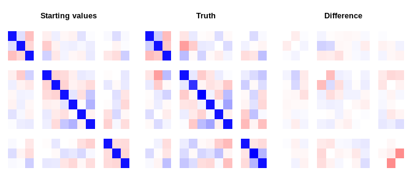

# mdgc

[](https://travis-ci.org/boennecd/mdgc)

This package contains a marginal likelihood approach to estimating the
model discussed by Hoff (2007) and Zhao and Udell (2019). That is, a
missing data approach where one uses Gaussian copulas. We have modified
the Fortran code by Genz and Bretz (2002) to supply an approximation of
the gradient for the log marginal likelihood and to use an approximation
of the marginal likelihood similar to the CDF approximation in Genz and
Bretz (2002). We have also used the same Fortran code to perform the
imputation conditional on a correlation matrix. Slides from a
presentation on the packages is provided at
[rpubs.com/boennecd/Gaussian-copula-KTH](https://rpubs.com/boennecd/Gaussian-copula-KTH)
and paper has not been published yet.

However, the package can be useful for a lot of other models. For
instance, the methods are directly applicable to other Gaussian copula
models and some mixed effect models. All methods are implemented in C++,
support computation in parallel, and should easily be able to be ported
to other languages.

## Example

Below, we provide an example similar to Zhao and Udell (2019 Section
7.1). The authors use a data set with a random correlation matrix, 5
continuous variables, 5 binary variables, and 5 ordinal variables with 5
levels. There is a total of 2000 observations and 30% of the variables
are missing completely at random.

To summarize Zhao and Udell (2019) results, they show that their
approximate EM algorithm converges in what seems to be 20-25 seconds
(this is with a pure R implementation to be fair) while it takes more
than 150 seconds for the MCMC algorithm used by Hoff (2007). These
figures should be kept in mind when looking at the results below.
Importantly, Zhao and Udell (2019) use an approximation in the E-step of
an EM algorithm which is fast but might be crude is some settings. Using
a potentially arbitrarily precise approximation of the log marginal
likelihood is useful if this can be done quickly enough.

We will provide a [quick-example](#quick-example) and [an even shorter
example](#an-even-shorter-example) where we show how to use the methods
in the package to estimate the correlation matrix and to perform the
imputation. We then show a [simulation study](#simulation-study) where
we compare with the method suggested by Zhao and Udell (2019).

We end by providing a [detailed example](#detailed-example) where we:

1.  show how to use the C++ functions and that these provide an
    approximation of the log marginal likelihood and its gradient.
    Moreover, we show that the methods scales well in the number of
    threads.
2.  define functions to perform maximum likelihood estimation.
3.  estimate the parameters using a simple gradient descent algorithm,
    and stochastic gradient descent methods. This serves as an example
    to show how to implement other gradient based methods to estimate
    the model.
4.  show how to improve 4. by using better starting values which are
    quick to compute. As of this writing, this reduces the estimation
    time to about 4 seconds using four threads and about 12 seconds
    using one thread.

The last section is added to give an idea about what is going on under
the hood and can likely be skipped.

## Installation

The packages can be installed from Github by calling:

``` r
remotes::install_github("boennecd/mdgc")
```

### Quick Example

We first simulate a data set and provide an example which shows how to
use the package. The [An Even Shorter Example](#an-even-shorter-example)
section shows a shorter example then what is shown here. You may want to
see this first if you just want to perform some quick imputation.

``` r
# load the packages we need
library(bench)
library(mdgc)
library(missForest, quietly = TRUE)
#> randomForest 4.6-14
#> Type rfNews() to see new features/changes/bug fixes.
# remotes::install_github("udellgroup/mixedgcImp", ref = "5ad6d523d")
library(mixedgcImp)
```

``` r
# simulates a data set and mask some of the data.
#
# Args: 
#   n: number of observations. 
#   p: number of variables. 
#   n_lvls: number of levels for the ordinal variables. 
# 
# Returns: 
#   Simluated masked data, the true data, and true covariance matrix. 
sim_dat <- function(n, p = 3L, n_lvls = 5L){
  # get the covariance matrix
  Sig <- cov2cor(drop(rWishart(1L, p, diag(p))))
    
  # draw the observations
  truth <- matrix(rnorm(n * p), n) %*% chol(Sig)
  
  # determine the type
  n_rep <- floor((p + 3 - 1) / 3)
  type <- rep(1:3, each = n_rep)[1:p]
  is_con <- type == 1L
  is_bin <- type == 2L
  is_ord <- type == 3L
  col_nam <- c(outer(1:n_rep, c("C", "B", "O"), 
                     function(x, y) paste0(y, x)))[1:p]
  
  # sample which are masked data 
  is_mask <- matrix(runif(n * p) < .3, n)
  
  # make sure we have no rows with all missing data
  while(any(all_nans <- rowSums(is_mask) == NCOL(is_mask)))
    is_mask[all_nans, ] <- runif(sum(all_nans) * p) < .3
  
  # create observed data
  truth_obs <- data.frame(truth)
  colnames(truth_obs) <- col_nam
  truth_obs[, is_con] <- qexp(pnorm(as.matrix(truth_obs[, is_con])))
  
  bs_border <- 0
  truth_obs[, is_bin] <- 
    truth_obs[, is_bin] > rep(bs_border, each = NROW(truth_obs))
  
  bs_ord <- qnorm(seq(0, 1, length.out = n_lvls + 1L))
  truth_obs[, is_ord] <- as.integer(cut(truth[, is_ord], breaks = bs_ord))
  for(i in which(is_ord)){
    truth_obs[, i] <- ordered(truth_obs[, i])
    levels(truth_obs[, i]) <- 
      LETTERS[seq_len(length(unique(truth_obs[, i])))]
  }

  # mask the data
  seen_obs <- truth_obs
  seen_obs[is_mask] <- NA
  
  list(truth = truth, truth_obs = truth_obs, seen_obs = seen_obs, 
       Sigma = Sig)
}

# simulate and show the data
set.seed(1)
p <- 15L
dat <- sim_dat(2000L, p = p)

# how an observed data set could look
head(dat$seen_obs)
#>      C1    C2    C3     C4       C5    B1    B2    B3    B4    B5   O1   O2
#> 1 0.237 0.693 0.798 0.0666       NA FALSE FALSE FALSE FALSE  TRUE    E    C
#> 2 0.142    NA    NA 0.0927 0.000152 FALSE    NA  TRUE    NA    NA    E    B
#> 3    NA 0.748 0.629 0.4280       NA    NA  TRUE    NA    NA  TRUE <NA>    A
#> 4 2.702    NA    NA 2.1776 1.700870 FALSE  TRUE  TRUE    NA  TRUE    A <NA>
#> 5 0.925    NA 0.205 0.6046 0.171311  TRUE  TRUE FALSE FALSE FALSE    E    B
#> 6 0.115    NA 1.341     NA       NA FALSE  TRUE  TRUE    NA    NA    E <NA>
#>     O3 O4   O5
#> 1    B  B <NA>
#> 2    A  A    C
#> 3 <NA>  C    E
#> 4    D  B <NA>
#> 5 <NA>  D <NA>
#> 6    A  B <NA>

# assign objects needed for model estimation
mdgc_obj <- get_mdgc(dat$seen_obs)
log_ml_ptr <- get_mdgc_log_ml(mdgc_obj)
start_val <- mdgc_start_value(mdgc_obj)

# this is very fast so we can neglect this when we consider the computation 
# time
mark(`Setup time` = {
  mdgc_obj <- get_mdgc(dat$seen_obs)
  log_ml_ptr <- get_mdgc_log_ml(mdgc_obj)
  start_val <- mdgc_start_value(mdgc_obj)
}, min_iterations = 10)
#> # A tibble: 1 x 6
#>   expression      min   median `itr/sec` mem_alloc `gc/sec`
#>   <bch:expr> <bch:tm> <bch:tm>     <dbl> <bch:byt>    <dbl>
#> 1 Setup time   22.4ms     23ms      43.0    9.65MB     13.4

# fit the model using three different methods
set.seed(60941821)
system.time(
  fit_Lagran_start <- mdgc_fit(
    ptr = log_ml_ptr, vcov = start_val, mea = mdgc_obj$means, 
    n_threads = 4L, maxit = 100L, method = "aug_Lagran", rel_eps = 1e-3, 
    maxpts = 200L))
#>    user  system elapsed 
#> 171.736   0.043  43.004
system.time(
  fit_Lagran <- mdgc_fit(
    ptr = log_ml_ptr, vcov = fit_Lagran_start$result$vcov, 
    mea = fit_Lagran_start$result$mea, 
    n_threads = 4L, maxit = 100L, method = "aug_Lagran", rel_eps = 1e-3, 
    maxpts = 5000L, mu = fit_Lagran_start$mu, 
    lambda = fit_Lagran_start$lambda))
#>    user  system elapsed 
#>  39.840   0.001  10.007

system.time(
  fit_adam <- mdgc_fit(
    ptr = log_ml_ptr, vcov = start_val, mea = mdgc_obj$means, 
    n_threads = 4L, lr = 1e-3, maxit = 25L, batch_size = 100L, 
    method = "adam", rel_eps = 1e-3, maxpts = 5000L))
#>    user  system elapsed 
#>    40.7     0.0    10.2

set.seed(fit_seed <- 19570958L)
system.time(
  fit_svrg <- mdgc_fit(
    ptr = log_ml_ptr, vcov = start_val, mea = mdgc_obj$means, 
    n_threads = 4L, lr = 1e-3, maxit = 25L, batch_size = 100L, 
    method = "svrg", verbose = TRUE, rel_eps = 1e-3, maxpts = 5000L))
#> End of iteration    1 with learning rate 0.00100000
#> Log marginal likelihood approximation is    -23440.90
#> Previous approximate gradient norm was        3448.44
#> 
#> End of iteration    2 with learning rate 0.00098000
#> Log marginal likelihood approximation is    -23389.65
#> Previous approximate gradient norm was        1728.53
#> 
#> End of iteration    3 with learning rate 0.00096040
#> Log marginal likelihood approximation is    -23367.04
#> Previous approximate gradient norm was        1163.49
#> 
#> End of iteration    4 with learning rate 0.00094119
#> Log marginal likelihood approximation is    -23355.12
#> Previous approximate gradient norm was         853.92
#> 
#> End of iteration    5 with learning rate 0.00092237
#> Log marginal likelihood approximation is    -23348.09
#> Previous approximate gradient norm was         675.05
#> 
#> End of iteration    6 with learning rate 0.00090392
#> Log marginal likelihood approximation is    -23343.66
#> Previous approximate gradient norm was         560.86
#> 
#> End of iteration    7 with learning rate 0.00088584
#> Log marginal likelihood approximation is    -23340.64
#> Previous approximate gradient norm was         478.72
#> 
#> End of iteration    8 with learning rate 0.00086813
#> Log marginal likelihood approximation is    -23338.56
#> Previous approximate gradient norm was         422.60
#> 
#> End of iteration    9 with learning rate 0.00085076
#> Log marginal likelihood approximation is    -23337.02
#> Previous approximate gradient norm was         379.01
#> 
#> End of iteration   10 with learning rate 0.00083375
#> Log marginal likelihood approximation is    -23335.80
#> Previous approximate gradient norm was         345.57
#> 
#> End of iteration   11 with learning rate 0.00081707
#> Log marginal likelihood approximation is    -23334.92
#> Previous approximate gradient norm was         323.14
#> 
#> End of iteration   12 with learning rate 0.00080073
#> Log marginal likelihood approximation is    -23334.21
#> Previous approximate gradient norm was         304.19
#> 
#> End of iteration   13 with learning rate 0.00078472
#> Log marginal likelihood approximation is    -23333.61
#> Previous approximate gradient norm was         289.58
#> 
#> End of iteration   14 with learning rate 0.00076902
#> Log marginal likelihood approximation is    -23333.12
#> Previous approximate gradient norm was         275.60
#> 
#> End of iteration   15 with learning rate 0.00075364
#> Log marginal likelihood approximation is    -23332.70
#> Previous approximate gradient norm was         264.18
#> 
#> End of iteration   16 with learning rate 0.00073857
#> Log marginal likelihood approximation is    -23332.37
#> Previous approximate gradient norm was         253.95
#> 
#> End of iteration   17 with learning rate 0.00072380
#> Log marginal likelihood approximation is    -23332.09
#> Previous approximate gradient norm was         273.96
#> 
#> End of iteration   18 with learning rate 0.00070932
#> Log marginal likelihood approximation is    -23331.87
#> Previous approximate gradient norm was         249.60
#> 
#> End of iteration   19 with learning rate 0.00069514
#> Log marginal likelihood approximation is    -23331.67
#> Previous approximate gradient norm was         243.70
#> 
#> End of iteration   20 with learning rate 0.00068123
#> Log marginal likelihood approximation is    -23331.49
#> Previous approximate gradient norm was         239.11
#> 
#> End of iteration   21 with learning rate 0.00066761
#> Log marginal likelihood approximation is    -23331.46
#> Previous approximate gradient norm was         248.30
#> 
#> End of iteration   22 with learning rate 0.00065426
#> Log marginal likelihood approximation is    -23331.29
#> Previous approximate gradient norm was         233.47
#> 
#> End of iteration   23 with learning rate 0.00064117
#> Log marginal likelihood approximation is    -23331.15
#> Previous approximate gradient norm was         228.26
#> 
#> End of iteration   24 with learning rate 0.00062835
#> Log marginal likelihood approximation is    -23330.90
#> Previous approximate gradient norm was         235.00
#> 
#> End of iteration   25 with learning rate 0.00061578
#> Log marginal likelihood approximation is    -23330.83
#> Previous approximate gradient norm was         226.77
#>    user  system elapsed 
#>    82.1     0.0    20.5

# compare the log marginal likelihood 
print(rbind(
  `Augmented Lagrangian` = 
    mdgc_log_ml(vcov = fit_Lagran$result$vcov, mea = fit_Lagran$result$mea, 
                ptr = log_ml_ptr, rel_eps = 1e-3),
  ADAM = 
    mdgc_log_ml(vcov = fit_adam$result$vcov  , mea = fit_adam$result$mea, 
                ptr = log_ml_ptr, rel_eps = 1e-3),
  SVRG =
    mdgc_log_ml(vcov = fit_svrg$result$vcov  , mea = fit_svrg$result$mea, 
                ptr = log_ml_ptr, rel_eps = 1e-3)), 
  digits = 10)
#>                              [,1]
#> Augmented Lagrangian -23330.35309
#> ADAM                 -23349.73214
#> SVRG                 -23330.80260

# we can use an approximation in the method
set.seed(fit_seed)
system.time(
  fit_svrg_aprx <- mdgc_fit(
    ptr = log_ml_ptr, vcov = start_val, mea = mdgc_obj$means, 
    n_threads = 4L, lr = 1e-3, maxit = 25L, batch_size = 100L, 
    method = "svrg", rel_eps = 1e-3, maxpts = 5000L, use_aprx = TRUE))
#>    user  system elapsed 
#>      56       0      14

# essentially the same estimates
norm(fit_svrg_aprx$result$vcov - fit_svrg$result$vcov, "F") 
#> [1] 9.22e-08
sd(fit_svrg_aprx$result$mea - fit_svrg$result$mea)
#> [1] 1.1e-09

# compare the estimated correlation matrix with the true value
do_plot <- function(est, truth, main){
  par_old <- par(mfcol = c(1, 3), mar  = c(1, 1, 4, 1))
  on.exit(par(par_old))
  sc <- colorRampPalette(c("Red", "White", "Blue"))(201)
  
  f <- function(x, main)
    image(x[, NCOL(x):1], main = main, col = sc, zlim = c(-1, 1), 
          xaxt = "n", yaxt = "n", bty = "n")
  f(est, main)
  f(truth, "Truth")
  f(est - truth, "Difference")
}

do_plot(fit_Lagran$result$vcov, dat$Sigma, "Estimates (Aug. Lagrangian)")
```


``` r
do_plot(fit_adam  $result$vcov, dat$Sigma, "Estimates (ADAM)")
```


``` r
do_plot(fit_svrg  $result$vcov, dat$Sigma, "Estimates (SVRG)")
```


``` r

norm(fit_Lagran$result$vcov - dat$Sigma, "F")
#> [1] 0.486
norm(fit_adam  $result$vcov - dat$Sigma, "F")
#> [1] 0.501
norm(fit_svrg  $result$vcov - dat$Sigma, "F")
#> [1] 0.488

# perform the imputation
system.time(imp_res <- mdgc_impute(
  mdgc_obj, fit_svrg$result$vcov, mea = fit_svrg$result$mea, rel_eps = 1e-3, 
  maxit = 10000L, n_threads = 4L))
#>    user  system elapsed 
#>   17.51    0.00    4.79

# look at the result for one of the observations
imp_res[2L]
#> [[1]]
#> [[1]]$C1
#> [1] 0.142
#> 
#> [[1]]$C2
#> [1] 2.08
#> 
#> [[1]]$C3
#> [1] 0.249
#> 
#> [[1]]$C4
#> [1] 0.0927
#> 
#> [[1]]$C5
#> [1] 0.000152
#> 
#> [[1]]$B1
#> FALSE  TRUE 
#>     1     0 
#> 
#> [[1]]$B2
#> FALSE  TRUE 
#> 0.192 0.808 
#> 
#> [[1]]$B3
#> FALSE  TRUE 
#>     0     1 
#> 
#> [[1]]$B4
#> FALSE  TRUE 
#>  0.81  0.19 
#> 
#> [[1]]$B5
#> FALSE  TRUE 
#> 0.251 0.749 
#> 
#> [[1]]$O1
#> A B C D E 
#> 0 0 0 0 1 
#> 
#> [[1]]$O2
#> A B C D E 
#> 0 1 0 0 0 
#> 
#> [[1]]$O3
#> A B C D E 
#> 1 0 0 0 0 
#> 
#> [[1]]$O4
#> A B C D E 
#> 1 0 0 0 0 
#> 
#> [[1]]$O5
#> A B C D E 
#> 0 0 1 0 0

# compare with the observed and true data
rbind(truth = dat$truth_obs[2L, ], observed = dat$seen_obs[2L, ])
#>             C1   C2    C3     C4       C5    B1   B2   B3    B4   B5 O1 O2 O3
#> truth    0.142 2.63 0.338 0.0927 0.000152 FALSE TRUE TRUE FALSE TRUE  E  B  A
#> observed 0.142   NA    NA 0.0927 0.000152 FALSE   NA TRUE    NA   NA  E  B  A
#>          O4 O5
#> truth     A  C
#> observed  A  C

# we can threshold the data like this
threshold <- function(org_data, imputed){
  # checks
  stopifnot(NROW(org_data) == length(imputed), 
            is.list(imputed), is.data.frame(org_data))
  
  # threshold
  is_cont <- which(sapply(org_data, is.numeric))
  is_bin  <- which(sapply(org_data, is.logical)) 
  is_ord  <- which(sapply(org_data, is.ordered))
  stopifnot(
    length(is_cont) + length(is_bin) + length(is_ord) == NCOL(org_data))
  is_cat <- c(is_bin, is_ord)
  
  trans_to_df <- function(x){
    if(is.matrix(x))
      as.data.frame(t(x))
    else
      as.data.frame(  x )
  }
  
  out_cont <- trans_to_df(sapply(imputed, function(x) unlist(x[is_cont])))
  out_cat <- trans_to_df(sapply(imputed, function(x) 
    sapply(x[is_cat], which.max)))
  out <- cbind(out_cont, out_cat)
  
  # set factor levels etc. 
  out <- out[, order(c(is_cont, is_bin, is_ord))]
  if(length(is_bin) > 0)
    out[, is_bin] <- out[, is_bin] > 1L
  if(length(is_ord) > 0)
    for(i in is_ord)
      out[[i]] <- ordered(
        unlist(out[[i]]), labels = levels(org_data[, i]))
  
  colnames(out) <- colnames(org_data)
  out
}
thresh_dat <- threshold(dat$seen_obs, imp_res)

# compare thresholded data with observed and true data
head(thresh_dat)
#>      C1    C2    C3     C4       C5    B1    B2    B3    B4    B5 O1 O2 O3 O4
#> 1 0.237 0.693 0.798 0.0666 1.217227 FALSE FALSE FALSE FALSE  TRUE  E  C  B  B
#> 2 0.142 2.083 0.249 0.0927 0.000152 FALSE  TRUE  TRUE FALSE  TRUE  E  B  A  A
#> 3 1.301 0.748 0.629 0.4280 0.572318 FALSE  TRUE  TRUE  TRUE  TRUE  E  A  E  C
#> 4 2.702 0.775 1.129 2.1776 1.700870 FALSE  TRUE  TRUE  TRUE  TRUE  A  B  D  B
#> 5 0.925 0.907 0.205 0.6046 0.171311  TRUE  TRUE FALSE FALSE FALSE  E  B  D  D
#> 6 0.115 1.063 1.341 0.2397 0.238344 FALSE  TRUE  TRUE FALSE  TRUE  E  A  A  B
#>   O5
#> 1  D
#> 2  C
#> 3  E
#> 4  E
#> 5  E
#> 6  B
head(dat$seen_obs)  # observed data
#>      C1    C2    C3     C4       C5    B1    B2    B3    B4    B5   O1   O2
#> 1 0.237 0.693 0.798 0.0666       NA FALSE FALSE FALSE FALSE  TRUE    E    C
#> 2 0.142    NA    NA 0.0927 0.000152 FALSE    NA  TRUE    NA    NA    E    B
#> 3    NA 0.748 0.629 0.4280       NA    NA  TRUE    NA    NA  TRUE <NA>    A
#> 4 2.702    NA    NA 2.1776 1.700870 FALSE  TRUE  TRUE    NA  TRUE    A <NA>
#> 5 0.925    NA 0.205 0.6046 0.171311  TRUE  TRUE FALSE FALSE FALSE    E    B
#> 6 0.115    NA 1.341     NA       NA FALSE  TRUE  TRUE    NA    NA    E <NA>
#>     O3 O4   O5
#> 1    B  B <NA>
#> 2    A  A    C
#> 3 <NA>  C    E
#> 4    D  B <NA>
#> 5 <NA>  D <NA>
#> 6    A  B <NA>
head(dat$truth_obs) # true data
#>      C1    C2    C3     C4       C5    B1    B2    B3    B4    B5 O1 O2 O3 O4
#> 1 0.237 0.693 0.798 0.0666 0.950476 FALSE FALSE FALSE FALSE  TRUE  E  C  B  B
#> 2 0.142 2.630 0.338 0.0927 0.000152 FALSE  TRUE  TRUE FALSE  TRUE  E  B  A  A
#> 3 2.864 0.748 0.629 0.4280 1.341650 FALSE  TRUE  TRUE FALSE  TRUE  C  A  D  C
#> 4 2.702 1.153 0.459 2.1776 1.700870 FALSE  TRUE  TRUE  TRUE  TRUE  A  C  D  B
#> 5 0.925 0.365 0.205 0.6046 0.171311  TRUE  TRUE FALSE FALSE FALSE  E  B  B  D
#> 6 0.115 0.563 1.341 0.7184 0.306274 FALSE  TRUE  TRUE FALSE  TRUE  E  A  A  B
#>   O5
#> 1  E
#> 2  C
#> 3  E
#> 4  E
#> 5  E
#> 6  B

# compare correct categories
get_classif_error <- function(impu_dat, truth = dat$truth_obs, 
                              observed = dat$seen_obs){
  is_cat <- sapply(truth, function(x)
    is.logical(x) || is.ordered(x))
  is_match <- impu_dat[, is_cat] == truth[, is_cat]
  is_match[!is.na(observed[, is_cat])] <- NA_integer_
  1 - colMeans(is_match, na.rm = TRUE)
}
get_classif_error(thresh_dat)
#>    B1    B2    B3    B4    B5    O1    O2    O3    O4    O5 
#> 0.274 0.297 0.226 0.320 0.288 0.566 0.640 0.616 0.599 0.548

# compute RMSE
get_rmse <- function(impu_dat, truth = dat$truth_obs,
                     observed = dat$seen_obs){
  is_con <- sapply(truth, is.numeric)
  err <- as.matrix(impu_dat[, is_con] - truth[, is_con])
  err[!is.na(observed[, is_con])] <- NA_real_
  sqrt(colMeans(err^2, na.rm = TRUE))
}
get_rmse(thresh_dat)
#>    C1    C2    C3    C4    C5 
#> 0.644 0.784 0.652 0.795 0.746

# we can compare this with missForest
miss_forest_arg <- dat$seen_obs
is_log <- sapply(miss_forest_arg, is.logical)
miss_forest_arg[, is_log] <- lapply(miss_forest_arg[, is_log], as.factor)
set.seed(1)
system.time(miss_res <- missForest(miss_forest_arg))
#>   missForest iteration 1 in progress...done!
#>   missForest iteration 2 in progress...done!
#>   missForest iteration 3 in progress...done!
#>   missForest iteration 4 in progress...done!
#>   missForest iteration 5 in progress...done!
#>   missForest iteration 6 in progress...done!
#>   missForest iteration 7 in progress...done!
#>   missForest iteration 8 in progress...done!
#>   missForest iteration 9 in progress...done!
#>    user  system elapsed 
#>  45.805   0.036  45.841

# turn binary variables back to logicals
miss_res$ximp[, is_log] <- lapply(
  miss_res$ximp[, is_log], function(x) as.integer(x) > 1L)

rbind(mdgc       = get_classif_error(thresh_dat),
      missForest = get_classif_error(miss_res$ximp))
#>               B1    B2    B3    B4    B5    O1    O2    O3    O4    O5
#> mdgc       0.274 0.297 0.226 0.320 0.288 0.566 0.640 0.616 0.599 0.548
#> missForest 0.315 0.340 0.304 0.371 0.319 0.651 0.726 0.680 0.673 0.612
rbind(mdgc       = get_rmse(thresh_dat),
      missForest = get_rmse(miss_res$ximp))
#>               C1    C2    C3    C4    C5
#> mdgc       0.644 0.784 0.652 0.795 0.746
#> missForest 0.806 0.848 0.755 0.845 0.842
```

#### An Even Shorter Example

Here is an example where we use the `mdgc` function to do the model
estimation and the imputation:

``` r
# have a data set with missing continous, binary, and ordinal variables
head(dat$seen_obs)
#>      C1    C2    C3     C4       C5    B1    B2    B3    B4    B5   O1   O2
#> 1 0.237 0.693 0.798 0.0666       NA FALSE FALSE FALSE FALSE  TRUE    E    C
#> 2 0.142    NA    NA 0.0927 0.000152 FALSE    NA  TRUE    NA    NA    E    B
#> 3    NA 0.748 0.629 0.4280       NA    NA  TRUE    NA    NA  TRUE <NA>    A
#> 4 2.702    NA    NA 2.1776 1.700870 FALSE  TRUE  TRUE    NA  TRUE    A <NA>
#> 5 0.925    NA 0.205 0.6046 0.171311  TRUE  TRUE FALSE FALSE FALSE    E    B
#> 6 0.115    NA 1.341     NA       NA FALSE  TRUE  TRUE    NA    NA    E <NA>
#>     O3 O4   O5
#> 1    B  B <NA>
#> 2    A  A    C
#> 3 <NA>  C    E
#> 4    D  B <NA>
#> 5 <NA>  D <NA>
#> 6    A  B <NA>
  
# perform the estimation and imputation
set.seed(1)
system.time(res <- mdgc(dat$seen_obs, verbose = TRUE, maxpts = 5000L, 
                        n_threads = 4L, maxit = 25L, use_aprx = TRUE))
#> Estimating the model...
#> End of iteration    1 with learning rate 0.00100000
#> Log marginal likelihood approximation is    -23442.36
#> Previous approximate gradient norm was        3442.57
#> 
#> End of iteration    2 with learning rate 0.00098000
#> Log marginal likelihood approximation is    -23390.44
#> Previous approximate gradient norm was        1714.26
#> 
#> End of iteration    3 with learning rate 0.00096040
#> Log marginal likelihood approximation is    -23367.67
#> Previous approximate gradient norm was        1150.81
#> 
#> End of iteration    4 with learning rate 0.00094119
#> Log marginal likelihood approximation is    -23355.49
#> Previous approximate gradient norm was         848.53
#> 
#> End of iteration    5 with learning rate 0.00092237
#> Log marginal likelihood approximation is    -23348.33
#> Previous approximate gradient norm was         661.09
#> 
#> End of iteration    6 with learning rate 0.00090392
#> Log marginal likelihood approximation is    -23343.81
#> Previous approximate gradient norm was         549.48
#> 
#> End of iteration    7 with learning rate 0.00088584
#> Log marginal likelihood approximation is    -23340.76
#> Previous approximate gradient norm was         469.18
#> 
#> End of iteration    8 with learning rate 0.00086813
#> Log marginal likelihood approximation is    -23338.57
#> Previous approximate gradient norm was         411.35
#> 
#> End of iteration    9 with learning rate 0.00085076
#> Log marginal likelihood approximation is    -23337.01
#> Previous approximate gradient norm was         372.60
#> 
#> End of iteration   10 with learning rate 0.00083375
#> Log marginal likelihood approximation is    -23335.82
#> Previous approximate gradient norm was         342.23
#> 
#> End of iteration   11 with learning rate 0.00081707
#> Log marginal likelihood approximation is    -23334.88
#> Previous approximate gradient norm was         318.26
#> 
#> End of iteration   12 with learning rate 0.00080073
#> Log marginal likelihood approximation is    -23334.18
#> Previous approximate gradient norm was         298.63
#> 
#> Performing imputation...
#>    user  system elapsed 
#>   16.56    0.00    4.61

# compare the estimated correlation matrix with the truth
norm(dat$Sigma - res$vcov, "F") / norm(dat$Sigma, "F")
#> [1] 0.0955

# compute the classifcation error and RMSE
get_classif_error(res$ximp)
#>    B1    B2    B3    B4    B5    O1    O2    O3    O4    O5 
#> 0.274 0.290 0.225 0.318 0.291 0.576 0.638 0.629 0.600 0.548
get_rmse(res$ximp)
#>    C1    C2    C3    C4    C5 
#> 0.644 0.784 0.652 0.795 0.746
```

We can compare this with the `mixedgcImp` which uses the method
described in Zhao and Udell (2019):

``` r
# turn the data to a format that can be bassed
dat_pass <- dat$seen_obs
is_cat <- sapply(dat_pass, function(x) is.logical(x) | is.ordered(x))
dat_pass[, is_cat] <- lapply(dat_pass[, is_cat], as.integer)

system.time(imp_apr_em <- impute_mixedgc(dat_pass, eps = 1e-4))
#>    user  system elapsed 
#>    19.8     0.0    19.8

# compare the estimated correlation matrix with the truth
get_rel_err <- function(est, keep = seq_len(NROW(truth)), truth = dat$Sigma)
  norm(truth[keep, keep] - est[keep, keep], "F") / 
  norm(truth, "F")

c(mdgc                     = get_rel_err(res$vcov), 
  mixedgcImp               = get_rel_err(imp_apr_em$R), 
  `mdgc bin/ordered`       = get_rel_err(res$vcov    , is_cat),
  `mixedgcImp bin/ordered` = get_rel_err(imp_apr_em$R, is_cat),
  `mdgc continuous`        = get_rel_err(res$vcov    , !is_cat),
  `mixedgcImp continuous`  = get_rel_err(imp_apr_em$R, !is_cat))
#>                   mdgc             mixedgcImp       mdgc bin/ordered 
#>                 0.0955                 0.1243                 0.0742 
#> mixedgcImp bin/ordered        mdgc continuous  mixedgcImp continuous 
#>                 0.1083                 0.0242                 0.0257

# compare the classifcation error and RMSE
imp_apr_res <- as.data.frame(imp_apr_em$Ximp)
is_bin <- sapply(dat$seen_obs, is.logical)
imp_apr_res[, is_bin] <- lapply(imp_apr_res[, is_bin], `>`, e2 = 0)
is_ord <- sapply(dat$seen_obs, is.ordered)
imp_apr_res[, is_ord] <- mapply(function(x, idx)
  ordered(x, labels = levels(dat$seen_obs[[idx]])), 
  x = imp_apr_res[, is_ord], i = which(is_ord), SIMPLIFY = FALSE)

rbind(mdgc       = get_classif_error(res$ximp),
      mixedgcImp = get_classif_error(imp_apr_res))
#>               B1    B2    B3    B4    B5    O1    O2    O3    O4    O5
#> mdgc       0.274 0.290 0.225 0.318 0.291 0.576 0.638 0.629 0.600 0.548
#> mixedgcImp 0.281 0.328 0.232 0.320 0.288 0.626 0.694 0.688 0.609 0.556
rbind(mdgc       = get_rmse(res$ximp),
      mixedgcImp = get_rmse(imp_apr_res))
#>               C1    C2    C3    C4    C5
#> mdgc       0.644 0.784 0.652 0.795 0.746
#> mixedgcImp 0.645 0.789 0.655 0.810 0.755
```

### Simulation Study

We will perform a simulation study in this section to compare different
methods in terms of their computation time and performance. We first
perform the simulation.

``` r
# the seeds we will use
seeds <- c(293498804L, 311878062L, 370718465L, 577520465L, 336825034L, 661670751L, 750947065L, 255824398L, 281823005L, 721186455L, 251974931L, 643568686L, 273097364L, 328663824L, 490259480L, 517126385L, 651705963L, 43381670L, 503505882L, 609251792L, 643001919L, 244401725L, 983414550L, 850590318L, 714971434L, 469416928L, 237089923L, 131313381L, 689679752L, 344399119L, 330840537L, 6287534L, 735760574L, 477353355L, 579527946L, 83409653L, 710142087L, 830103443L, 94094987L, 422058348L, 117889526L, 259750108L, 180244429L, 762680168L, 112163383L, 10802048L, 440434442L, 747282444L, 736836365L, 837303896L, 50697895L, 231661028L, 872653438L, 297024405L, 719108161L, 201103881L, 485890767L, 852715172L, 542126886L, 155221223L, 18987375L, 203133067L, 460377933L, 949381283L, 589083178L, 820719063L, 543339683L, 154667703L, 480316186L, 310795921L, 287317945L, 30587393L, 381290126L, 178269809L, 939854883L, 660119506L, 825302990L, 764135140L, 433746745L, 173637986L, 100446967L, 333304121L, 225525537L, 443031789L, 587486506L, 245392609L, 469144801L, 44073812L, 462948652L, 226692940L, 165285895L, 546908869L, 550076645L, 872290900L, 452044364L, 620131127L, 600097817L, 787537854L, 15915195L, 64220696L)

# gather or compute the results (you may skip this)
res <- lapply(seeds, function(s){
  file_name <- file.path("sim-res", sprintf("seed-%d.RDS", s))
  
  if(file.exists(file_name)){
    message(sprintf("Reading '%s'", file_name))
    out <- readRDS(file_name)
  } else { 
    message(sprintf("Running '%s'", file_name))
    
    # simulate the data
    set.seed(s)
    dat <- sim_dat(2000L, p = 15L)
    
    # fit models and impute
    mdgc_time <- system.time(
      mdgc_res <- mdgc(dat$seen_obs, verbose = FALSE, maxpts = 5000L, 
                        n_threads = 4L, maxit = 25L, use_aprx = TRUE))
    
    dat_pass <- dat$seen_obs
    is_cat <- sapply(dat_pass, function(x) is.logical(x) | is.ordered(x))
    dat_pass[, is_cat] <- lapply(dat_pass[, is_cat], as.integer)
    mixedgc_time <- 
      system.time(mixedgc_res <- impute_mixedgc(dat_pass, eps = 1e-4))
    
    miss_forest_arg <- dat$seen_obs
    is_log <- sapply(miss_forest_arg, is.logical)
    miss_forest_arg[, is_log] <- lapply(
      miss_forest_arg[, is_log], as.factor)
    sink(tempfile())
    miss_time <- system.time(
      miss_res <- missForest(miss_forest_arg, verbose = FALSE))
    sink()
    
    miss_res$ximp[, is_log] <- lapply(
      miss_res$ximp[, is_log], function(x) as.integer(x) > 1L)
    
    # impute using the other estimate
    mdgc_obj <- get_mdgc(dat$seen_obs)
    impu_mixedgc_est <- mdgc_impute(mdgc_obj, mixedgc_res$R, mdgc_obj$means)
    impu_mixedgc_est <- threshold(dat$seen_obs, impu_mixedgc_est)
    
    # gather output for the correlation matrix estimates
    vcov_res <- list(truth = dat$Sigma, mdgc = mdgc_res$vcov, 
                     mixedgc = mixedgc_res$R)
    get_rel_err <- function(est, truth, keep = seq_len(NROW(truth)))
      norm(truth[keep, keep] - est[keep, keep], "F") / norm(truth, "F")
    
    vcov_res <- within(vcov_res, {
      mdgc_rel_err    = get_rel_err(mdgc   , truth)
      mixedgc_rel_err = get_rel_err(mixedgc, truth)
    })
    
    # gather the estimated means
    mea_ests <- list(marginal = mdgc_obj$means, 
                     joint    = mdgc_res$mea)
    
    # gather output for the imputation 
    mixedgc_imp_res <- as.data.frame(mixedgc_res$Ximp)
    is_bin <- sapply(dat$seen_obs, is.logical)
    mixedgc_imp_res[, is_bin] <- 
      lapply(mixedgc_imp_res[, is_bin, drop = FALSE], `>`, e2 = 0)
    is_ord <- sapply(dat$seen_obs, is.ordered)
    mixedgc_imp_res[, is_ord] <- mapply(function(x, idx)
      ordered(x, labels = levels(dat$seen_obs[[idx]])), 
      x = mixedgc_imp_res[, is_ord, drop = FALSE], 
      i = which(is_ord), SIMPLIFY = FALSE)
    
    get_bin_err <- function(x){
      . <- function(z) z[, is_bin, drop = FALSE]
      get_classif_error(
        .(x), truth = .(dat$truth_obs), observed = .(dat$seen_obs))
    }
    get_ord_err <- function(x){
      . <- function(z) z[, is_ord, drop = FALSE]
      get_classif_error(
        .(x), truth = .(dat$truth_obs), observed = .(dat$seen_obs))
    }
          
    err <- list(
      mdgc_bin = get_bin_err(mdgc_res$ximp), 
      mixedgc_bin = get_bin_err(mixedgc_imp_res), 
      mixed_bin = get_bin_err(impu_mixedgc_est),
      missForest_bin = get_bin_err(miss_res$ximp),
      
      mdgc_class = get_ord_err(mdgc_res$ximp), 
      mixedgc_class = get_ord_err(mixedgc_imp_res), 
      mixed_class = get_ord_err(impu_mixedgc_est),
      missForest_class = get_ord_err(miss_res$ximp),
      
      mdgc_rmse = get_rmse(
        mdgc_res$ximp, truth = dat$truth_obs, observed = dat$seen_obs),
      mixedgc_rmse = get_rmse(
        mixedgc_imp_res, truth = dat$truth_obs, observed = dat$seen_obs),
      mixed_rmse = get_rmse(
        impu_mixedgc_est, truth = dat$truth_obs, observed = dat$seen_obs), 
      missForest_rmse = get_rmse(
        miss_res$ximp, truth = dat$truth_obs, observed = dat$seen_obs))
    
    # gather the times
    times <- list(mdgc = mdgc_time, mixedgc = mixedgc_time, 
                  missForest = miss_time)
    
    # save stats to check convergence
    conv_stats <- list(mdgc = mdgc_res$logLik, 
                       mixedgc = mixedgc_res$loglik)
    
    # save output 
    out <- list(vcov_res = vcov_res, err = err, times = times, 
                conv_stats = conv_stats, mea_ests = mea_ests)
    saveRDS(out, file_name)
  }
  
  # print summary stat to the console while knitting
  out <- readRDS(file_name)
  . <- function(x)
    message(paste(sprintf("%8.3f", x), collapse = " "))
  with(out, {
    message(paste(
      "mdgc    logLik", 
      paste(sprintf("%.2f", conv_stats$mdgc), collapse = " ")))
    message(paste(
      "mixedgc logLik", 
      paste(sprintf("%.2f", conv_stats$mixedgc), collapse = " ")))
    message(sprintf(
      "Relative correlation matrix estimate errors are %.4f %.4f", 
      vcov_res$mdgc_rel_err, vcov_res$mixedgc_rel_err))
    message(sprintf(
      "Times are %.2f %.2f %.2f", 
      times$mdgc["elapsed"], times$mixedgc["elapsed"], 
      times$missForest["elapsed"]))
    
    message(sprintf(
      "Binary classifcation errors are %.2f %.2f %.2f (%.2f)", 
      mean(err$mdgc_bin), mean(err$mixedgc_bin), 
      mean(err$missForest_bin), mean(err$mixed_bin)))
    
    message(sprintf(
      "Ordinal classifcation errors are %.2f %.2f %.2f (%.2f)", 
      mean(err$mdgc_class), mean(err$mixedgc_class), 
      mean(err$missForest_class), mean(err$mixed_class)))
    
    message(sprintf(
      "Mean RMSEs are %.2f %.2f %.2f (%.2f)",
      mean(err$mdgc_rmse), mean(err$mixedgc_rmse), 
      mean(err$missForest_rmse), mean(err$mixed_rmse)))
    message("")
  })
  
  out  
})
```

The difference in computation time is given below:

``` r
# assign function to show the summary stats
show_sim_stats <- function(v1, v2, v3, what, sub_ele = NULL){
  vals <- sapply(res, function(x) 
    do.call(rbind, x[[what]][c(v1, v2, v3)]), 
    simplify = "array")
  if(!is.null(sub_ele))
    vals <- vals[, sub_ele, , drop = FALSE]
    
  cat("Means and standard errors:\n")
  mea_se <- function(x)
    c(mean = mean(x), SE = sd(x) / sqrt(length(x)))
  print(t(apply(vals, 1L, mea_se)))
  
  cat("\nDifference:\n")
  print(t(apply(
    c(vals[v1, , ]) - 
      aperm(vals[c(v2, v3), , , drop = FALSE], c(3L, 2L, 1L)), 
    3L, mea_se)))
}

# compare estimation time
show_sim_stats(1L, 2L, 3L, "times", "elapsed")
#> Means and standard errors:
#>             mean    SE
#> mdgc        5.65 0.122
#> mixedgc    21.25 0.146
#> missForest 46.68 0.617
#> 
#> Difference:
#>             mean    SE
#> mixedgc    -15.6 0.183
#> missForest -41.0 0.608
```

The summary stats for the relative Frobenius norm between the estimated
and true correlation matrix is given below:

``` r
# relative norms
show_sim_stats("mixedgc_rel_err", "mdgc_rel_err", NULL, "vcov_res")
#> Means and standard errors:
#>                   mean      SE
#> mixedgc_rel_err 0.1187 0.00123
#> mdgc_rel_err    0.0866 0.00097
#> 
#> Difference:
#>                mean      SE
#> mdgc_rel_err 0.0321 0.00091
```

Finally, here are the results for the classification error for the
binary and ordinal outcomes and the root mean square error:

``` r
# the binary variables
show_sim_stats("mdgc_bin", "mixedgc_bin", "missForest_bin", "err")
#> Means and standard errors:
#>                 mean      SE
#> mdgc_bin       0.244 0.00187
#> mixedgc_bin    0.252 0.00186
#> missForest_bin 0.294 0.00188
#> 
#> Difference:
#>                    mean      SE
#> mixedgc_bin    -0.00743 0.00255
#> missForest_bin -0.05005 0.00255

# the ordinal variables
show_sim_stats("mdgc_class", "mixedgc_class", "missForest_class", "err")
#> Means and standard errors:
#>                   mean      SE
#> mdgc_class       0.590 0.00214
#> mixedgc_class    0.623 0.00245
#> missForest_class 0.658 0.00173
#> 
#> Difference:
#>                     mean      SE
#> mixedgc_class    -0.0332 0.00316
#> missForest_class -0.0679 0.00272

# the continous variables
show_sim_stats("mdgc_rmse", "mixedgc_rmse", "missForest_rmse", "err")
#> Means and standard errors:
#>                  mean      SE
#> mdgc_rmse       0.760 0.00402
#> mixedgc_rmse    0.767 0.00404
#> missForest_rmse 0.850 0.00340
#> 
#> Difference:
#>                    mean      SE
#> mixedgc_rmse    -0.0074 0.00575
#> missForest_rmse -0.0902 0.00525
```

It is important to emphasize that missForest is not estimating the true
model.

## Adding Multinomial Variables

We extend the model suggested by Zhao and Udell (2019) in this section.
The example is very similar to the previous one but with multinomial
variables.

``` r
# simulates a data set and mask some of the data.
#
# Args: 
#   n: number of observations. 
#   p: number of variables. 
#   n_lvls: number of levels for the ordinal and multinomial variables. 
#   verbose: print status during the simulation.
# 
# Returns: 
#   Simluated masked data, the true data, and true covariance matrix. 
sim_dat <- function(n, p = 4L, n_lvls = 5L, verbose = FALSE){
  # determine the type
  n_rep <- floor((p + 4 - 1) / 4)
  type <- rep(1:4, n_rep)[1:p]
  is_con  <- type == 1L
  is_bin  <- type == 2L
  is_ord  <- type == 3L
  is_mult <- type == 4L
  
  col_nam <- c(outer(c("C", "B", "O", "M"), 1:n_rep, paste0))[1:p]
  idx <- head(cumsum(c(1L, ifelse(type == 4, n_lvls, 1L))), -1L)
  
  # get the covariance matrix
  n_latent <- p + (n_lvls - 1L) * (p %/% 4)

  Sig <- cov2cor(drop(rWishart(1L, 2 * n_latent, diag(n_latent))))
  
  # Find the closest matrix which satisfy the zero constraint
  type_augmented <- unlist(sapply(seq_along(type), function(x)
    if(x %% 4 == 0) rep(x, n_lvls) else x))
  zero_indices <- do.call(rbind, tapply(
    seq_along(type_augmented)[type_augmented %% 4L == 0L], 
    type_augmented[type_augmented %% 4L == 0L], function(x)
      subset(expand.grid(row = x, col = x), row > col)))
  zero_indices <- as.matrix(zero_indices) - 1L
  
  # setup objects and functions to run augmented Lagrangian method
  par <- t(chol(Sig))
  par <- par[lower.tri(par, TRUE)]
  
  # you can skip these function definitions
  com_vec <- mdgc:::get_commutation_vec(n_latent, n_latent, FALSE)
  get_mat_from_cholesky <- function(x){
    out <- matrix(0., n_latent, n_latent)
    out[lower.tri(out, TRUE)] <- x
    tcrossprod(out)
  }
  fn <- function(x, lambda, mu){
    sig_hat <- get_mat_from_cholesky(x)
    consts <- mdgc:::lower_tri_inner(
      x = x, idx = zero_indices, jacob = FALSE, rhs = numeric())
    
    norm(sig_hat - Sig, "F")^2 / 2 - sum(lambda * consts) +
      mu / 2 * sum(consts^2)
  }
  gr <- function(x, lambda, mu){
    sig_hat <- get_mat_from_cholesky(x)
    
    L <- matrix(0., n_latent, n_latent)
    L[lower.tri(L, TRUE)] <- x
    
    d_Sig <- sig_hat - Sig
    d_Sig <- ((d_Sig + d_Sig[com_vec]) %*% L)[lower.tri(L, TRUE)]
    
    consts <- mdgc:::lower_tri_inner(
      x = x, idx = zero_indices, jacob = FALSE, rhs = numeric())
    rhs <- -lambda + mu * consts
    d_aug <- mdgc:::lower_tri_inner(
      x = x, idx = zero_indices, jacob = TRUE, rhs = rhs)
    
    d_Sig + d_aug
  }
  
  # augmented Lagrangian method
  lambda <- numeric(NROW(zero_indices))
  mu <- 1
  
  # check gradient
  if(FALSE){
    x_test      <- runif(length(par))
    lambda_test <- runif(length(lambda))
    all.equal(numDeriv::grad(fn, x_test, lambda = lambda_test, mu = mu),
              gr(x_test, lambda = lambda_test, mu = mu))
  }
  
  for(i in 1:25){
    opt <- optim(par, fn, gr, mu = mu, lambda = lambda, method = "BFGS")
    par <- opt$par
    
    consts <- mdgc:::lower_tri_inner(
      x = par, idx = zero_indices, jacob = FALSE, rhs = numeric())
      
    all_ok <- all(abs(consts) < 1e-8)
    if(all_ok)
      break

    # update lambda, mu and par. Then repaet
    lambda <- lambda - mu * consts
    mu <- mu * 5
  }
  
  # we found a matrix. We set it
  Sig_new <- cov2cor(get_mat_from_cholesky(par))
  if(verbose)
    cat(sprintf(
      "Relative norm difference between the constrained and simulated covariance matrix is %.2f\n", 
      norm(Sig - Sig_new, "F") / norm(Sig, "F")))
  
  Sig <- Sig_new
      
  # draw the observations
  truth <- matrix(rnorm(n * n_latent), n) %*% chol(Sig)
  
  # sample which are masked data 
  is_mask <- matrix(runif(n * p) < .3, n)
  
  # make sure we have no rows with all missing data
  while(any(all_nans <- rowSums(is_mask) == NCOL(is_mask)))
    is_mask[all_nans, ] <- runif(sum(all_nans) * p) < .3
  
  # create the observed data
  truth_obs <- lapply(type, function(i) if(i == 1L) numeric(n) else integer(n))
  truth_obs <- data.frame(truth_obs)
  colnames(truth_obs) <- col_nam
  
  bs_ord <- qnorm(seq(0, 1, length.out = n_lvls + 1L))
  for(i in 1:p){
    idx_i <- idx[i]
    switch(
      type[i],
      # continous
      truth_obs[, i] <- qexp(pnorm(truth[, idx_i])),
      # binary
      truth_obs[, i] <- truth[, idx_i] > 0,
      # ordinal
      {
        truth_obs[, i] <- 
          ordered(as.integer(cut(truth[, idx_i], breaks = bs_ord)))
        levels(truth_obs[, i]) <- 
          LETTERS[seq_len(length(unique(truth_obs[, i])))]
      },
      # multinomial
      {
        truth_obs[, i] <- apply(
          truth[, idx_i + 1:n_lvls - 1L], 1L, which.max)
        truth_obs[, i] <- factor(truth_obs[, i], 
                                 labels = paste0("T", 1:n_lvls))
      }, 
      stop("Type is not implemented"))
  }

  # mask the data
  seen_obs <- truth_obs
  seen_obs[is_mask] <- NA
  
  list(truth = truth, truth_obs = truth_obs, seen_obs = seen_obs, 
       Sigma = Sig)
}

# simulate and show the data
set.seed(1)
p <- 8L
dat <- sim_dat(2000L, p = p, verbose = TRUE, n_lvls = 3)
#> Relative norm difference between the constrained and simulated covariance matrix is 0.15

# show the first rows of the observed data
head(dat$seen_obs)
#>      C1    B1   O1 M1    C2    B2   O2   M2
#> 1 2.255  TRUE <NA> T1    NA  TRUE    C <NA>
#> 2 1.514    NA    B T2 0.722  TRUE    C   T2
#> 3 0.533 FALSE    C T2 0.612  TRUE    B   T1
#> 4 0.409  TRUE    A T1    NA FALSE <NA>   T1
#> 5    NA  TRUE    A T3    NA FALSE    C   T2
#> 6 1.836 FALSE    C T1 1.973 FALSE <NA>   T3

# assign object to perform the estimation and the imputation
obj <- get_mdgc(dat$seen_obs)
ptr <- get_mdgc_log_ml(obj)

# get starting values
start_vals <- mdgc_start_value(obj)

# plot the starting values and the true values (should not match because of
# overparameterization)
par(mar = c(3, 3, 2, 1), mfcol = c(1, 2))
sc <- colorRampPalette(c("Red", "White", "Blue"))(201)
image(start_vals [, NCOL(dat$Sigma):1], zlim = c(-1, 1), col = sc, 
      main = "Starting values")
image(dat$Sigma  [, NCOL(dat$Sigma):1], zlim = c(-1, 1), col = sc,
      main = "Truth")
```



``` r
# check the log marginal likelihood at the starting values and compare with
# the true values at the starting values
mdgc_log_ml(ptr, start_vals, mea = obj$means, n_threads = 1L)
#> [1] -11842
# and at the true values
mdgc_log_ml(ptr, dat$Sigma , mea = obj$means, n_threads = 1L)
#> [1] -11856

# much better than using a diagonal matrix!
mdgc_log_ml(ptr, diag(NROW(dat$Sigma)), mea = obj$means, n_threads = 1L)
#> [1] -12085

# estimate the model
system.time(
  ests <- mdgc_fit(ptr, vcov = start_vals, mea = obj$means, 
                   method = "aug_Lagran",
                   n_threads = 4L, rel_eps = 1e-2, maxpts = 1000L, 
                   minvls = 200L, use_aprx = TRUE))
#>    user  system elapsed 
#>    59.8     0.0    14.9

# refine the estimates
system.time(
  ests <- mdgc_fit(ptr, vcov = ests$result$vcov, 
                   mea = ests$result$mea, 
                   method = "aug_Lagran",
                   n_threads = 4L, rel_eps = 1e-3, maxpts = 10000L, 
                   minvls = 1000L, mu = ests$mu, lambda = ests$lambda, 
                   use_aprx = TRUE))
#>    user  system elapsed 
#>   21.56    0.00    5.44

# compare the estimated and the true values (should not match because of
# overparameterization)
image(ests$result$vcov[, NCOL(dat$Sigma):1], zlim = c(-1, 1), col = sc, 
      main = "Estimates")
image(dat$Sigma       [, NCOL(dat$Sigma):1], zlim = c(-1, 1), col = sc, 
      main = "Truth")
```


``` r
# perform the imputation
system.time(
  imp_res <- mdgc_impute(obj, ests$result$vcov, mea = ests$result$mea, 
                         rel_eps = 1e-3, maxit = 10000L, n_threads = 4L))
#>    user  system elapsed 
#>  11.550   0.004   3.097

# look at the result for one of the observations
imp_res[1L]
#> [[1]]
#> [[1]]$C1
#> [1] 2.25
#> 
#> [[1]]$B1
#> FALSE  TRUE 
#>     0     1 
#> 
#> [[1]]$O1
#>     A     B     C 
#> 0.457 0.332 0.211 
#> 
#> [[1]]$M1
#> T1 T2 T3 
#>  1  0  0 
#> 
#> [[1]]$C2
#> [1] 0.752
#> 
#> [[1]]$B2
#> FALSE  TRUE 
#>     0     1 
#> 
#> [[1]]$O2
#> A B C 
#> 0 0 1 
#> 
#> [[1]]$M2
#>    T1    T2    T3 
#> 0.571 0.128 0.302

# compare with the observed and true data
rbind(truth = dat$truth_obs[1L, ], observed = dat$seen_obs[1L, ])
#>            C1   B1   O1 M1    C2   B2 O2   M2
#> truth    2.25 TRUE    C T1 0.505 TRUE  C   T3
#> observed 2.25 TRUE <NA> T1    NA TRUE  C <NA>

# we can threshold the data like this
threshold <- function(org_data, imputed){
  # checks
  stopifnot(NROW(org_data) == length(imputed), 
            is.list(imputed), is.data.frame(org_data))
  
  # threshold
  is_cont <- which(sapply(org_data, is.numeric))
  is_bin  <- which(sapply(org_data, is.logical)) 
  is_ord  <- which(sapply(org_data, is.ordered))
  is_mult <- which(sapply(org_data, is.factor))
  is_mult <- setdiff(is_mult, is_ord)
  stopifnot(
    length(is_cont) + length(is_bin) + length(is_ord) + length(is_mult) == 
      NCOL(org_data))
  is_cat <- c(is_bin, is_ord, is_mult)
  
  trans_to_df <- function(x){
    if(is.matrix(x))
      as.data.frame(t(x))
    else
      as.data.frame(  x )
  }
  
  out_cont <- trans_to_df(sapply(imputed, function(x) unlist(x[is_cont])))
  out_cat <- trans_to_df(sapply(imputed, function(x) 
    sapply(x[is_cat], which.max)))
  out <- cbind(out_cont, out_cat)
  
  # set factor levels etc. 
  out <- out[, order(c(is_cont, is_bin, is_ord, is_mult))]
  if(length(is_bin) > 0)
    out[, is_bin] <- out[, is_bin] > 1L
  if(length(is_ord) > 0)
    for(i in is_ord)
      out[[i]] <- ordered(
        unlist(out[[i]]), labels = levels(org_data[, i]))
  if(length(is_mult) > 0)
    for(i in is_mult)
      out[[i]] <- factor(
        unlist(out[[i]]), labels = levels(org_data[, i]))
  
  colnames(out) <- colnames(org_data)
  out
}
thresh_dat <- threshold(dat$seen_obs, imp_res)

# compare thresholded data with observed and true data
head(thresh_dat)
#>      C1    B1 O1 M1    C2    B2 O2 M2
#> 1 2.255  TRUE  A T1 0.752  TRUE  C T1
#> 2 1.514 FALSE  B T2 0.722  TRUE  C T2
#> 3 0.533 FALSE  C T2 0.612  TRUE  B T1
#> 4 0.409  TRUE  A T1 0.736 FALSE  A T1
#> 5 1.050  TRUE  A T3 0.510 FALSE  C T2
#> 6 1.836 FALSE  C T1 1.973 FALSE  B T3
head(dat$seen_obs)  # observed data
#>      C1    B1   O1 M1    C2    B2   O2   M2
#> 1 2.255  TRUE <NA> T1    NA  TRUE    C <NA>
#> 2 1.514    NA    B T2 0.722  TRUE    C   T2
#> 3 0.533 FALSE    C T2 0.612  TRUE    B   T1
#> 4 0.409  TRUE    A T1    NA FALSE <NA>   T1
#> 5    NA  TRUE    A T3    NA FALSE    C   T2
#> 6 1.836 FALSE    C T1 1.973 FALSE <NA>   T3
head(dat$truth_obs) # true data
#>      C1    B1 O1 M1    C2    B2 O2 M2
#> 1 2.255  TRUE  C T1 0.505  TRUE  C T3
#> 2 1.514  TRUE  B T2 0.722  TRUE  C T2
#> 3 0.533 FALSE  C T2 0.612  TRUE  B T1
#> 4 0.409  TRUE  A T1 0.298 FALSE  B T1
#> 5 0.412  TRUE  A T3 0.648 FALSE  C T2
#> 6 1.836 FALSE  C T1 1.973 FALSE  B T3

# compare correct categories
get_classif_error <- function(impu_dat, truth = dat$truth_obs, 
                              observed = dat$seen_obs){
  is_cat <- sapply(truth, function(x)
    is.logical(x) || is.factor(x))
  is_match <- impu_dat[, is_cat] == truth[, is_cat]
  is_match <- matrix(is_match, ncol = sum(is_cat))
  is_match[!is.na(observed[, is_cat])] <- NA_integer_
  setNames(1 - colMeans(is_match, na.rm = TRUE), 
           colnames(truth)[is_cat])
}
get_classif_error(thresh_dat)
#>    B1    O1    M1    B2    O2    M2 
#> 0.413 0.539 0.589 0.388 0.607 0.545

# compute RMSE
get_rmse <- function(impu_dat, truth = dat$truth_obs,
                     observed = dat$seen_obs){
  is_con <- sapply(truth, is.numeric)
  err <- as.matrix(impu_dat[, is_con] - truth[, is_con])
  err[!is.na(observed[, is_con])] <- NA_real_
  sqrt(colMeans(err^2, na.rm = TRUE))
}
get_rmse(thresh_dat)
#>    C1    C2 
#> 1.021 0.965

# we can compare this with missForest
miss_forest_arg <- dat$seen_obs
is_log <- sapply(miss_forest_arg, is.logical)
miss_forest_arg[, is_log] <- lapply(miss_forest_arg[, is_log], as.factor)
set.seed(1)
system.time(miss_res <- missForest(miss_forest_arg))
#>   missForest iteration 1 in progress...done!
#>   missForest iteration 2 in progress...done!
#>   missForest iteration 3 in progress...done!
#>   missForest iteration 4 in progress...done!
#>   missForest iteration 5 in progress...done!
#>   missForest iteration 6 in progress...done!
#>   missForest iteration 7 in progress...done!
#>   missForest iteration 8 in progress...done!
#>   missForest iteration 9 in progress...done!
#>   missForest iteration 10 in progress...done!
#>    user  system elapsed 
#>    9.41    0.04    9.45

# turn binary variables back to logicals
miss_res$ximp[, is_log] <- lapply(
  miss_res$ximp[, is_log], function(x) as.integer(x) > 1L)

# compare errors
rbind(mdgc       = get_classif_error(thresh_dat),
      missForest = get_classif_error(miss_res$ximp))
#>               B1    O1    M1    B2    O2    M2
#> mdgc       0.413 0.539 0.589 0.388 0.607 0.545
#> missForest 0.470 0.607 0.602 0.417 0.639 0.558
rbind(mdgc       = get_rmse(thresh_dat),
      missForest = get_rmse(miss_res$ximp))
#>              C1    C2
#> mdgc       1.02 0.965
#> missForest 1.06 0.966
```

### Edgar Andersons Iris Data

We make a small example below were we take the iris data set and
randomly mask it. Then we compare the imputation method in this package
with missForest.

``` r
# load the iris data set
data(iris)

# assign function to produce iris data set with NAs.
# 
# Args:
#   p_na: chance of missing a value.
get_iris <- function(p_na = .1){
  is_miss <- matrix(p_na > runif(NROW(iris) * NCOL(iris)), 
                    NROW(iris), NCOL(iris))
  while(any(all_missing <- apply(is_miss, 1, all)))
    # avoid rows with all missing variables
    is_miss[all_missing, ] <- p_na > runif(sum(all_missing) * NCOL(iris))
  
  # create data set with missing values
  out <- iris
  out[is_miss] <- NA 
  out
}

# get a data set with all missing values
set.seed(68129371)
dat <- get_iris()

# use the mdgc method
system.time(
  mdgc_res <- mdgc(dat, maxpts = 5000L, n_threads = 4L, maxit = 100L, 
                   use_aprx = TRUE, method = "aug_Lagran", 
                   minvls = 1000L, iminvls = 1000L))
#>    user  system elapsed 
#>    5.17    0.00    1.31

# some of the impuated values
head(mdgc_res$ximp)
#>   Sepal.Length Sepal.Width Petal.Length Petal.Width Species
#> 1          5.1         3.5          1.4         0.2  setosa
#> 2          4.9         3.0          1.4         0.2  setosa
#> 3          4.7         3.2          1.3         0.2  setosa
#> 4          4.6         3.1          1.5         0.2  setosa
#> 5          5.0         3.6          1.4         0.2  setosa
#> 6          5.4         3.9          1.7         1.0  setosa

# the errors
get_classif_error(impu_dat = mdgc_res$ximp, truth = iris, 
                  observed = dat)
#> Species 
#>   0.208
get_rmse(impu_dat = mdgc_res$ximp, truth = iris, observed = dat)
#> Sepal.Length  Sepal.Width Petal.Length  Petal.Width 
#>        0.378        0.356        0.287        0.324

# compare with missForest
system.time(miss_res <- missForest(dat))
#>   missForest iteration 1 in progress...done!
#>   missForest iteration 2 in progress...done!
#>   missForest iteration 3 in progress...done!
#>   missForest iteration 4 in progress...done!
#>   missForest iteration 5 in progress...done!
#>    user  system elapsed 
#>   0.360   0.000   0.359

# the errors
get_classif_error(impu_dat = miss_res$ximp, truth = iris, 
                  observed = dat)
#> Species 
#>  0.0833
get_rmse(impu_dat = miss_res$ximp, truth = iris, observed = dat)
#> Sepal.Length  Sepal.Width Petal.Length  Petal.Width 
#>        0.310        0.316        0.280        0.218
```

## Chemotherapy for Stage B/C Colon Cancer

``` r
library(survival)
colon_use <- colon[, setdiff(
  colnames(colon), c("id", "study", "time", "status", "node4", "etype"))]
colon_use <- within(colon_use, {
  sex <- sex > 0
  obstruct <- obstruct > 0
  perfor <- perfor > 0
  adhere <- adhere > 0
  differ <- ordered(differ)
  extent <- ordered(extent)
  surg <- surg > 0
})

get_colon <- function(p_na = .1){
  is_miss <- matrix(p_na > runif(NROW(colon_use) * NCOL(colon_use)), 
                    NROW(colon_use), NCOL(colon_use))
  while(any(all_missing <- apply(is_miss, 1, all)))
    # avoid rows with all missing variables
    is_miss[all_missing, ] <- 
      p_na > runif(sum(all_missing) * NCOL(colon_use))
  
  # create data set with missing values
  out <- colon_use
  out[is_miss] <- NA 
  out
}

set.seed(68129371)
dat <- get_colon()

# use the mdgc method
system.time(
  mdgc_res <- mdgc(dat, maxpts = 10000L, n_threads = 4L, maxit = 100L, 
                   use_aprx = TRUE, method = "aug_Lagran", 
                   minvls = 1000L, iminvls = 5000L))
#>    user  system elapsed 
#>  515.73    0.16  130.61

# some of the impuated values
head(mdgc_res$ximp)
#>        rx   sex age obstruct perfor adhere nodes differ extent  surg
#> 1 Lev+5FU  TRUE  43    FALSE  FALSE  FALSE     5      2      3 FALSE
#> 2 Lev+5FU  TRUE  43    FALSE  FALSE  FALSE     5      2      3 FALSE
#> 3 Lev+5FU  TRUE  63    FALSE  FALSE  FALSE     1      2      3 FALSE
#> 4 Lev+5FU  TRUE  63    FALSE  FALSE  FALSE     1      2      3 FALSE
#> 5     Obs FALSE  71    FALSE  FALSE   TRUE     2      2      2 FALSE
#> 6     Obs FALSE  71    FALSE  FALSE   TRUE     7      2      2 FALSE

# compare with missForest
miss_forest_arg <- dat
is_log <- sapply(miss_forest_arg, is.logical)
miss_forest_arg[, is_log] <- lapply(miss_forest_arg[, is_log], as.factor)
system.time(miss_res <- missForest(miss_forest_arg))
#>   missForest iteration 1 in progress...done!
#>   missForest iteration 2 in progress...done!
#>   missForest iteration 3 in progress...done!
#>   missForest iteration 4 in progress...done!
#>   missForest iteration 5 in progress...done!
#>   missForest iteration 6 in progress...done!
#>   missForest iteration 7 in progress...done!
#>   missForest iteration 8 in progress...done!
#>   missForest iteration 9 in progress...done!
#>   missForest iteration 10 in progress...done!
#>    user  system elapsed 
#>  17.637   0.004  17.642

# turn binary variables back to logicals
miss_res$ximp[, is_log] <- lapply(
  miss_res$ximp[, is_log], function(x) as.integer(x) > 1L)

# the errors
rbind(
  mdgc = get_classif_error(
    impu_dat = mdgc_res$ximp, truth = colon_use, observed = dat), 
  missForest = get_classif_error(
    impu_dat = miss_res$ximp, truth = colon_use, observed = dat))
#>               rx   sex obstruct perfor adhere differ extent  surg
#> mdgc       0.675 0.483    0.193 0.0296  0.149  0.311  0.213 0.267
#> missForest 0.470 0.393    0.172 0.0296  0.138  0.281  0.319 0.251

rbind(
  mdgc = get_rmse(
    impu_dat = mdgc_res$ximp, truth = colon_use, observed = dat), 
  missForest = 
    get_rmse(impu_dat = miss_res$ximp, truth = colon_use, observed = dat))
#>             age nodes
#> mdgc       11.0  3.93
#> missForest 10.5  3.62
```

## References

<div id="refs" class="references">

<div id="ref-Genz02">

Genz, Alan, and Frank Bretz. 2002. Comparison of Methods for the
Computation of Multivariate T Probabilities. *Journal of Computational
and Graphical Statistics* 11 (4). Taylor & Francis: 95071.
<https://doi.org/10.1198/106186002394>.

</div>

<div id="ref-hoff07">

Hoff, Peter D. 2007. Extending the Rank Likelihood for Semiparametric
Copula Estimation. *Ann. Appl. Stat.* 1 (1). The Institute of
Mathematical Statistics: 26583. <https://doi.org/10.1214/07-AOAS107>.

</div>

<div id="ref-zhao19">

Zhao, Yuxuan, and Madeleine Udell. 2019. Missing Value Imputation for
Mixed Data via Gaussian Copula.

</div>

</div>
