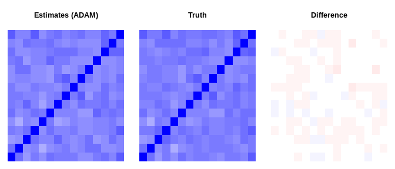
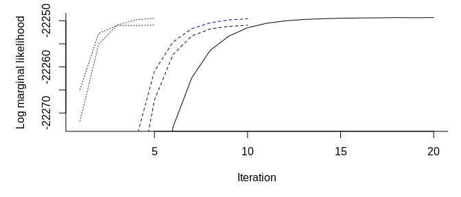

# mdgc

This package contains a marginal likelihood approach to estimating the
model discussed by D. Hoff (2007) and Zhao and Udell (2019). We have
modified the Fortran code by Genz and Bretz (2002) to supply an
approximation gradient for the log marginal likelihood and to use an
approximation of the marginal likelihood similar to the CDF
approximation in Genz and Bretz (2002).

However, the package can be useful for a lot of other models. For
instance, the methods are directly applicable to other Gaussian copula
models and some mixed effect models. All methods are implemented in C++,
support computation in parallel, and should easily be able to be ported
to other languages.

## Example

Below, we provide an example similar to Zhao and Udell (2019 Section
7.1). The authors use a data set with a random correlation matrix, 5
continuous variables, 5 binary variables, and 5 ordinal variables with 5
levels. There is a total of 2000 observations and 30% of the variables
are missing completely at random.

To summarize Zhao and Udell (2019) results, they show that their
approximate EM algorithm converges in what seems to be 20-25 seconds
while it takes more than 150 seconds for the MCMC algorithm used by D.
Hoff (2007). In essence, these figures should be kept in mind when
looking at the results below. Importantly, Zhao and Udell (2019) use an
approximation in the E-step of the EM algorithm which is fast but might
be crude is some settings. Using a potentially arbitrarily precise
approximation of the marginal likelihood is useful if this can be done
quickly enough.

To summarize, we do the following below:

1.  simulate the data set we will use.
2.  show how to use the C++ functions and that these provide an
    approximation of the log marginal likelihood and its gradient.
    Moreover, we show that the methods scales well in the number of
    threads.
3.  define functions to perform maximum likelihood estimation.
4.  estimate the parameters using a simple gradient descent algorithm
    and stochastic gradient descent using ADAM.
5.  show how to improve 4. by using better starting values which are
    quick to compute. As of this writing, this reduces the estimation
    time to less than 5 seconds using four threads and less than 13.5
    seconds using one thread.

Presumably/likely, computing the marginals of each variable should be
extremely fast, as should the imputation once the model parameters are
estimated. Given that this is true, then the main concern should be the
time it takes to estimate the model parameters. As we show, this can be
done quickly using our code.

``` r
library(mdgc)

# simulates a data set and puts it into a format to pass to C++.
#
# Args: 
#   n: number of observations. 
#   p: number of variables. 
#   n_lvls: number of levels for the ordinal variables. 
# 
# Returns: 
#   Simluated masked data set in the format needed to pass to C++.
sim_dat <- function(n, p = 4, n_lvls = 5L){
  # get the covariance matrix
  Sb <- diag(p)
  Sb[lower.tri(Sb)] <- Sb[upper.tri(Sb)] <- .5
  Sb <- Sb / p / 5
  Sig <- cov2cor(drop(rWishart(1L, 5L * p, Sb)))
  
  # draw the observations
  Z <- truth <- crossprod(chol(Sig), matrix(rnorm(n * p), p))
  
  # determine the type
  type <- rep(1:3, each = floor((p + 3 - 1) / 3))[1:p]
  is_con <- type == 1L
  is_bin <- type == 2L
  is_ord <- type == 3L
  
  # mask data 
  is_mask <- matrix(runif(n * p) < .3, p)
  Z[is_mask] <- NA_real_
  
  # set code arugment. Codes are:
  #  0: latent Z is observed (upper is the observed point).
  #  1: latent Z can be anything.
  #  2: latent Z is in an interval given by lower and upper.
  code <- matrix(0L, p, n)
  code[is_ord | is_bin, ] <- 2L
  code[is_mask] <- 1L
  
  # create upper and lower bounds
  upper <- lower <- matrix(NA_real_, p, n)
  lower[is_con, ] <- upper[is_con, ] <- truth[is_con, ]
  
  bs <- c(-Inf, 0, Inf)
  lower[is_bin, ] <- head(bs, -1)[cut(truth[is_bin, ], breaks = bs)]
  upper[is_bin, ] <- bs[-1]      [cut(truth[is_bin, ], breaks = bs)]
  
  bs <- qnorm(seq(0, 1, length.out = n_lvls + 1L))
  lower[is_ord, ] <- head(bs, -1)[cut(truth[is_ord, ], breaks = bs)]
  upper[is_ord, ] <- bs[-1]      [cut(truth[is_ord, ], breaks = bs)]
  
  lower[is_mask] <- upper[is_mask] <- NA_real_
  
  list(lower = lower, upper = upper, code = code, Sigma = Sig, 
       truth = truth)
}

# simulate and show the data. Data is stored in 
# [# variables] x [# observations] format
set.seed(1)
p <- 15L
dat <- sim_dat(2000L, p = p)
dat$lower[, 1:5] # lower bounds
#>          [,1]   [,2]   [,3]    [,4]   [,5]
#>  [1,] -0.1796 -0.652 -0.929      NA -1.467
#>  [2,]      NA -0.396 -1.754  0.0985     NA
#>  [3,]  0.5360 -1.967 -1.683  2.0384     NA
#>  [4,]  0.0677 -0.136     NA      NA     NA
#>  [5,]  0.1167     NA -1.279      NA     NA
#>  [6,]    -Inf   -Inf   -Inf  0.0000   -Inf
#>  [7,]      NA   -Inf  0.000  0.0000   -Inf
#>  [8,]      NA   -Inf     NA  0.0000     NA
#>  [9,]    -Inf  0.000     NA      NA   -Inf
#> [10,]  0.0000   -Inf     NA      NA   -Inf
#> [11,]    -Inf     NA -0.842      NA -0.253
#> [12,] -0.2533     NA   -Inf      NA   -Inf
#> [13,]    -Inf -0.842     NA -0.8416   -Inf
#> [14,]      NA   -Inf   -Inf      NA  0.253
#> [15,] -0.8416   -Inf   -Inf      NA   -Inf
dat$upper[, 1:5] # upper bounds
#>          [,1]   [,2]   [,3]    [,4]   [,5]
#>  [1,] -0.1796 -0.652 -0.929      NA -1.467
#>  [2,]      NA -0.396 -1.754  0.0985     NA
#>  [3,]  0.5360 -1.967 -1.683  2.0384     NA
#>  [4,]  0.0677 -0.136     NA      NA     NA
#>  [5,]  0.1167     NA -1.279      NA     NA
#>  [6,]  0.0000  0.000  0.000     Inf  0.000
#>  [7,]      NA  0.000    Inf     Inf  0.000
#>  [8,]      NA  0.000     NA     Inf     NA
#>  [9,]  0.0000    Inf     NA      NA  0.000
#> [10,]     Inf  0.000     NA      NA  0.000
#> [11,] -0.8416     NA -0.253      NA  0.253
#> [12,]  0.2533     NA -0.842      NA -0.842
#> [13,] -0.8416 -0.253     NA -0.2533 -0.842
#> [14,]      NA -0.842 -0.842      NA  0.842
#> [15,] -0.2533 -0.842 -0.842      NA -0.842
dat$code [, 1:5] # code for type of data
#>       [,1] [,2] [,3] [,4] [,5]
#>  [1,]    0    0    0    1    0
#>  [2,]    1    0    0    0    1
#>  [3,]    0    0    0    0    1
#>  [4,]    0    0    1    1    1
#>  [5,]    0    1    0    1    1
#>  [6,]    2    2    2    2    2
#>  [7,]    1    2    2    2    2
#>  [8,]    1    2    1    2    1
#>  [9,]    2    2    1    1    2
#> [10,]    2    2    1    1    2
#> [11,]    2    1    2    1    2
#> [12,]    2    1    2    1    2
#> [13,]    2    2    1    2    2
#> [14,]    1    2    2    1    2
#> [15,]    2    2    2    1    2
dat$truth[, 1:5] # true values
#>          [,1]   [,2]    [,3]    [,4]   [,5]
#>  [1,] -0.1796 -0.652 -0.9294 -0.1444 -1.467
#>  [2,] -0.1805 -0.396 -1.7539  0.0985 -0.342
#>  [3,]  0.5360 -1.967 -1.6828  2.0384 -0.592
#>  [4,]  0.0677 -0.136 -0.5009  0.8403  0.399
#>  [5,]  0.1167 -2.124 -1.2791  1.1416 -1.058
#>  [6,] -0.4768 -1.189 -1.9331  0.5362 -0.906
#>  [7,] -0.1970 -1.779  0.1310  0.5243 -1.221
#>  [8,]  0.0299 -1.685 -0.8426  0.5991 -0.911
#>  [9,] -0.4405  0.572 -1.1092  1.1539 -0.309
#> [10,]  0.3715 -1.284  0.0287  2.1279 -1.265
#> [11,] -1.0883 -1.854 -0.3069  1.7843 -0.092
#> [12,]  0.0737 -2.347 -1.6364  1.2509 -1.619
#> [13,] -1.3447 -0.675  0.8154 -0.2623 -1.528
#> [14,] -0.6888 -1.128 -0.9740  1.3349  0.280
#> [15,] -0.7121 -0.895 -1.2615  0.7079 -1.448

#####
# get pointers to objects in C++
system.time(
  ptr <- mdgc:::get_log_lm_terms(lower = dat$lower, upper = dat$upper, 
                                 code = dat$code))
#>    user  system elapsed 
#>   0.001   0.000   0.000

# approximates the log marginal likelihood function.
#
# Args: 
#   vcov: correlation matrix.
#   releps: relative error for each term. 
#   n_threads: number of threads. 
#   comp_derivs: logical for whether to approximate the gradient. 
#   indices: integer vector with which terms to include. 
#   do_reorder: logical for whether to use heuristic variable reordering.
log_ml <- function(vcov, releps = 1e-2, n_threads = 1L, comp_derivs = FALSE, 
                   indices = 0:(NCOL(dat$lower) - 1L), do_reorder = TRUE)
  mdgc:::eval_log_lm_terms(
    ptr = ptr, vcov = vcov, indices = indices, 
    maxpts = 100000L, abseps = -1, releps = releps, n_threads = n_threads, 
    comp_derivs = comp_derivs, do_reorder = do_reorder)

# print the approximate log marginal likelihood at the true parameters
set.seed(1)
print(log_ml(dat$Sigma), digits = 7)
#> [1] -22290.21

# check standard error
sd(replicate(20, log_ml(dat$Sigma, n_threads = 4L)))
#> [1] 0.0282

# without reordering
print(log_ml(dat$Sigma, n_threads = 4L, do_reorder = FALSE), digits = 7)
#> [1] -22290.13

# check standard error
sd(replicate(20, log_ml(dat$Sigma, n_threads = 4L, do_reorder = FALSE)))
#> [1] 0.0637

# check computation time
library(microbenchmark)
microbenchmark(
  `1 thread                 ` = 
    log_ml(dat$Sigma), 
  `1 thread  (w/o rordering)` = 
    log_ml(dat$Sigma, do_reorder = FALSE), 
  `2 threads                ` = 
    log_ml(dat$Sigma                    , n_threads = 2L),
  `2 threads (w/o rordering)` = 
    log_ml(dat$Sigma, do_reorder = FALSE, n_threads = 2L),
  `4 threads                ` = 
    log_ml(dat$Sigma                    , n_threads = 4L), 
  `4 threads (w/o rordering)` = 
    log_ml(dat$Sigma, do_reorder = FALSE, n_threads = 4L), 
  times = 5)
#> Unit: milliseconds
#>                       expr min  lq mean median  uq max neval
#>  1 thread                  539 546  549    547 554 556     5
#>  1 thread  (w/o rordering) 804 811  819    819 829 831     5
#>  2 threads                 269 273  274    275 275 278     5
#>  2 threads (w/o rordering) 403 423  427    426 429 454     5
#>  4 threads                 137 139  143    142 148 148     5
#>  4 threads (w/o rordering) 214 217  222    223 226 231     5

#####
# we can also get an approximation of the gradient
t1 <- log_ml(dat$Sigma, comp_derivs = TRUE)
t2 <- log_ml(dat$Sigma, comp_derivs = TRUE, n_threads = 4L)
all.equal(t1, t2, tolerance = 1e-2)
#> [1] TRUE
  
microbenchmark(
  `1 thread                 ` = 
    log_ml(dat$Sigma, comp_derivs = TRUE), 
  `1 thread  (w/o rordering)` = 
    log_ml(dat$Sigma, comp_derivs = TRUE, do_reorder = FALSE), 
  `2 threads                ` = 
    log_ml(dat$Sigma, comp_derivs = TRUE                    , n_threads = 2L),
  `2 threads (w/o rordering)` = 
    log_ml(dat$Sigma, comp_derivs = TRUE, do_reorder = FALSE, n_threads = 2L),
  `4 threads                ` = 
    log_ml(dat$Sigma, comp_derivs = TRUE                    , n_threads = 4L), 
  `4 threads (w/o rordering)` = 
    log_ml(dat$Sigma, comp_derivs = TRUE, do_reorder = FALSE, n_threads = 4L), 
  times = 5)
#> Unit: milliseconds
#>                       expr  min   lq mean median   uq  max neval
#>  1 thread                  2378 2397 2433   2431 2475 2482     5
#>  1 thread  (w/o rordering) 4213 4216 4254   4219 4263 4359     5
#>  2 threads                 1193 1201 1224   1220 1244 1262     5
#>  2 threads (w/o rordering) 2127 2130 2167   2141 2166 2271     5
#>  4 threads                  654  655  663    657  664  688     5
#>  4 threads (w/o rordering) 1123 1128 1158   1131 1189 1217     5

# creates a matrix from a log-Cholesky decomposition.
# 
# Args:
#   par: p (p + 1) / 2 elements in the log-Cholesky decomposition.
get_lchol_inv <- function(par){
  # use log-cholesky parametrization
  p <- (sqrt(8 * length(par) + 1) - 1) / 2
  L <- matrix(0, p, p)
  L[lower.tri(L, TRUE)] <- par
  diag(L) <- exp(diag(L))
  tcrossprod(L)
}

# creates the log-Cholesky decomposition. 
# 
# Args: 
#   par: positive definite matrix to decompose
get_lchol <- function(par){
  lSig <- t(chol(par))
  diag(lSig) <- log(diag(lSig))
  lSig[lower.tri(lSig, TRUE)]
}

Jac_dum <- mdgc:::get_commutation(p, p)
diag(Jac_dum) <- diag(Jac_dum) + 1

# computes the approximate log marginal likelihood. 
#
# Args:
#   par: log-Cholesky decomposition.
#   seed: seed to use.  
#   comp_derivs: logical for whether to approximate the gradient. 
#   n_threads: number of threads. 
#   releps: relative error for each term.
#   indices: integer vector with which terms to include. 
par_fn <- function(par, seed = NULL, comp_derivs = FALSE, 
                   n_threads = 1L, releps = 1e-2, 
                   indices = 0:(NCOL(dat$lower) - 1L)){
  if(!is.null(seed))
    set.seed(seed)
  Arg <- get_lchol_inv(par)
  
  res <- log_ml(Arg, comp_derivs = comp_derivs, indices = indices,
                n_threads = n_threads, releps = releps)
  log_ml <- c(res)
  if(comp_derivs){
    gr <- attr(res, "grad")
    tmp <- matrix(0, p, p)
    tmp[lower.tri(tmp, TRUE)] <- par
    diag(tmp) <- exp(diag(tmp))
    gr <- (c(gr) %*% Jac_dum) %*% (tmp %x% diag(p))
    gr <- gr[, lower.tri(tmp, TRUE)]
    idx_diag <- c(1L, 1L + cumsum(NCOL(tmp):2)) 
    gr[idx_diag] <- gr[idx_diag] * diag(tmp)
      
    attr(log_ml, "grad") <- gr
    
  }
  
  log_ml
}

# check that the function gives the correct log marginal likelihood
# approximation and gradient approximation.
lSig <- get_lchol(dat$Sigma)
r1 <- par_fn(lSig, comp_derivs = TRUE, n_threads = 4L, releps = 1e-3, 
             indices = 1:100)
r2 <- numDeriv::jacobian(par_fn, lSig, seed = 1L, n_threads = 6L, 
                         releps = 1e-3, indices = 1:100)
all.equal(attr(r1, "grad"), drop(r2), tolerance = 1e-2)
#> [1] TRUE

#####
# performs gradient descent. 
# 
# Args: 
#   val: starting value. 
#   step_start: starting value for the step length. 
#   n_threads: number of threads to use. 
#   maxit: maximum number of iteration. 
#   eps: convergence threshold to use. 
#   seed: seed to use.
naiv_gradient_descent <- function(val, step_start, n_threads = 4L, 
                                  maxit = 10L, eps = 1e-3, seed = 1L){
  fun_vals <- step_sizes <- rep(NA_real_, maxit)
  
  for(i in 1:maxit){
    gr <- par_fn(val, comp_derivs = TRUE, n_threads = n_threads, 
                 seed = seed)
    fun_vals[i] <- prev_fun <- c(gr)
    dir <- attr(gr, "grad")
    step <- step_start
    if(sqrt(sum(dir^2)) < eps)
      break
    
    max_j <- 11L
    for(j in 1:max_j){
      if(j == max_j)
        warning("Failed to find a decrease")
      new_val <- val + step * dir
      new_val <- get_lchol(cov2cor(get_lchol_inv(new_val)))
      new_fun <- par_fn(new_val, comp_derivs = FALSE, n_threads = n_threads, 
                        seed = seed)
      if(new_fun > prev_fun){
        val <- new_val
        break
      }
      step <- step / 2
    }
    
    step_sizes[i] <- step
  }
  
  list(result = get_lchol_inv(val), logml = prev_fun, 
       nit = i, step_sizes = step_sizes, fun_vals = fun_vals)
}

# estimate model parameters
start_val <- numeric(p * (p + 1) / 2)
system.time(res <- naiv_gradient_descent(val = start_val, step_start = .001, 
                                         maxit = 20L, eps = 1e-2))
#>    user  system elapsed 
#>    73.9     0.0    19.1

# compare estimates with truth
norm(res$result - dat$Sigma)
#> [1] 0.374
res$result
#>        [,1]  [,2]  [,3]  [,4]  [,5]  [,6]  [,7]  [,8]  [,9] [,10] [,11] [,12]
#>  [1,] 1.000 0.539 0.407 0.505 0.456 0.556 0.491 0.517 0.497 0.439 0.434 0.509
#>  [2,] 0.539 1.000 0.435 0.485 0.318 0.431 0.465 0.503 0.439 0.494 0.535 0.534
#>  [3,] 0.407 0.435 1.000 0.542 0.471 0.491 0.579 0.468 0.424 0.484 0.546 0.411
#>  [4,] 0.505 0.485 0.542 1.000 0.455 0.539 0.475 0.458 0.521 0.447 0.432 0.467
#>  [5,] 0.456 0.318 0.471 0.455 1.000 0.505 0.367 0.414 0.485 0.423 0.422 0.493
#>  [6,] 0.556 0.431 0.491 0.539 0.505 1.000 0.474 0.487 0.467 0.411 0.399 0.567
#>  [7,] 0.491 0.465 0.579 0.475 0.367 0.474 1.000 0.516 0.434 0.560 0.527 0.491
#>  [8,] 0.517 0.503 0.468 0.458 0.414 0.487 0.516 1.000 0.502 0.630 0.376 0.523
#>  [9,] 0.497 0.439 0.424 0.521 0.485 0.467 0.434 0.502 1.000 0.462 0.448 0.438
#> [10,] 0.439 0.494 0.484 0.447 0.423 0.411 0.560 0.630 0.462 1.000 0.530 0.434
#> [11,] 0.434 0.535 0.546 0.432 0.422 0.399 0.527 0.376 0.448 0.530 1.000 0.437
#> [12,] 0.509 0.534 0.411 0.467 0.493 0.567 0.491 0.523 0.438 0.434 0.437 1.000
#> [13,] 0.549 0.455 0.452 0.480 0.488 0.505 0.563 0.532 0.545 0.468 0.472 0.448
#> [14,] 0.478 0.427 0.549 0.518 0.524 0.551 0.454 0.437 0.488 0.423 0.451 0.429
#> [15,] 0.609 0.474 0.475 0.628 0.442 0.511 0.536 0.456 0.499 0.539 0.479 0.477
#>       [,13] [,14] [,15]
#>  [1,] 0.549 0.478 0.609
#>  [2,] 0.455 0.427 0.474
#>  [3,] 0.452 0.549 0.475
#>  [4,] 0.480 0.518 0.628
#>  [5,] 0.488 0.524 0.442
#>  [6,] 0.505 0.551 0.511
#>  [7,] 0.563 0.454 0.536
#>  [8,] 0.532 0.437 0.456
#>  [9,] 0.545 0.488 0.499
#> [10,] 0.468 0.423 0.539
#> [11,] 0.472 0.451 0.479
#> [12,] 0.448 0.429 0.477
#> [13,] 1.000 0.608 0.614
#> [14,] 0.608 1.000 0.535
#> [15,] 0.614 0.535 1.000
dat$Sigma
#>        [,1]  [,2]  [,3]  [,4]  [,5]  [,6]  [,7]  [,8]  [,9] [,10] [,11] [,12]
#>  [1,] 1.000 0.534 0.394 0.521 0.449 0.536 0.469 0.508 0.528 0.457 0.446 0.504
#>  [2,] 0.534 1.000 0.417 0.500 0.319 0.414 0.486 0.524 0.473 0.504 0.521 0.517
#>  [3,] 0.394 0.417 1.000 0.570 0.509 0.461 0.551 0.516 0.467 0.502 0.528 0.461
#>  [4,] 0.521 0.500 0.570 1.000 0.489 0.540 0.500 0.458 0.550 0.474 0.471 0.504
#>  [5,] 0.449 0.319 0.509 0.489 1.000 0.484 0.383 0.426 0.491 0.456 0.451 0.496
#>  [6,] 0.536 0.414 0.461 0.540 0.484 1.000 0.475 0.459 0.461 0.393 0.409 0.555
#>  [7,] 0.469 0.486 0.551 0.500 0.383 0.475 1.000 0.500 0.438 0.556 0.523 0.516
#>  [8,] 0.508 0.524 0.516 0.458 0.426 0.459 0.500 1.000 0.502 0.612 0.416 0.507
#>  [9,] 0.528 0.473 0.467 0.550 0.491 0.461 0.438 0.502 1.000 0.475 0.506 0.452
#> [10,] 0.457 0.504 0.502 0.474 0.456 0.393 0.556 0.612 0.475 1.000 0.514 0.420
#> [11,] 0.446 0.521 0.528 0.471 0.451 0.409 0.523 0.416 0.506 0.514 1.000 0.420
#> [12,] 0.504 0.517 0.461 0.504 0.496 0.555 0.516 0.507 0.452 0.420 0.420 1.000
#> [13,] 0.517 0.469 0.445 0.465 0.498 0.454 0.545 0.531 0.569 0.469 0.480 0.450
#> [14,] 0.476 0.445 0.565 0.533 0.548 0.544 0.474 0.473 0.513 0.421 0.515 0.433
#> [15,] 0.627 0.506 0.495 0.638 0.481 0.535 0.514 0.511 0.539 0.537 0.493 0.488
#>       [,13] [,14] [,15]
#>  [1,] 0.517 0.476 0.627
#>  [2,] 0.469 0.445 0.506
#>  [3,] 0.445 0.565 0.495
#>  [4,] 0.465 0.533 0.638
#>  [5,] 0.498 0.548 0.481
#>  [6,] 0.454 0.544 0.535
#>  [7,] 0.545 0.474 0.514
#>  [8,] 0.531 0.473 0.511
#>  [9,] 0.569 0.513 0.539
#> [10,] 0.469 0.421 0.537
#> [11,] 0.480 0.515 0.493
#> [12,] 0.450 0.433 0.488
#> [13,] 1.000 0.598 0.615
#> [14,] 0.598 1.000 0.548
#> [15,] 0.615 0.548 1.000

# or plot both of them and compare
do_plot <- function(x, main){
  sc <- colorRampPalette(c("Red", "White", "Blue"))(50)
  image(x, main = main, col = sc, zlim = c(-1, 1), xaxt = "n", yaxt = "n", 
        bty = "n")
}
par(mfcol = c(1, 3), mar  = c(1, 1, 4, 1))
do_plot(res$result, "Estimates")
do_plot(dat$Sigma, "Truth")
do_plot(res$result - dat$Sigma, "Difference")
```


``` r

res$fun_vals # log marginal likelihood estimates at each iteration
#>  [1] -26054 -23001 -22643 -22430 -22298 -22284 -22264 -22260 -22254 -22253
#> [11] -22251 -22250 -22250 -22249 -22249 -22249 -22249 -22249 -22249 -22249

#####
# performs stochastic gradient descent instead (using ADAM).
# 
# Args: 
#   val: starting value. 
#   batch_size: number of observations in each batch. 
#   n_threads: number of threads to use. 
#   maxit: maximum number of iteration. 
#   seed: seed to use.
#   epsilon, alpha, beta_1, beta_2: ADAM parameters.
adam <- function(val, batch_size, n_threads = 4L, maxit = 10L, 
                 seed = 1L, epsilon = 1e-8, alpha = .001, beta_1 = .9, 
                 beta_2 = .999){
  indices <- sample(0:(NCOL(dat$lower) - 1L), replace = FALSE)
  blocks <- tapply(indices, (seq_along(indices) - 1L) %/% batch_size, 
                   identity, simplify = FALSE)
  
  n_blocks <- length(blocks)
  n_par <- length(val)
  m <- v <- numeric(n_par)
  fun_vals <- numeric(maxit)
  estimates <- matrix(NA_real_, n_par, maxit)
  i <- -1L
  
  for(k in 1:maxit){
    for(ii in 1:n_blocks){
      i <- i + 1L
      idx_b <- (i %% n_blocks) + 1L
      m_old <- m
      v_old <- v
      res <- par_fn(val, comp_derivs = TRUE, n_threads = n_threads, 
                    seed = seed, indices = blocks[[idx_b]])
      fun_vals[(i %/% n_blocks) + 1L] <- 
        fun_vals[(i %/% n_blocks) + 1L] + c(res)
      
      gr <- attr(res, "grad")
      
      m <- beta_1 * m_old + (1 - beta_1) * gr
      v <- beta_2 * v_old + (1 - beta_2) * gr^2
      
      m_hat <- m / (1 - beta_1^(i + 1))
      v_hat <- v / (1 - beta_2^(i + 1))
      
      val <- val + alpha * m_hat / (sqrt(v_hat) + epsilon)
      val <- get_lchol(cov2cor(get_lchol_inv(val)))
    }
    
    estimates[, k] <- val
  }
  
  list(result = get_lchol_inv(val), fun_vals = fun_vals, 
       estimates = estimates)
}

# estimate the model parameters
set.seed(1)
system.time(res_adam  <- adam(
  val = start_val, alpha = 1e-2, maxit = 10L, batch_size = 100L))
#>    user  system elapsed 
#>  34.285   0.004   9.286

# compare estimates with the truth
norm(res_adam$result - dat$Sigma)
#> [1] 0.378
res_adam$result
#>        [,1]  [,2]  [,3]  [,4]  [,5]  [,6]  [,7]  [,8]  [,9] [,10] [,11] [,12]
#>  [1,] 1.000 0.540 0.400 0.497 0.445 0.555 0.490 0.517 0.493 0.435 0.436 0.501
#>  [2,] 0.540 1.000 0.435 0.485 0.314 0.434 0.471 0.510 0.439 0.493 0.540 0.535
#>  [3,] 0.400 0.435 1.000 0.532 0.461 0.489 0.575 0.465 0.421 0.480 0.545 0.409
#>  [4,] 0.497 0.485 0.532 1.000 0.443 0.539 0.473 0.457 0.519 0.446 0.430 0.458
#>  [5,] 0.445 0.314 0.461 0.443 1.000 0.505 0.361 0.403 0.480 0.414 0.422 0.487
#>  [6,] 0.555 0.434 0.489 0.539 0.505 1.000 0.475 0.488 0.467 0.409 0.402 0.569
#>  [7,] 0.490 0.471 0.575 0.473 0.361 0.475 1.000 0.518 0.431 0.560 0.524 0.494
#>  [8,] 0.517 0.510 0.465 0.457 0.403 0.488 0.518 1.000 0.498 0.632 0.378 0.515
#>  [9,] 0.493 0.439 0.421 0.519 0.480 0.467 0.431 0.498 1.000 0.457 0.446 0.431
#> [10,] 0.435 0.493 0.480 0.446 0.414 0.409 0.560 0.632 0.457 1.000 0.522 0.430
#> [11,] 0.436 0.540 0.545 0.430 0.422 0.402 0.524 0.378 0.446 0.522 1.000 0.438
#> [12,] 0.501 0.535 0.409 0.458 0.487 0.569 0.494 0.515 0.431 0.430 0.438 1.000
#> [13,] 0.540 0.451 0.444 0.473 0.485 0.502 0.560 0.531 0.541 0.465 0.473 0.439
#> [14,] 0.469 0.434 0.553 0.512 0.512 0.549 0.451 0.434 0.484 0.421 0.451 0.429
#> [15,] 0.607 0.481 0.478 0.622 0.431 0.511 0.540 0.458 0.495 0.536 0.484 0.477
#>       [,13] [,14] [,15]
#>  [1,] 0.540 0.469 0.607
#>  [2,] 0.451 0.434 0.481
#>  [3,] 0.444 0.553 0.478
#>  [4,] 0.473 0.512 0.622
#>  [5,] 0.485 0.512 0.431
#>  [6,] 0.502 0.549 0.511
#>  [7,] 0.560 0.451 0.540
#>  [8,] 0.531 0.434 0.458
#>  [9,] 0.541 0.484 0.495
#> [10,] 0.465 0.421 0.536
#> [11,] 0.473 0.451 0.484
#> [12,] 0.439 0.429 0.477
#> [13,] 1.000 0.599 0.605
#> [14,] 0.599 1.000 0.528
#> [15,] 0.605 0.528 1.000
dat$Sigma
#>        [,1]  [,2]  [,3]  [,4]  [,5]  [,6]  [,7]  [,8]  [,9] [,10] [,11] [,12]
#>  [1,] 1.000 0.534 0.394 0.521 0.449 0.536 0.469 0.508 0.528 0.457 0.446 0.504
#>  [2,] 0.534 1.000 0.417 0.500 0.319 0.414 0.486 0.524 0.473 0.504 0.521 0.517
#>  [3,] 0.394 0.417 1.000 0.570 0.509 0.461 0.551 0.516 0.467 0.502 0.528 0.461
#>  [4,] 0.521 0.500 0.570 1.000 0.489 0.540 0.500 0.458 0.550 0.474 0.471 0.504
#>  [5,] 0.449 0.319 0.509 0.489 1.000 0.484 0.383 0.426 0.491 0.456 0.451 0.496
#>  [6,] 0.536 0.414 0.461 0.540 0.484 1.000 0.475 0.459 0.461 0.393 0.409 0.555
#>  [7,] 0.469 0.486 0.551 0.500 0.383 0.475 1.000 0.500 0.438 0.556 0.523 0.516
#>  [8,] 0.508 0.524 0.516 0.458 0.426 0.459 0.500 1.000 0.502 0.612 0.416 0.507
#>  [9,] 0.528 0.473 0.467 0.550 0.491 0.461 0.438 0.502 1.000 0.475 0.506 0.452
#> [10,] 0.457 0.504 0.502 0.474 0.456 0.393 0.556 0.612 0.475 1.000 0.514 0.420
#> [11,] 0.446 0.521 0.528 0.471 0.451 0.409 0.523 0.416 0.506 0.514 1.000 0.420
#> [12,] 0.504 0.517 0.461 0.504 0.496 0.555 0.516 0.507 0.452 0.420 0.420 1.000
#> [13,] 0.517 0.469 0.445 0.465 0.498 0.454 0.545 0.531 0.569 0.469 0.480 0.450
#> [14,] 0.476 0.445 0.565 0.533 0.548 0.544 0.474 0.473 0.513 0.421 0.515 0.433
#> [15,] 0.627 0.506 0.495 0.638 0.481 0.535 0.514 0.511 0.539 0.537 0.493 0.488
#>       [,13] [,14] [,15]
#>  [1,] 0.517 0.476 0.627
#>  [2,] 0.469 0.445 0.506
#>  [3,] 0.445 0.565 0.495
#>  [4,] 0.465 0.533 0.638
#>  [5,] 0.498 0.548 0.481
#>  [6,] 0.454 0.544 0.535
#>  [7,] 0.545 0.474 0.514
#>  [8,] 0.531 0.473 0.511
#>  [9,] 0.569 0.513 0.539
#> [10,] 0.469 0.421 0.537
#> [11,] 0.480 0.515 0.493
#> [12,] 0.450 0.433 0.488
#> [13,] 1.000 0.598 0.615
#> [14,] 0.598 1.000 0.548
#> [15,] 0.615 0.548 1.000

# use plot instead
par(mfcol = c(1, 3), mar  = c(1, 1, 4, 1))
do_plot(res_adam$result, "Estimates (ADAM)")
do_plot(dat$Sigma, "Truth")
do_plot(res_adam$result - dat$Sigma, "Difference")
```


``` r

# look at the maximum log marginal likelihood both at the end and after 
# each iteration
log_ml(res_adam$result)
#> [1] -22251
funvals_adam_org <- 
  apply(res_adam$estimates, 2L, function(x) log_ml(get_lchol_inv(x)))
funvals_adam_org
#>  [1] -23063 -22506 -22339 -22289 -22267 -22257 -22253 -22252 -22251 -22251
res_adam$fun_vals # likely lower bounds on the log-marginal likelihood
#>  [1] -24144 -22755 -22427 -22333 -22302 -22288 -22282 -22279 -22278 -22278
res_adam_org <- res_adam

#####
# performs stochastic gradient descent instead (using SVRG).
# 
# Args: 
#   val: starting value. 
#   batch_size: number of observations in each batch. 
#   n_threads: number of threads to use. 
#   maxit: maximum number of iteration. 
#   seed: seed to use.
#   lr: learning rate. 
svrg <- function(val, batch_size, n_threads = 4L, maxit = 10L, 
                 seed = 1L, lr){
  all_indices <- 0:(NCOL(dat$lower) - 1L)
  indices <- sample(all_indices, replace = FALSE)
  blocks <- tapply(indices, (seq_along(indices) - 1L) %/% batch_size, 
                   identity, simplify = FALSE)
  
  n_blocks <- length(blocks)
  n_par <- length(val)
  estimates <- matrix(NA_real_, n_par, maxit + 1L)
  fun_vals <- numeric(maxit + 1L)
  estimates[, 1L] <- val
  
  for(k in 1:maxit + 1L){
    old_val <- estimates[, k - 1L]
    old_grs <- sapply(1:n_blocks - 1L, function(ii){
      idx_b <- (ii %% n_blocks) + 1L
      res_old <- par_fn(old_val, comp_derivs = TRUE, n_threads = n_threads, 
                        seed = seed, indices = blocks[[idx_b]])
      c(res_old, attr(res_old, "grad"))
    })
    
    fun_vals[k - 1L] <- sum(old_grs[1, ])
    old_grs <- old_grs[-1L, , drop = FALSE ]
    old_gr <- rowSums(old_grs) / n_blocks
    
    for(ii in 1:n_blocks - 1L){
      idx_b <- (ii %% n_blocks) + 1L
      res <- par_fn(val, comp_derivs = TRUE, n_threads = n_threads, 
                    seed = seed, indices = blocks[[idx_b]])
      fun_vals[k] <- fun_vals[k] + c(res)
      dir <- attr(res, "grad") - old_grs[, ii + 1L] + old_gr
      
      val <- val + lr * dir
      val <- get_lchol(cov2cor(get_lchol_inv(val)))
    }
    
    estimates[, k] <- val
  }
  
  list(result = get_lchol_inv(val), fun_vals = fun_vals[-1L], 
       estimates = estimates[, -1L, drop = FALSE])
}

# estimate the model parameters
set.seed(1)
system.time(res_svrg  <- svrg(
  val = start_val, lr = 1e-3, maxit = 10L, batch_size = 100L))
#>    user  system elapsed 
#>  66.114   0.076  17.919

# compare estimates with the truth
norm(res_svrg$result - dat$Sigma)
#> [1] 0.371
res_svrg$result
#>        [,1]  [,2]  [,3]  [,4]  [,5]  [,6]  [,7]  [,8]  [,9] [,10] [,11] [,12]
#>  [1,] 1.000 0.535 0.402 0.498 0.451 0.550 0.482 0.510 0.490 0.429 0.427 0.504
#>  [2,] 0.535 1.000 0.436 0.483 0.317 0.430 0.465 0.503 0.438 0.494 0.534 0.534
#>  [3,] 0.402 0.436 1.000 0.542 0.471 0.490 0.579 0.468 0.424 0.483 0.546 0.411
#>  [4,] 0.498 0.483 0.542 1.000 0.455 0.539 0.476 0.458 0.521 0.447 0.432 0.467
#>  [5,] 0.451 0.317 0.471 0.455 1.000 0.505 0.367 0.414 0.484 0.422 0.422 0.493
#>  [6,] 0.550 0.430 0.490 0.539 0.505 1.000 0.475 0.488 0.468 0.415 0.399 0.567
#>  [7,] 0.482 0.465 0.579 0.476 0.367 0.475 1.000 0.514 0.433 0.556 0.525 0.490
#>  [8,] 0.510 0.503 0.468 0.458 0.414 0.488 0.514 1.000 0.500 0.625 0.374 0.521
#>  [9,] 0.490 0.438 0.424 0.521 0.484 0.468 0.433 0.500 1.000 0.462 0.447 0.437
#> [10,] 0.429 0.494 0.483 0.447 0.422 0.415 0.556 0.625 0.462 1.000 0.528 0.433
#> [11,] 0.427 0.534 0.546 0.432 0.422 0.399 0.525 0.374 0.447 0.528 1.000 0.436
#> [12,] 0.504 0.534 0.411 0.467 0.493 0.567 0.490 0.521 0.437 0.433 0.436 1.000
#> [13,] 0.544 0.455 0.452 0.479 0.487 0.505 0.561 0.531 0.544 0.467 0.472 0.448
#> [14,] 0.472 0.427 0.549 0.518 0.523 0.551 0.453 0.436 0.487 0.422 0.451 0.428
#> [15,] 0.605 0.473 0.474 0.627 0.441 0.512 0.533 0.454 0.498 0.538 0.477 0.476
#>       [,13] [,14] [,15]
#>  [1,] 0.544 0.472 0.605
#>  [2,] 0.455 0.427 0.473
#>  [3,] 0.452 0.549 0.474
#>  [4,] 0.479 0.518 0.627
#>  [5,] 0.487 0.523 0.441
#>  [6,] 0.505 0.551 0.512
#>  [7,] 0.561 0.453 0.533
#>  [8,] 0.531 0.436 0.454
#>  [9,] 0.544 0.487 0.498
#> [10,] 0.467 0.422 0.538
#> [11,] 0.472 0.451 0.477
#> [12,] 0.448 0.428 0.476
#> [13,] 1.000 0.607 0.613
#> [14,] 0.607 1.000 0.534
#> [15,] 0.613 0.534 1.000
dat$Sigma
#>        [,1]  [,2]  [,3]  [,4]  [,5]  [,6]  [,7]  [,8]  [,9] [,10] [,11] [,12]
#>  [1,] 1.000 0.534 0.394 0.521 0.449 0.536 0.469 0.508 0.528 0.457 0.446 0.504
#>  [2,] 0.534 1.000 0.417 0.500 0.319 0.414 0.486 0.524 0.473 0.504 0.521 0.517
#>  [3,] 0.394 0.417 1.000 0.570 0.509 0.461 0.551 0.516 0.467 0.502 0.528 0.461
#>  [4,] 0.521 0.500 0.570 1.000 0.489 0.540 0.500 0.458 0.550 0.474 0.471 0.504
#>  [5,] 0.449 0.319 0.509 0.489 1.000 0.484 0.383 0.426 0.491 0.456 0.451 0.496
#>  [6,] 0.536 0.414 0.461 0.540 0.484 1.000 0.475 0.459 0.461 0.393 0.409 0.555
#>  [7,] 0.469 0.486 0.551 0.500 0.383 0.475 1.000 0.500 0.438 0.556 0.523 0.516
#>  [8,] 0.508 0.524 0.516 0.458 0.426 0.459 0.500 1.000 0.502 0.612 0.416 0.507
#>  [9,] 0.528 0.473 0.467 0.550 0.491 0.461 0.438 0.502 1.000 0.475 0.506 0.452
#> [10,] 0.457 0.504 0.502 0.474 0.456 0.393 0.556 0.612 0.475 1.000 0.514 0.420
#> [11,] 0.446 0.521 0.528 0.471 0.451 0.409 0.523 0.416 0.506 0.514 1.000 0.420
#> [12,] 0.504 0.517 0.461 0.504 0.496 0.555 0.516 0.507 0.452 0.420 0.420 1.000
#> [13,] 0.517 0.469 0.445 0.465 0.498 0.454 0.545 0.531 0.569 0.469 0.480 0.450
#> [14,] 0.476 0.445 0.565 0.533 0.548 0.544 0.474 0.473 0.513 0.421 0.515 0.433
#> [15,] 0.627 0.506 0.495 0.638 0.481 0.535 0.514 0.511 0.539 0.537 0.493 0.488
#>       [,13] [,14] [,15]
#>  [1,] 0.517 0.476 0.627
#>  [2,] 0.469 0.445 0.506
#>  [3,] 0.445 0.565 0.495
#>  [4,] 0.465 0.533 0.638
#>  [5,] 0.498 0.548 0.481
#>  [6,] 0.454 0.544 0.535
#>  [7,] 0.545 0.474 0.514
#>  [8,] 0.531 0.473 0.511
#>  [9,] 0.569 0.513 0.539
#> [10,] 0.469 0.421 0.537
#> [11,] 0.480 0.515 0.493
#> [12,] 0.450 0.433 0.488
#> [13,] 1.000 0.598 0.615
#> [14,] 0.598 1.000 0.548
#> [15,] 0.615 0.548 1.000

# use plot instead
par(mfcol = c(1, 3), mar  = c(1, 1, 4, 1))
do_plot(res_svrg$result, "Estimates (SVRG)")
do_plot(dat$Sigma, "Truth")
do_plot(res_svrg$result - dat$Sigma, "Difference")
```


``` r

# look at the maximum log marginal likelihood both at the end and after 
# each iteration
funvals_svrg_org <- res_svrg$fun_vals
funvals_svrg_org[length(funvals_svrg_org)] <- log_ml(res_svrg$result)
funvals_svrg_org
#>  [1] -22885 -22437 -22316 -22276 -22261 -22255 -22252 -22250 -22250 -22250

#####
# we can use better starting values. E.g. something heuristic like: 
#   - transform back into the [0, 1] scale. 
#   - take the middle of the interval and map back. 
#   - compute the partial correlations. 
get_z_hat <- function(lower, upper, code){
  out <- mapply(function(l, u, co){
    if(co <= 1)
      return(u)
    
    a <- if(is.infinite(l)) 0 else pnorm(l)
    b <- if(is.infinite(u)) 1 else pnorm(u)
    qnorm((a + b) / 2)
  }, l = lower, u = upper, c = code)
  dim(out) <- dim(lower)
  out
}
tmp <- get_z_hat(dat$lower, dat$upper, dat$code)

# we also have a C++ function to do this which is faster
all.equal(tmp, mdgc:::get_z_hat(
  dat$lower, dat$upper, dat$code, n_threads = 4L))
#> [1] TRUE

# the latter is faster but both are relatively fast
microbenchmark(
  `R version  ` = get_z_hat(dat$lower, dat$upper, dat$code), 
  `C++ verison` = mdgc:::get_z_hat(
  dat$lower, dat$upper, dat$code, n_threads = 4L), times = 10)
#> Unit: microseconds
#>         expr   min    lq  mean median    uq   max neval
#>  R version   67455 69697 73202  72135 74834 86831    10
#>  C++ verison   613   626   641    646   651   667    10

# then we can compute an approximation of the covariance matrix as follows
system.time(chat <- cov2cor(cov(t(tmp), use = "pairwise.complete.obs")))
#>    user  system elapsed 
#>   0.002   0.000   0.003

# the starting value is already quite close
par(mfcol = c(1, 3), mar  = c(1, 1, 4, 1))
norm(chat - dat$Sigma)
#> [1] 2.02
do_plot(chat, "Starting value")
do_plot(dat$Sigma, "Truth")
do_plot(chat - dat$Sigma, "Difference")
```


``` r

# run ADAM again 
start_val <- get_lchol(chat)
set.seed(1)
system.time(res_adam  <- adam(
  val = start_val, alpha = 1e-2, maxit = 5L, batch_size = 100L))
#>    user  system elapsed 
#>  15.956   0.004   4.239

# for comparisons, we also run the code using one thread
set.seed(1)
system.time(res_adam_ser  <- adam(
  val = start_val, alpha = 1e-2, maxit = 5L, batch_size = 100L, 
  n_threads = 1L))
#>    user  system elapsed 
#>  12.253   0.016  12.270

# we get (roughly) the same
norm(res_adam$result - res_adam_ser$result)
#> [1] 0.0049

# plot estimate
par(mfcol = c(1, 3), mar  = c(1, 1, 4, 1))
norm(res_adam$result - dat$Sigma)
#> [1] 0.378
do_plot(res_adam$result, "Estimates (ADAM)")
do_plot(dat$Sigma, "Truth")
do_plot(res_adam$result - dat$Sigma, "Difference")
```



``` r

# check log marginal likelihood like before
log_ml(res_adam$result)
#> [1] -22251
funvals_adam <- 
  apply(res_adam$estimates, 2L, function(x) log_ml(get_lchol_inv(x)))
funvals_adam
#> [1] -22265 -22253 -22251 -22251 -22251
res_adam$fun_vals # likely lower bounds on the log-marginal likelihood
#> [1] -22355 -22276 -22281 -22280 -22279

# do the same with SVRG
set.seed(1)
system.time(res_svrg  <- svrg(
  val = start_val, lr = 1e-3, maxit = 5L, batch_size = 100L))
#>    user  system elapsed 
#>  31.754   0.004   8.586

# compare estimates with the truth
norm(res_svrg$result - dat$Sigma)
#> [1] 0.383
res_svrg$result
#>        [,1]  [,2]  [,3]  [,4]  [,5]  [,6]  [,7]  [,8]  [,9] [,10] [,11] [,12]
#>  [1,] 1.000 0.540 0.410 0.504 0.456 0.557 0.491 0.516 0.496 0.438 0.434 0.509
#>  [2,] 0.540 1.000 0.434 0.481 0.315 0.428 0.461 0.500 0.434 0.490 0.532 0.532
#>  [3,] 0.410 0.434 1.000 0.541 0.471 0.490 0.577 0.466 0.422 0.481 0.546 0.410
#>  [4,] 0.504 0.481 0.541 1.000 0.456 0.538 0.475 0.457 0.520 0.446 0.432 0.466
#>  [5,] 0.456 0.315 0.471 0.456 1.000 0.505 0.367 0.413 0.483 0.419 0.421 0.492
#>  [6,] 0.557 0.428 0.490 0.538 0.505 1.000 0.470 0.482 0.464 0.410 0.398 0.564
#>  [7,] 0.491 0.461 0.577 0.475 0.367 0.470 1.000 0.513 0.430 0.549 0.523 0.489
#>  [8,] 0.516 0.500 0.466 0.457 0.413 0.482 0.513 1.000 0.495 0.615 0.373 0.519
#>  [9,] 0.496 0.434 0.422 0.520 0.483 0.464 0.430 0.495 1.000 0.458 0.445 0.437
#> [10,] 0.438 0.490 0.481 0.446 0.419 0.410 0.549 0.615 0.458 1.000 0.526 0.432
#> [11,] 0.434 0.532 0.546 0.432 0.421 0.398 0.523 0.373 0.445 0.526 1.000 0.435
#> [12,] 0.509 0.532 0.410 0.466 0.492 0.564 0.489 0.519 0.437 0.432 0.435 1.000
#> [13,] 0.549 0.452 0.451 0.479 0.487 0.503 0.559 0.528 0.543 0.467 0.471 0.448
#> [14,] 0.478 0.424 0.548 0.518 0.523 0.549 0.452 0.434 0.485 0.422 0.450 0.428
#> [15,] 0.609 0.471 0.474 0.627 0.441 0.510 0.532 0.453 0.497 0.537 0.477 0.476
#>       [,13] [,14] [,15]
#>  [1,] 0.549 0.478 0.609
#>  [2,] 0.452 0.424 0.471
#>  [3,] 0.451 0.548 0.474
#>  [4,] 0.479 0.518 0.627
#>  [5,] 0.487 0.523 0.441
#>  [6,] 0.503 0.549 0.510
#>  [7,] 0.559 0.452 0.532
#>  [8,] 0.528 0.434 0.453
#>  [9,] 0.543 0.485 0.497
#> [10,] 0.467 0.422 0.537
#> [11,] 0.471 0.450 0.477
#> [12,] 0.448 0.428 0.476
#> [13,] 1.000 0.607 0.613
#> [14,] 0.607 1.000 0.535
#> [15,] 0.613 0.535 1.000
dat$Sigma
#>        [,1]  [,2]  [,3]  [,4]  [,5]  [,6]  [,7]  [,8]  [,9] [,10] [,11] [,12]
#>  [1,] 1.000 0.534 0.394 0.521 0.449 0.536 0.469 0.508 0.528 0.457 0.446 0.504
#>  [2,] 0.534 1.000 0.417 0.500 0.319 0.414 0.486 0.524 0.473 0.504 0.521 0.517
#>  [3,] 0.394 0.417 1.000 0.570 0.509 0.461 0.551 0.516 0.467 0.502 0.528 0.461
#>  [4,] 0.521 0.500 0.570 1.000 0.489 0.540 0.500 0.458 0.550 0.474 0.471 0.504
#>  [5,] 0.449 0.319 0.509 0.489 1.000 0.484 0.383 0.426 0.491 0.456 0.451 0.496
#>  [6,] 0.536 0.414 0.461 0.540 0.484 1.000 0.475 0.459 0.461 0.393 0.409 0.555
#>  [7,] 0.469 0.486 0.551 0.500 0.383 0.475 1.000 0.500 0.438 0.556 0.523 0.516
#>  [8,] 0.508 0.524 0.516 0.458 0.426 0.459 0.500 1.000 0.502 0.612 0.416 0.507
#>  [9,] 0.528 0.473 0.467 0.550 0.491 0.461 0.438 0.502 1.000 0.475 0.506 0.452
#> [10,] 0.457 0.504 0.502 0.474 0.456 0.393 0.556 0.612 0.475 1.000 0.514 0.420
#> [11,] 0.446 0.521 0.528 0.471 0.451 0.409 0.523 0.416 0.506 0.514 1.000 0.420
#> [12,] 0.504 0.517 0.461 0.504 0.496 0.555 0.516 0.507 0.452 0.420 0.420 1.000
#> [13,] 0.517 0.469 0.445 0.465 0.498 0.454 0.545 0.531 0.569 0.469 0.480 0.450
#> [14,] 0.476 0.445 0.565 0.533 0.548 0.544 0.474 0.473 0.513 0.421 0.515 0.433
#> [15,] 0.627 0.506 0.495 0.638 0.481 0.535 0.514 0.511 0.539 0.537 0.493 0.488
#>       [,13] [,14] [,15]
#>  [1,] 0.517 0.476 0.627
#>  [2,] 0.469 0.445 0.506
#>  [3,] 0.445 0.565 0.495
#>  [4,] 0.465 0.533 0.638
#>  [5,] 0.498 0.548 0.481
#>  [6,] 0.454 0.544 0.535
#>  [7,] 0.545 0.474 0.514
#>  [8,] 0.531 0.473 0.511
#>  [9,] 0.569 0.513 0.539
#> [10,] 0.469 0.421 0.537
#> [11,] 0.480 0.515 0.493
#> [12,] 0.450 0.433 0.488
#> [13,] 1.000 0.598 0.615
#> [14,] 0.598 1.000 0.548
#> [15,] 0.615 0.548 1.000

# use plot instead
par(mfcol = c(1, 3), mar  = c(1, 1, 4, 1))
do_plot(res_svrg$result, "Estimates (SVRG)")
do_plot(dat$Sigma, "Truth")
do_plot(res_svrg$result - dat$Sigma, "Difference")
```


``` r

# look at the maximum log marginal likelihood both at the end and after 
# each iteration
funvals_svrg <- res_svrg$fun_vals
funvals_svrg[length(funvals_svrg)] <- log_ml(res_svrg$result)
funvals_svrg
#> [1] -22272 -22255 -22251 -22250 -22249

#####
# compare convergence of the different methods 
#  line: gradient descent. 
#  dashed: ADAM with poor starting values. 
#  dotted: ADAM with better starting values
#  blue: same as ADAM but using SVRG.
lls <- matrix(NA_real_, max(length(res$fun_vals), length(funvals_adam_org), 
                            length(funvals_adam), length(funvals_svrg_org), 
                            length(funvals_svrg)), 5L)
lls[seq_along(res$fun_vals)    , 1] <- res$fun_vals
lls[seq_along(funvals_adam_org), 2] <- funvals_adam_org
lls[seq_along(funvals_adam)    , 3] <- funvals_adam
lls[seq_along(funvals_svrg_org), 4] <- funvals_svrg_org
lls[seq_along(funvals_svrg)    , 5] <- funvals_svrg

par(mfcol = c(1, 1), mar = c(5, 5, 1, 1))
matplot(
  lls, lty = c(1:3, 2:3), col = c(rep("black", 3), rep("darkblue", 2)), 
  bty = "l", type = "l", xlab = "Iteration", 
  ylab = "Log marginal likelihood")
```


``` r

# skipping the first n steps
n_skip <- 3L
matplot(
  lls, lty = c(1:3, 2:3), col = c(rep("black", 3), rep("darkblue", 2)), 
  ylim = range(lls[-(1:n_skip), ], na.rm = TRUE), bty = "l", 
  type = "l", xlab = "Iteration", ylab = "Log marginal likelihood")
```



## References

<div id="refs" class="references">

<div id="ref-hoff07">

D. Hoff, Peter. 2007. “Extending the Rank Likelihood for Semiparametric
Copula Estimation.” *Ann. Appl. Stat.* 1 (1). The Institute of
Mathematical Statistics: 265–83. <https://doi.org/10.1214/07-AOAS107>.

</div>

<div id="ref-Genz02">

Genz, Alan, and Frank Bretz. 2002. “Comparison of Methods for the
Computation of Multivariate T Probabilities.” *Journal of Computational
and Graphical Statistics* 11 (4). Taylor & Francis: 950–71.
<https://doi.org/10.1198/106186002394>.

</div>

<div id="ref-zhao19">

Zhao, Yuxuan, and Madeleine Udell. 2019. “Missing Value Imputation for
Mixed Data via Gaussian Copula.”

</div>

</div>
