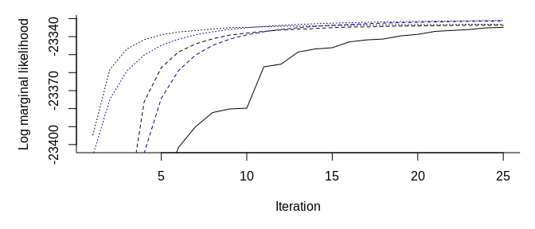

# mdgc

This package contains a marginal likelihood approach to estimating the
model discussed by D. Hoff (2007) and Zhao and Udell (2019). That is, a
missing data approach where one uses Gaussian copulas. We have modified
the Fortran code by Genz and Bretz (2002) to supply an approximation of
the gradient for the log marginal likelihood and to use an approximation
of the marginal likelihood similar to the CDF approximation in Genz and
Bretz (2002). We have also used the same Fortran code to perform the
imputation conditional on a correlation matrix.

However, the package can be useful for a lot of other models. For
instance, the methods are directly applicable to other Gaussian copula
models and some mixed effect models. All methods are implemented in C++,
support computation in parallel, and should easily be able to be ported
to other languages.

## Example

Below, we provide an example similar to Zhao and Udell (2019 Section
7.1). The authors use a data set with a random correlation matrix, 5
continuous variables, 5 binary variables, and 5 ordinal variables with 5
levels. There is a total of 2000 observations and 30% of the variables
are missing completely at random.

To summarize Zhao and Udell (2019) results, they show that their
approximate EM algorithm converges in what seems to be 20-25 seconds
(this is with a pure R implementation to be fair) while it takes more
than 150 seconds for the MCMC algorithm used by D. Hoff (2007). These
figures should be kept in mind when looking at the results below.
Importantly, Zhao and Udell (2019) use an approximation in the E-step of
an EM algorithm which is fast but might be crude is some settings. Using
a potentially arbitrarily precise approximation of the marginal
likelihood is useful if this can be done quickly enough.

We will provide a [quick-example](#quick-example) and [an even shorter
example](#an-even-shorter-example) where we show how to use the methods
in the package to estimate the correlation matrix and to perform the
imputation. We then show a [simulation study](#simulation-study) where
we compare with the method suggested by Zhao and Udell (2019).

We end by provding a [detailed example](#detailed-example) where we:

1.  show how to use the C++ functions and that these provide an
    approximation of the log marginal likelihood and its gradient.
    Moreover, we show that the methods scales well in the number of
    threads.
2.  define functions to perform maximum likelihood estimation.
3.  estimate the parameters using a simple gradient descent algorithm,
    and stochastic gradient descent methods.
4.  show how to improve 4. by using better starting values which are
    quick to compute. As of this writing, this reduces the estimation
    time to about 4 seconds using four threads and about 12 seconds
    using one thread.

The last section is added to give an idea about what is going on under
the hood and can likely be skipped.

### Quick Example

We first simulate a data set and provide an example which shows how to
use the package. The [An Even Shorter Example](an-even-shorter-example)
section shows a shorter example then what is shown here. You may want to
see this first if you just want to perform some quick imputation.

``` r
# load the packages we need
library(bench)
library(mdgc)
library(missForest, quietly = TRUE)
#> randomForest 4.6-14
#> Type rfNews() to see new features/changes/bug fixes.
# remotes::install_github("udellgroup/mixedgcImp", ref = "5ad6d523d")
library(mixedgcImp)
```

``` r
# simulates a data set and mask some of the data.
#
# Args: 
#   n: number of observations. 
#   p: number of variables. 
#   n_lvls: number of levels for the ordinal variables. 
# 
# Returns: 
#   Simluated masked data and true covariance matrix. 
sim_dat <- function(n, p = 3L, n_lvls = 5L){
  # get the covariance matrix
  Sb <- diag(p)
  Sb[lower.tri(Sb)] <- Sb[upper.tri(Sb)] <- .5
  Sb <- Sb / p / 5
  Sig <- cov2cor(drop(rWishart(1L, 5L * p, Sb)))
    
  # draw the observations
  truth <- matrix(rnorm(n * p), n) %*% chol(Sig)
  
  # determine the type
  type <- rep(1:3, each = floor((p + 3 - 1) / 3))[1:p]
  is_con <- type == 1L
  is_bin <- type == 2L
  is_ord <- type == 3L
  
  # sample which are masked data 
  is_mask <- matrix(runif(n * p) < .3, n)
  
  # make sure we have no rows with all missing data
  while(any(all_nans <- rowSums(is_mask) == NCOL(is_mask)))
    is_mask[all_nans, ] <- runif(sum(all_nans) * p) < .3
  
  # create observed data
  truth_obs <- data.frame(truth)
  truth_obs[, is_con] <- qexp(pnorm(as.matrix(truth_obs[, is_con])))
  
  bs_border <- 0
  truth_obs[, is_bin] <- 
    truth_obs[, is_bin] > rep(bs_border, each = NROW(truth_obs))
  
  bs_ord <- qnorm(seq(0, 1, length.out = n_lvls + 1L))
  truth_obs[, is_ord] <- as.integer(cut(truth[, is_ord], breaks = bs_ord))
  for(i in which(is_ord)){
    truth_obs[, i] <- ordered(truth_obs[, i])
    levels(truth_obs[, i]) <- 
      LETTERS[seq_len(length(unique(truth_obs[, i])))]
  }

  # mask the data
  seen_obs <- truth_obs
  seen_obs[is_mask] <- NA
  
  list(truth = truth, truth_obs = truth_obs, seen_obs = seen_obs, 
       Sigma = Sig)
}

# simulate and show the data
set.seed(1)
p <- 15L
dat <- sim_dat(2000L, p = p)

# how an observed data set could look
head(dat$seen_obs)
#>      X1   X2    X3    X4    X5    X6    X7    X8    X9   X10  X11  X12  X13 X14
#> 1 0.560   NA    NA 0.812 0.800  TRUE    NA  TRUE    NA    NA    C    D    C   C
#> 2    NA 1.85 0.132 0.215    NA    NA  TRUE    NA    NA FALSE <NA>    A <NA>   A
#> 3 1.435   NA    NA 0.575 0.891  TRUE  TRUE  TRUE    NA  TRUE    A <NA>    B   C
#> 4 0.636   NA 0.455 0.227 1.727  TRUE FALSE  TRUE FALSE  TRUE    C    B <NA>   B
#> 5 0.664   NA 1.334    NA    NA  TRUE  TRUE FALSE    NA    NA    E <NA>    D   D
#> 6 0.285   NA 0.309 0.178 0.156 FALSE    NA FALSE    NA    NA <NA>    A    B   A
#>    X15
#> 1    D
#> 2    B
#> 3 <NA>
#> 4 <NA>
#> 5 <NA>
#> 6    B

# assign objects needed for model estimation
mdgc_obj <- get_mdgc(dat$seen_obs)
log_ml_ptr <- get_mdgc_log_ml(mdgc_obj)
start_val <- mdgc_start_value(mdgc_obj)

# this is very fast so we can neglect this when we consider the computation 
# time
mark(`Setup time` = {
  mdgc_obj <- get_mdgc(dat$seen_obs)
  log_ml_ptr <- get_mdgc_log_ml(mdgc_obj)
  start_val <- mdgc_start_value(mdgc_obj)
}, min_iterations = 10)
#> # A tibble: 1 x 6
#>   expression      min   median `itr/sec` mem_alloc `gc/sec`
#>   <bch:expr> <bch:tm> <bch:tm>     <dbl> <bch:byt>    <dbl>
#> 1 Setup time   16.3ms   16.9ms      57.6    8.85MB     15.0

# fit the model using two different methods
set.seed(60941821)
system.time(
  fit_adam <- mdgc_fit(
    ptr = log_ml_ptr, vcov = start_val, n_threads = 4L, 
    lr = 1e-3, maxit = 10L, batch_size = 100L, method = "adam", 
     rel_eps = 1e-3, maxpts = 5000L))
#>    user  system elapsed 
#>   15.45    0.00    3.87
system.time(
  fit_svrg <- mdgc_fit(
    ptr = log_ml_ptr, vcov = start_val, n_threads = 4L, 
    lr = 1e-3, maxit = 10L, batch_size = 100L, method = "svrg", 
    verbose = TRUE, rel_eps = 1e-3, maxpts = 5000L))
#> End if iteration    1 with learning rate 0.00100000
#> Log marginal likelihood approximation is    -21757.84
#> Previous approximate gradient norm was        4060.58
#> 
#> End if iteration    2 with learning rate 0.00098000
#> Log marginal likelihood approximation is    -21714.42
#> Previous approximate gradient norm was        1785.74
#> 
#> End if iteration    3 with learning rate 0.00096040
#> Log marginal likelihood approximation is    -21704.90
#> Previous approximate gradient norm was         941.78
#> 
#> End if iteration    4 with learning rate 0.00094119
#> Log marginal likelihood approximation is    -21702.37
#> Previous approximate gradient norm was         540.59
#> 
#> End if iteration    5 with learning rate 0.00092237
#> Log marginal likelihood approximation is    -21701.58
#> Previous approximate gradient norm was         344.61
#> 
#> End if iteration    6 with learning rate 0.00090392
#> Log marginal likelihood approximation is    -21701.31
#> Previous approximate gradient norm was         251.03
#> 
#> End if iteration    7 with learning rate 0.00088584
#> Log marginal likelihood approximation is    -21701.23
#> Previous approximate gradient norm was         210.20
#> 
#> End if iteration    8 with learning rate 0.00086813
#> Log marginal likelihood approximation is    -21701.19
#> Previous approximate gradient norm was         173.20
#> 
#> End if iteration    9 with learning rate 0.00085076
#> Log marginal likelihood approximation is    -21701.16
#> Previous approximate gradient norm was         162.41
#> 
#> End if iteration   10 with learning rate 0.00083375
#> Log marginal likelihood approximation is    -21701.14
#> Previous approximate gradient norm was         151.51
#>    user  system elapsed 
#>   30.64    0.00    7.66

# compare the log marginal likelihood 
mdgc_log_ml(vcov = fit_adam$result, ptr = log_ml_ptr, rel_eps = 1e-3)
#> [1] -21711
mdgc_log_ml(vcov = fit_svrg$result, ptr = log_ml_ptr, rel_eps = 1e-3)
#> [1] -21701

# compare the estimated correlation matrix with the true value
do_plot <- function(est, truth, main){
  par_old <- par(mfcol = c(1, 3), mar  = c(1, 1, 4, 1))
  on.exit(par(par_old))
  sc <- colorRampPalette(c("Red", "White", "Blue"))(201)
  
  f <- function(x, main)
    image(x[, NCOL(x):1], main = main, col = sc, zlim = c(-1, 1), 
          xaxt = "n", yaxt = "n", bty = "n")
  f(est, main)
  f(truth, "Truth")
  f(est - truth, "Difference")
}

do_plot(fit_adam$result, dat$Sigma, "Estimates (ADAM)")
```


``` r
do_plot(fit_svrg$result, dat$Sigma, "Estimates (SVRG)")
```


``` r

# perform the imputation
system.time(
  imp_res <- mdgc_impute(mdgc_obj, fit_svrg$result, rel_eps = 1e-3,
                         maxit = 10000L, n_threads = 4L))
#>    user  system elapsed 
#>    5.42    0.00    1.80

# look at the result for the one of the observations
imp_res[2L]
#> [[1]]
#> [[1]]$X1
#> [1] 0.431
#> 
#> [[1]]$X2
#> [1] 1.85
#> 
#> [[1]]$X3
#> [1] 0.132
#> 
#> [[1]]$X4
#> [1] 0.215
#> 
#> [[1]]$X5
#> [1] 0.0974
#> 
#> [[1]]$X6
#>  FALSE   TRUE 
#> 0.9125 0.0875 
#> 
#> [[1]]$X7
#> FALSE  TRUE 
#>     0     1 
#> 
#> [[1]]$X8
#> FALSE  TRUE 
#> 0.777 0.223 
#> 
#> [[1]]$X9
#> FALSE  TRUE 
#> 0.815 0.185 
#> 
#> [[1]]$X10
#> FALSE  TRUE 
#>     1     0 
#> 
#> [[1]]$X11
#>      A      B      C      D      E 
#> 0.2031 0.2805 0.2637 0.1799 0.0728 
#> 
#> [[1]]$X12
#> A B C D E 
#> 1 0 0 0 0 
#> 
#> [[1]]$X13
#>      A      B      C      D      E 
#> 0.2933 0.3592 0.2090 0.1138 0.0246 
#> 
#> [[1]]$X14
#> A B C D E 
#> 1 0 0 0 0 
#> 
#> [[1]]$X15
#> A B C D E 
#> 0 1 0 0 0

# compare with the observed and true data
rbind(truth = dat$truth_obs[2L, ], observed = dat$seen_obs[2L, ])
#>             X1   X2    X3    X4      X5    X6   X7    X8    X9   X10  X11 X12
#> truth    0.616 1.85 0.132 0.215 0.00782 FALSE TRUE FALSE FALSE FALSE    D   A
#> observed    NA 1.85 0.132 0.215      NA    NA TRUE    NA    NA FALSE <NA>   A
#>           X13 X14 X15
#> truth       C   A   B
#> observed <NA>   A   B

# we can threshold the data like this
threshold <- function(org_data, imputed){
  # checks
  stopifnot(NROW(org_data) == length(imputed), 
            is.list(imputed), is.data.frame(org_data))
  
  # threshold
  is_cont <- which(sapply(org_data, is.numeric))
  is_bin  <- which(sapply(org_data, is.logical)) 
  is_ord  <- which(sapply(org_data, is.ordered))
  stopifnot(
    length(is_cont) + length(is_bin) + length(is_ord) == NCOL(org_data))
  is_cat <- c(is_bin, is_ord)
  
  trans_to_df <- function(x){
    if(is.matrix(x))
      as.data.frame(t(x))
    else
      as.data.frame(  x )
  }
  
  out_cont <- trans_to_df(sapply(imputed, function(x) unlist(x[is_cont])))
  out_cat <- trans_to_df(sapply(imputed, function(x) 
    sapply(x[is_cat], which.max)))
  out <- cbind(out_cont, out_cat)
  
  # set factor levels etc. 
  out <- out[, order(c(is_cont, is_bin, is_ord))]
  if(length(is_bin) > 0)
    out[, is_bin] <- out[, is_bin] > 1L
  if(length(is_ord) > 0)
    for(i in is_ord){
      out[[i]] <- ordered(
        unlist(out[[i]]), labels = levels(org_data[, i]))
    }
  
  colnames(out) <- colnames(org_data)
  out
}
thresh_dat <- threshold(dat$seen_obs, imp_res)

# compare thresholded data with observed and true data
head(thresh_dat)
#>      X1    X2    X3    X4     X5    X6    X7    X8    X9   X10 X11 X12 X13 X14
#> 1 0.560 0.798 0.864 0.812 0.8000  TRUE  TRUE  TRUE  TRUE  TRUE   C   D   C   C
#> 2 0.431 1.845 0.132 0.215 0.0974 FALSE  TRUE FALSE FALSE FALSE   B   A   B   A
#> 3 1.435 0.650 0.607 0.575 0.8906  TRUE  TRUE  TRUE FALSE  TRUE   A   D   B   C
#> 4 0.636 0.415 0.455 0.227 1.7270  TRUE FALSE  TRUE FALSE  TRUE   C   B   B   B
#> 5 0.664 1.050 1.334 1.135 1.0777  TRUE  TRUE FALSE  TRUE  TRUE   E   E   D   D
#> 6 0.285 0.264 0.309 0.178 0.1564 FALSE FALSE FALSE FALSE FALSE   A   A   B   A
#>   X15
#> 1   D
#> 2   B
#> 3   C
#> 4   B
#> 5   D
#> 6   B
head(dat$seen_obs)  # observed data
#>      X1   X2    X3    X4    X5    X6    X7    X8    X9   X10  X11  X12  X13 X14
#> 1 0.560   NA    NA 0.812 0.800  TRUE    NA  TRUE    NA    NA    C    D    C   C
#> 2    NA 1.85 0.132 0.215    NA    NA  TRUE    NA    NA FALSE <NA>    A <NA>   A
#> 3 1.435   NA    NA 0.575 0.891  TRUE  TRUE  TRUE    NA  TRUE    A <NA>    B   C
#> 4 0.636   NA 0.455 0.227 1.727  TRUE FALSE  TRUE FALSE  TRUE    C    B <NA>   B
#> 5 0.664   NA 1.334    NA    NA  TRUE  TRUE FALSE    NA    NA    E <NA>    D   D
#> 6 0.285   NA 0.309 0.178 0.156 FALSE    NA FALSE    NA    NA <NA>    A    B   A
#>    X15
#> 1    D
#> 2    B
#> 3 <NA>
#> 4 <NA>
#> 5 <NA>
#> 6    B
head(dat$truth_obs) # true data
#>      X1    X2    X3    X4      X5    X6    X7    X8    X9   X10 X11 X12 X13 X14
#> 1 0.560 1.034 0.862 0.812 0.79996  TRUE  TRUE  TRUE FALSE FALSE   C   D   C   C
#> 2 0.616 1.845 0.132 0.215 0.00782 FALSE  TRUE FALSE FALSE FALSE   D   A   C   A
#> 3 1.435 1.089 1.390 0.575 0.89061  TRUE  TRUE  TRUE FALSE  TRUE   A   D   B   C
#> 4 0.636 0.409 0.455 0.227 1.72698  TRUE FALSE  TRUE FALSE  TRUE   C   B   D   B
#> 5 0.664 1.218 1.334 3.924 0.98331  TRUE  TRUE FALSE  TRUE  TRUE   E   C   D   D
#> 6 0.285 0.054 0.309 0.178 0.15641 FALSE FALSE FALSE FALSE FALSE   A   A   B   A
#>   X15
#> 1   D
#> 2   B
#> 3   D
#> 4   D
#> 5   E
#> 6   B

# compare correct categories
get_classif_error <- function(impu_dat, truth = dat$truth_obs, 
                              observed = dat$seen_obs){
  is_cat <- sapply(truth, function(x)
    is.logical(x) || is.ordered(x))
  is_match <- impu_dat[, is_cat] == truth[, is_cat]
  is_match[!is.na(observed[, is_cat])] <- NA_integer_
  1 - colMeans(is_match, na.rm = TRUE)
}
get_classif_error(thresh_dat)
#>    X6    X7    X8    X9   X10   X11   X12   X13   X14   X15 
#> 0.257 0.285 0.240 0.254 0.234 0.620 0.627 0.596 0.588 0.581

# compare RMSE
get_rmse <- function(impu_dat, truth = dat$truth_obs,
                     observed = dat$seen_obs){
  is_con <- sapply(truth, is.numeric)
  err <- as.matrix(impu_dat[, is_con] - truth[, is_con])
  err[!is.na(observed[, is_con])] <- NA_real_
  sqrt(colMeans(err^2, na.rm = TRUE))
}
get_rmse(thresh_dat)
#>    X1    X2    X3    X4    X5 
#> 0.812 0.880 0.717 0.786 0.763

# we can compare this with missForest
miss_forest_arg <- dat$seen_obs
is_log <- sapply(miss_forest_arg, is.logical)
miss_forest_arg[, is_log] <- lapply(miss_forest_arg[, is_log], as.factor)
set.seed(1)
system.time(miss_res <- missForest(miss_forest_arg))
#>   missForest iteration 1 in progress...done!
#>   missForest iteration 2 in progress...done!
#>   missForest iteration 3 in progress...done!
#>   missForest iteration 4 in progress...done!
#>   missForest iteration 5 in progress...done!
#>   missForest iteration 6 in progress...done!
#>   missForest iteration 7 in progress...done!
#>   missForest iteration 8 in progress...done!
#>   missForest iteration 9 in progress...done!
#>   missForest iteration 10 in progress...done!
#>    user  system elapsed 
#>  46.848   0.047  46.896

# turn binary variables back to logicals
miss_res$ximp[, is_log] <- lapply(
  miss_res$ximp[, is_log], function(x) as.integer(x) > 1L)

rbind(mdgc       = get_classif_error(thresh_dat),
      missForest = get_classif_error(miss_res$ximp))
#>               X6    X7    X8    X9   X10   X11   X12   X13   X14   X15
#> mdgc       0.257 0.285 0.240 0.254 0.234 0.620 0.627 0.596 0.588 0.581
#> missForest 0.262 0.279 0.264 0.259 0.255 0.635 0.635 0.637 0.608 0.611
rbind(mdgc       = get_rmse(thresh_dat),
      missForest = get_rmse(miss_res$ximp))
#>               X1    X2    X3    X4    X5
#> mdgc       0.812 0.880 0.717 0.786 0.763
#> missForest 0.867 0.897 0.742 0.808 0.791
```

#### An Even Shorter Example

Here is an example where we use the `mdgc` function to do the model
estimation and the imputation:

``` r
# have a data set with missing continous, binary, and ordinal variables
head(dat$seen_obs)
#>      X1   X2    X3    X4    X5    X6    X7    X8    X9   X10  X11  X12  X13 X14
#> 1 0.560   NA    NA 0.812 0.800  TRUE    NA  TRUE    NA    NA    C    D    C   C
#> 2    NA 1.85 0.132 0.215    NA    NA  TRUE    NA    NA FALSE <NA>    A <NA>   A
#> 3 1.435   NA    NA 0.575 0.891  TRUE  TRUE  TRUE    NA  TRUE    A <NA>    B   C
#> 4 0.636   NA 0.455 0.227 1.727  TRUE FALSE  TRUE FALSE  TRUE    C    B <NA>   B
#> 5 0.664   NA 1.334    NA    NA  TRUE  TRUE FALSE    NA    NA    E <NA>    D   D
#> 6 0.285   NA 0.309 0.178 0.156 FALSE    NA FALSE    NA    NA <NA>    A    B   A
#>    X15
#> 1    D
#> 2    B
#> 3 <NA>
#> 4 <NA>
#> 5 <NA>
#> 6    B

# perform the estimation and imputation
system.time(res <- mdgc(dat$seen_obs, verbose = TRUE, maxpts = 5000L, 
                        n_threads = 4L, maxit = 10L))
#> Estimating the model...
#> End if iteration    1 with learning rate 0.00100000
#> Log marginal likelihood approximation is    -21762.41
#> Previous approximate gradient norm was        4050.92
#> 
#> End if iteration    2 with learning rate 0.00098000
#> Log marginal likelihood approximation is    -21717.34
#> Previous approximate gradient norm was        1809.21
#> 
#> End if iteration    3 with learning rate 0.00096040
#> Log marginal likelihood approximation is    -21706.32
#> Previous approximate gradient norm was         961.09
#> 
#> End if iteration    4 with learning rate 0.00094119
#> Log marginal likelihood approximation is    -21703.07
#> Previous approximate gradient norm was         551.68
#> 
#> End if iteration    5 with learning rate 0.00092237
#> Log marginal likelihood approximation is    -21701.97
#> Previous approximate gradient norm was         351.61
#> 
#> End if iteration    6 with learning rate 0.00090392
#> Log marginal likelihood approximation is    -21701.53
#> Previous approximate gradient norm was         253.17
#> 
#> End if iteration    7 with learning rate 0.00088584
#> Log marginal likelihood approximation is    -21701.39
#> Previous approximate gradient norm was         209.66
#> 
#> End if iteration    8 with learning rate 0.00086813
#> Log marginal likelihood approximation is    -21701.29
#> Previous approximate gradient norm was         176.64
#> 
#> End if iteration    9 with learning rate 0.00085076
#> Log marginal likelihood approximation is    -21701.18
#> Previous approximate gradient norm was         162.66
#> 
#> End if iteration   10 with learning rate 0.00083375
#> Log marginal likelihood approximation is    -21701.17
#> Previous approximate gradient norm was         150.95
#> 
#> Performing imputation...
#>    user  system elapsed 
#>  34.487   0.024   9.102

# compute the estimated correlation matrix with the truth
norm(dat$Sigma - res$vcov, "F") / norm(dat$Sigma, "F")
#> [1] 0.0634

# compute the classifcation error and RMSE
get_classif_error(res$ximp)
#>    X6    X7    X8    X9   X10   X11   X12   X13   X14   X15 
#> 0.259 0.282 0.242 0.252 0.236 0.608 0.632 0.592 0.588 0.586
get_rmse(res$ximp)
#>    X1    X2    X3    X4    X5 
#> 0.813 0.880 0.717 0.786 0.763
```

We can compare this with the `mixedgcImp` which uses the method
described in Zhao and Udell (2019):

``` r
# prepare data to a format that can be bassed
dat_pass <- dat$seen_obs
is_cat <- sapply(dat_pass, function(x) is.logical(x) | is.ordered(x))
dat_pass[, is_cat] <- lapply(dat_pass[, is_cat], as.integer)

system.time(imp_apr_em <- impute_mixedgc(dat_pass, eps = 1e-4))
#>    user  system elapsed 
#>  13.656   0.016  13.673

# compare the estimated correlation matrix with the truth
get_rel_err <- function(est, keep = seq_len(NROW(truth)), truth = dat$Sigma)
  norm(truth[keep, keep] - est[keep, keep], "F") / 
  norm(truth, "F")

c(mdgc               = get_rel_err(res$vcov), 
  mixedgcImp         = get_rel_err(imp_apr_em$R), 
  `mdgc bin/ordered` = get_rel_err(res$vcov    , is_cat),
  `mdgc bin/ordered` = get_rel_err(imp_apr_em$R, is_cat),
  `mdgc continuous`  = get_rel_err(res$vcov    , !is_cat),
  `mdgc continuous`  = get_rel_err(imp_apr_em$R, !is_cat))
#>             mdgc       mixedgcImp mdgc bin/ordered mdgc bin/ordered 
#>           0.0634           0.0495           0.0477           0.0332 
#>  mdgc continuous  mdgc continuous 
#>           0.0138           0.0129

# compare the classifcation error and RMSE
imp_apr_res <- as.data.frame(imp_apr_em$Ximp)
is_bin <- sapply(dat$seen_obs, is.logical)
imp_apr_res[, is_bin] <- lapply(imp_apr_res[, is_bin], `>`, e2 = 0)
is_ord <- sapply(dat$seen_obs, is.ordered)
imp_apr_res[, is_ord] <- mapply(function(x, idx)
  ordered(x, labels = levels(dat$seen_obs[[idx]])), 
  x = imp_apr_res[, is_ord], i = which(is_ord), SIMPLIFY = FALSE)

rbind(mdgc       = get_classif_error(res$ximp),
      mixedgcImp = get_classif_error(imp_apr_res))
#>               X6    X7    X8    X9   X10   X11   X12   X13   X14   X15
#> mdgc       0.259 0.282 0.242 0.252 0.236 0.608 0.632 0.592 0.588 0.586
#> mixedgcImp 0.255 0.277 0.239 0.259 0.223 0.600 0.614 0.613 0.577 0.588
rbind(mdgc       = get_rmse(res$ximp),
      mixedgcImp = get_rmse(imp_apr_res))
#>               X1    X2    X3    X4    X5
#> mdgc       0.813 0.880 0.717 0.786 0.763
#> mixedgcImp 0.810 0.879 0.717 0.785 0.764
```

### Simulation Study

We will perform a simulation study in this section to compare different
methods in terms of their computation time and performance. We first
perform the simulation.

``` r
# the seeds we will use
seeds <- c(293498804L, 311878062L, 370718465L, 577520465L, 336825034L, 661670751L, 750947065L, 255824398L, 281823005L, 721186455L, 251974931L, 643568686L, 273097364L, 328663824L, 490259480L, 517126385L, 651705963L, 43381670L, 503505882L, 609251792L, 643001919L, 244401725L, 983414550L, 850590318L, 714971434L, 469416928L, 237089923L, 131313381L, 689679752L, 344399119L, 330840537L, 6287534L, 735760574L, 477353355L, 579527946L, 83409653L, 710142087L, 830103443L, 94094987L, 422058348L, 117889526L, 259750108L, 180244429L, 762680168L, 112163383L, 10802048L, 440434442L, 747282444L, 736836365L, 837303896L, 50697895L, 231661028L, 872653438L, 297024405L, 719108161L, 201103881L, 485890767L, 852715172L, 542126886L, 155221223L, 18987375L, 203133067L, 460377933L, 949381283L, 589083178L, 820719063L, 543339683L, 154667703L, 480316186L, 310795921L, 287317945L, 30587393L, 381290126L, 178269809L, 939854883L, 660119506L, 825302990L, 764135140L, 433746745L, 173637986L, 100446967L, 333304121L, 225525537L, 443031789L, 587486506L, 245392609L, 469144801L, 44073812L, 462948652L, 226692940L, 165285895L, 546908869L, 550076645L, 872290900L, 452044364L, 620131127L, 600097817L, 787537854L, 15915195L, 64220696L)

# gather or compute the results
res <- lapply(head(seeds, 25), function(s){
  file_name <- file.path("sim-res", sprintf("seed-%d.RDS", s))
  
  if(file.exists(file_name)){
    message(sprintf("Reading '%s'", file_name))
    out <- readRDS(file_name)
  } else { 
    message(sprintf("Running '%s'", file_name))
    
    # simulate the data
    set.seed(s)
    dat <- sim_dat(2000L, p = 15L)
    
    # fit models
    mdgc_time <- system.time(
      mdgc_res <- mdgc(dat$seen_obs, verbose = FALSE, maxpts = 5000L, 
                        n_threads = 4L, maxit = 10L))
    
    dat_pass <- dat$seen_obs
    is_cat <- sapply(dat_pass, function(x) is.logical(x) | is.ordered(x))
    dat_pass[, is_cat] <- lapply(dat_pass[, is_cat], as.integer)
    mixedgc_time <- 
      system.time(mixedgc_res <- impute_mixedgc(dat_pass, eps = 1e-4))
    
    # impute using the other estimate
    mdgc_obj <- get_mdgc(dat$seen_obs)
    impu_mixedgc_est <- mdgc_impute(mdgc_obj, mixedgc_res$R)
    impu_mixedgc_est <- threshold(dat$seen_obs, impu_mixedgc_est)
    
    # gather output for the correlation matrix estimates
    vcov_res <- list(truth = dat$Sigma, mdgc = mdgc_res$vcov, 
                     mixedgc = mixedgc_res$R)
    get_rel_err <- function(est, truth, keep = seq_len(NROW(truth)))
      norm(truth[keep, keep] - est[keep, keep], "F") / norm(truth, "F")
    
    vcov_res <- within(vcov_res, {
      mdgc_rel_err    = get_rel_err(mdgc   , truth)
      mixedgc_rel_err = get_rel_err(mixedgc, truth)
    })
    
    # gather output for the imputation 
    mixedgc_imp_res <- as.data.frame(mixedgc_res$Ximp)
    is_bin <- sapply(dat$seen_obs, is.logical)
    mixedgc_imp_res[, is_bin] <- 
      lapply(mixedgc_imp_res[, is_bin, drop = FALSE], `>`, e2 = 0)
    is_ord <- sapply(dat$seen_obs, is.ordered)
    mixedgc_imp_res[, is_ord] <- mapply(function(x, idx)
      ordered(x, labels = levels(dat$seen_obs[[idx]])), 
      x = mixedgc_imp_res[, is_ord, drop = FALSE], 
      i = which(is_ord), SIMPLIFY = FALSE)
    
    get_bin_err <- function(x){
      . <- function(z) z[, is_bin, drop = FALSE]
      get_classif_error(
        .(x), truth = .(dat$truth_obs), observed = .(dat$seen_obs))
    }
    get_ord_err <- function(x){
      . <- function(z) z[, is_ord, drop = FALSE]
      get_classif_error(
        .(x), truth = .(dat$truth_obs), observed = .(dat$seen_obs))
    }
          
    err <- list(
      mdgc_bin = get_bin_err(mdgc_res$ximp), 
      mixedgc_bin = get_bin_err(mixedgc_imp_res), 
      mixed_bin = get_bin_err(impu_mixedgc_est),
      
      mdgc_class = get_ord_err(mdgc_res$ximp), 
      mixedgc_class = get_ord_err(mixedgc_imp_res), 
      mixed_class = get_ord_err(impu_mixedgc_est),
      
      mdgc_rmse = get_rmse(
        mdgc_res$ximp, truth = dat$truth_obs, observed = dat$seen_obs),
      mixedgc_rmse = get_rmse(
        mixedgc_imp_res, truth = dat$truth_obs, observed = dat$seen_obs),
      mixed_rmse = get_rmse(
        impu_mixedgc_est, truth = dat$truth_obs, observed = dat$seen_obs))
    
    # gather the times
    times <- list(mdgc = mdgc_time, mixedgc = mixedgc_time)
    
    # save stats to check convergence
    conv_stats <- list(mdgc = mdgc_res$logLik, 
                       mixedgc = mixedgc_res$loglik)
    
    # save output 
    out <- list(vcov_res = vcov_res, err = err, times = times, 
                conv_stats = conv_stats)
    saveRDS(out, file_name)
  }
  
  # print summary stat to the console while knitting
  . <- function(x)
    message(paste(sprintf("%8.3f", x), collapse = " "))
  with(out, {
    message(paste(
      "mdgc    logLik", 
      paste(sprintf("%.2f", conv_stats$mdgc), collapse = " ")))
    message(paste(
      "mixedgc logLik", 
      paste(sprintf("%.2f", conv_stats$mixedgc), collapse = " ")))
    message(sprintf(
      "Relative correlation estimate errors are %.4f %.4f", 
      vcov_res$mdgc_rel_err, vcov_res$mixedgc_rel_err))
    message(sprintf(
      "Times are %.2f %.2f", 
      times$mdgc["elapsed"], times$mixedgc["elapsed"]))
    
    message(sprintf(
      "Binary classifcation errors are %.2f %.2f %.2f", 
      mean(err$mdgc_bin), mean(err$mixedgc_bin), 
      mean(err$mixed_bin)))
    .(err$mdgc_bin)
    .(err$mixedgc_bin)
    .(err$mixed_bin)
    
    message(sprintf(
      "Ordinal classifcation errors are %.2f %.2f %.2f", 
      mean(err$mdgc_class), mean(err$mixedgc_class), 
      mean(err$mixed_class)))
    .(err$mdgc_class)
    .(err$mixedgc_class)
    .(err$mixed_class)
    
    message(sprintf(
      "Mean RMSEs are %.2f %.2f %.2f",
      mean(err$mdgc_rmse), mean(err$mixedgc_rmse), mean(err$mixed_rmse)))
    .(err$mdgc_rmse)
    .(err$mixedgc_rmse)
    .(err$mixed_rmse)
    message("")
  })
  
  out  
})
```

The difference in computation time is given below:

``` r
# assign function to show the summary stats
show_sim_stats <- function(v1, v2, what, sub_ele = NULL){
  vals <- sapply(res, function(x) 
    do.call(rbind, x[[what]][c(v1, v2)]), 
    simplify = "array")
  if(!is.null(sub_ele))
    vals <- vals[, sub_ele, , drop = FALSE]
    
  cat("Means and standard errors:\n")
  mea_se <- function(x)
    c(mean = mean(x), SE = sd(x) / sqrt(length(x)))
  print(t(apply(vals, 1L, mea_se)))
  
  cat("\nDifference:\n")
  mea_se(vals[v1, , ] - vals[v2, , ])
}

# compare estimation time
show_sim_stats(1L, 2L, "times", "elapsed")
#> Means and standard errors:
#>          mean    SE
#> mdgc     9.76 0.037
#> mixedgc 15.18 0.192
#> 
#> Difference:
#>  mean    SE 
#> -5.42  0.19
```

The summary stats for the relative Frobenius norm between the estimated
and true correlation matrix is given below:

``` r
# relative norms
show_sim_stats("mixedgc_rel_err", "mdgc_rel_err", "vcov_res")
#> Means and standard errors:
#>                   mean      SE
#> mixedgc_rel_err 0.0550 0.00220
#> mdgc_rel_err    0.0487 0.00154
#> 
#> Difference:
#>    mean      SE 
#> 0.00631 0.00155
```

Finally, here are the results for the classification error for the
binary and ordinal outcomes and the root mean square error:

``` r
# the binary variables
show_sim_stats("mdgc_bin", "mixedgc_bin", "err")
#> Means and standard errors:
#>              mean      SE
#> mdgc_bin    0.253 0.00294
#> mixedgc_bin 0.254 0.00291
#> 
#> Difference:
#>      mean        SE 
#> -0.000972  0.000734

# the ordinal variables
show_sim_stats("mdgc_class", "mixedgc_class", "err")
#> Means and standard errors:
#>                mean      SE
#> mdgc_class    0.594 0.00343
#> mixedgc_class 0.618 0.00433
#> 
#> Difference:
#>     mean       SE 
#> -0.02432  0.00217

# the continous variables
show_sim_stats("mdgc_rmse", "mixedgc_rmse", "err")
#> Means and standard errors:
#>               mean      SE
#> mdgc_rmse    0.762 0.00670
#> mixedgc_rmse 0.762 0.00669
#> 
#> Difference:
#>     mean       SE 
#> 0.000221 0.000095
```

### Detailed Example

In this section, we show a more detailed example where we use some of
the non-exported functions package. This section is mainly included to
give an idea of what is going on under the hood.

``` r
# assign function to evalute the log marginal likelihood
log_ml <- function(...)
  mdgc_log_ml(ptr = log_ml_ptr, ...)

# print the approximate log marginal likelihood at the true parameters
set.seed(1)
print(log_ml(dat$Sigma, n_threads = 1L), digits = 7)
#> [1] -21748.55

# check standard error
sd(replicate(20, log_ml(dat$Sigma, n_threads = 4L)))
#> [1] 0.0244

# without reordering
print(log_ml(dat$Sigma, n_threads = 4L, do_reorder = FALSE), digits = 7)
#> [1] -21748.53

# check standard error
sd(replicate(20, log_ml(dat$Sigma, n_threads = 4L, do_reorder = FALSE)))
#> [1] 0.0644

# check computation time
mark(
  `1 thread                 ` = 
    log_ml(dat$Sigma                    , n_threads = 1L), 
  `1 thread  (w/o rordering)` = 
    log_ml(dat$Sigma, do_reorder = FALSE, n_threads = 1L), 
  `2 threads                ` = 
    log_ml(dat$Sigma                    , n_threads = 2L),
  `2 threads (w/o rordering)` = 
    log_ml(dat$Sigma, do_reorder = FALSE, n_threads = 2L),
  `4 threads                ` = 
    log_ml(dat$Sigma                    , n_threads = 4L), 
  `4 threads (w/o rordering)` = 
    log_ml(dat$Sigma, do_reorder = FALSE, n_threads = 4L), 
  min_iterations = 5, check = FALSE)
#> # A tibble: 6 x 6
#>   expression                     min   median `itr/sec` mem_alloc `gc/sec`
#>   <bch:expr>                <bch:tm> <bch:tm>     <dbl> <bch:byt>    <dbl>
#> 1 1 thread                     475ms    479ms      2.09    33.9KB     0   
#> 2 1 thread  (w/o rordering)    713ms    725ms      1.38    33.9KB     0   
#> 3 2 threads                    243ms    244ms      4.10    33.9KB     0   
#> 4 2 threads (w/o rordering)    363ms    377ms      2.66    33.9KB     0   
#> 5 4 threads                    126ms    128ms      7.83    33.9KB     0   
#> 6 4 threads (w/o rordering)    207ms    208ms      4.80    33.9KB     1.20

#####
# we can also get an approximation of the gradient
t1 <- log_ml(dat$Sigma, comp_derivs = TRUE, n_threads = 1L, rel_eps = 1e-3)
t2 <- log_ml(dat$Sigma, comp_derivs = TRUE, n_threads = 4L, rel_eps = 1e-3)
all.equal(t1, t2, tolerance = 1e-2)
#> [1] TRUE
  
mark(
  `1 thread                 ` = 
    log_ml(dat$Sigma, comp_derivs = TRUE                    , n_threads = 1L), 
  `1 thread  (w/o rordering)` = 
    log_ml(dat$Sigma, comp_derivs = TRUE, do_reorder = FALSE, n_threads = 1L), 
  `2 threads                ` = 
    log_ml(dat$Sigma, comp_derivs = TRUE                    , n_threads = 2L),
  `2 threads (w/o rordering)` = 
    log_ml(dat$Sigma, comp_derivs = TRUE, do_reorder = FALSE, n_threads = 2L),
  `4 threads                ` = 
    log_ml(dat$Sigma, comp_derivs = TRUE                    , n_threads = 4L), 
  `4 threads (w/o rordering)` = 
    log_ml(dat$Sigma, comp_derivs = TRUE, do_reorder = FALSE, n_threads = 4L), 
  min_iterations = 5, check = FALSE)
#> # A tibble: 6 x 6
#>   expression                     min   median `itr/sec` mem_alloc `gc/sec`
#>   <bch:expr>                <bch:tm> <bch:tm>     <dbl> <bch:byt>    <dbl>
#> 1 1 thread                      2.3s    2.37s     0.426    35.7KB        0
#> 2 1 thread  (w/o rordering)    3.99s    4.08s     0.243    35.7KB        0
#> 3 2 threads                    1.21s    1.27s     0.794    35.7KB        0
#> 4 2 threads (w/o rordering)    2.15s    2.17s     0.460    35.7KB        0
#> 5 4 threads                 651.82ms 686.98ms     1.48     35.7KB        0
#> 6 4 threads (w/o rordering)    1.18s    1.23s     0.775    35.7KB        0

#####
# the main code in the packages provides an approximation to the CDF similar 
# to the one in the mvtnorm package. We provide an example below to 
# illustrate this. Feel free to skip this part of the README.
library(mvtnorm)
set.seed(1)
p_ex <- 5L
S_ex <- diag(p_ex)
S_ex[lower.tri(S_ex)] <- S_ex[upper.tri(S_ex)] <- .25
m_ex <- seq(-2, 2, length.out = p_ex)
lower_ex <- m_ex + drop(rnorm(p_ex) %*% chol(S_ex)) - 1
upper_ex <- lower_ex + 1

use_mvtnorm <- function()
  pmvnorm(
    lower = lower_ex, upper = upper_ex, sigma = S_ex, mean = m_ex, 
    algorithm = GenzBretz(maxpts = 100000L, abseps = -1, releps = 1e-5))
use_this_pkg <- function(derivs = FALSE)
  mdgc:::pmvnorm(lower = lower_ex, upper = upper_ex, mu = m_ex, 
                 Sigma = S_ex, maxvls = 100000L, abs_eps = -1, rel_eps = 1e-5, 
                 derivs = derivs)
use_mvtnorm()
#> [1] 0.00136
#> attr(,"error")
#> [1] 1.09e-08
#> attr(,"msg")
#> [1] "Normal Completion"
use_this_pkg()
#>         [,1]
#> [1,] 0.00136
#> attr(,"minvls")
#> [1] 6992
#> attr(,"inform")
#> [1] 0
#> attr(,"abserr")
#> [1] 1.12e-08
all.equal(c(use_mvtnorm()), c(use_this_pkg()), tolerance = 1e-5)
#> [1] TRUE
mark(mvtnorm = use_mvtnorm(), mdgc = use_this_pkg(), 
     min_iterations = 25, check = FALSE)
#> # A tibble: 2 x 6
#>   expression      min   median `itr/sec` mem_alloc `gc/sec`
#>   <bch:expr> <bch:tm> <bch:tm>     <dbl> <bch:byt>    <dbl>
#> 1 mvtnorm      1.07ms   4.44ms      261.    4.43KB        0
#> 2 mdgc         2.86ms   7.33ms      142.    2.49KB        0

sd(replicate(25, use_mvtnorm()))
#> [1] 4.47e-09
sd(replicate(25, use_this_pkg()))
#> [1] 3.63e-09

# the latter function can also provide gradients with respect to the mean 
# and covariance matrix
library(numDeriv)
gr_hat <- jacobian(function(a){
  m <- a[1:p_ex]
  S <- matrix(nr = p_ex, nc = p_ex)
  S[upper.tri(S, TRUE)] <- a[-(1:p_ex)]
  S[lower.tri(S)] <- t(S)[lower.tri(S)]
  
  set.seed(1L)
  res <- pmvnorm(
    lower = lower_ex, upper = upper_ex, sigma = S, mean = m, 
    algorithm = GenzBretz(maxpts = 10000L, abseps = -1, releps = 1e-6))
  c(res)
}, c(m_ex, S_ex[upper.tri(S_ex, TRUE)]))
gr <- use_this_pkg(TRUE)

# the off diagonal elements of the covariance matrix are not scaled by 2
gr_hat / gr[-1]
#>      [,1] [,2] [,3] [,4] [,5] [,6] [,7] [,8] [,9] [,10] [,11] [,12] [,13] [,14]
#> [1,]    1    1    1    1    1    1    2    1    2     2     1     2     2     2
#>      [,15] [,16] [,17] [,18] [,19] [,20]
#> [1,]     1     2     2     2     2     1

# creates a matrix from a log-Cholesky decomposition.
# 
# Args:
#   par: p (p + 1) / 2 elements in the log-Cholesky decomposition.
get_lchol_inv <- function(par){
  # use log-cholesky parametrization
  p <- (sqrt(8 * length(par) + 1) - 1) / 2
  L <- matrix(0, p, p)
  L[lower.tri(L, TRUE)] <- par
  diag(L) <- exp(diag(L))
  tcrossprod(L)
}

# creates the log-Cholesky decomposition. 
# 
# Args: 
#   par: positive definite matrix to decompose
get_lchol <- function(par){
  lSig <- t(chol(par))
  diag(lSig) <- log(diag(lSig))
  lSig[lower.tri(lSig, TRUE)]
}

# indices used to apply a matrix product with a get_commutation matrix
com_vec <- mdgc:::get_commutation_vec(p, p, FALSE)

# computes the approximate log marginal likelihood. 
#
# Args:
#   par: log-Cholesky decomposition.
#   seed: seed to use.  
#   comp_derivs: logical for whether to approximate the gradient. 
#   n_threads: number of threads. 
#   rel_eps: relative error for each term.
#   indices: integer vector with which terms to include. 
par_fn <- function(par, seed = NULL, comp_derivs = FALSE, 
                   n_threads = 1L, rel_eps = 1e-2, 
                   indices = 0:(NROW(dat$seen_obs) - 1L)){
  if(!is.null(seed))
    set.seed(seed)
  Arg <- get_lchol_inv(par)
  
  res <- log_ml(Arg, comp_derivs = comp_derivs, indices = indices,
                n_threads = n_threads, rel_eps = rel_eps)
  log_ml <- c(res)
  if(comp_derivs){
    gr <- attr(res, "grad")
    tmp <- matrix(0, p, p)
    tmp[lower.tri(tmp, TRUE)] <- par
    diag(tmp) <- exp(diag(tmp))
    gr <- gr[com_vec] + c(gr)
    gr <- mdgc:::x_dot_X_kron_I(x = gr, X = tmp, l = p)
    gr <- gr[, lower.tri(tmp, TRUE)]
    idx_diag <- c(1L, 1L + cumsum(NCOL(tmp):2)) 
    gr[idx_diag] <- gr[idx_diag] * diag(tmp)
      
    attr(log_ml, "grad") <- gr
    
  }
  
  log_ml
}

# check that the function gives the correct log marginal likelihood
# approximation and gradient approximation.
lSig <- get_lchol(dat$Sigma)
r1 <- par_fn(lSig, comp_derivs = TRUE, n_threads = 4L, rel_eps = 1e-3, 
             indices = 1:100)
r2 <- numDeriv::jacobian(par_fn, lSig, seed = 1L, n_threads = 6L, 
                         rel_eps = 1e-3, indices = 1:100)
all.equal(attr(r1, "grad"), drop(r2), tolerance = 1e-2)
#> [1] TRUE

#####
# performs gradient descent. 
# 
# Args: 
#   val: starting value. 
#   step_start: starting value for the step length. 
#   n_threads: number of threads to use. 
#   maxit: maximum number of iteration. 
#   eps: convergence threshold to use. 
#   seed: seed to use.
#   c1, c2: parameters for Wolfe condition.
naiv_gradient_descent <- function(val, step_start, n_threads = 4L, 
                                  maxit = 10L, eps = 1e-3, seed = 1L, 
                                  c1 = 1e-3, c2 = .1){
  fun_vals <- step_sizes <- rep(NA_real_, maxit)
  
  gr_new <- par_fn(val, comp_derivs = TRUE, n_threads = n_threads, 
                   seed = seed)
  for(i in 1:maxit){
    gr <- gr_new
    fun_vals[i] <- prev_fun <- c(gr)
    dir <- attr(gr, "grad")
    step <- step_start
    m <- drop(dir %*% attr(gr, "grad"))
    
    max_j <- 11L
    for(j in 1:max_j){
      if(j == max_j)
        warning("Failed to find a decrease")
      new_val <- val + step * dir
      new_val <- get_lchol(cov2cor(get_lchol_inv(new_val)))
      new_fun <- par_fn(new_val, comp_derivs = FALSE, n_threads = n_threads, 
                        seed = seed)
      
      # strong Wolfe conditions
      if(-new_fun <= -prev_fun + c1 * step * m){
        gr_new <- par_fn(new_val, comp_derivs = TRUE, n_threads = n_threads, 
                         seed = seed)
      
        if(abs(drop(attr(gr_new, "grad") %*% dir)) >= c2 * m){
          val <- new_val
          break
        }
      }
      
      step <- step / 2
    }
    
    step_sizes[i] <- step
  }
  
  list(result = get_lchol_inv(val), logml = prev_fun, 
       nit = i, step_sizes = step_sizes, fun_vals = fun_vals)
}

# estimate model parameters
start_val <- numeric(p * (p + 1) / 2)
system.time(res <- naiv_gradient_descent(val = start_val, step_start = .001, 
                                         maxit = 20L, eps = 1e-2))
#>    user  system elapsed 
#>  82.417   0.004  21.189

# compare estimates with truth
norm(res$result - dat$Sigma)
#> [1] 0.615
res$result
#>        [,1]  [,2]  [,3]  [,4]  [,5]  [,6]  [,7]  [,8]  [,9] [,10] [,11] [,12]
#>  [1,] 1.000 0.568 0.416 0.539 0.499 0.588 0.503 0.561 0.575 0.496 0.479 0.542
#>  [2,] 0.568 1.000 0.384 0.504 0.330 0.428 0.521 0.535 0.500 0.484 0.531 0.512
#>  [3,] 0.416 0.384 1.000 0.562 0.510 0.475 0.560 0.514 0.486 0.513 0.567 0.456
#>  [4,] 0.539 0.504 0.562 1.000 0.507 0.594 0.526 0.479 0.548 0.492 0.472 0.539
#>  [5,] 0.499 0.330 0.510 0.507 1.000 0.508 0.437 0.490 0.512 0.506 0.477 0.534
#>  [6,] 0.588 0.428 0.475 0.594 0.508 1.000 0.526 0.509 0.550 0.460 0.443 0.617
#>  [7,] 0.503 0.521 0.560 0.526 0.437 0.526 1.000 0.566 0.438 0.555 0.565 0.564
#>  [8,] 0.561 0.535 0.514 0.479 0.490 0.509 0.566 1.000 0.534 0.622 0.450 0.527
#>  [9,] 0.575 0.500 0.486 0.548 0.512 0.550 0.438 0.534 1.000 0.501 0.537 0.497
#> [10,] 0.496 0.484 0.513 0.492 0.506 0.460 0.555 0.622 0.501 1.000 0.522 0.452
#> [11,] 0.479 0.531 0.567 0.472 0.477 0.443 0.565 0.450 0.537 0.522 1.000 0.467
#> [12,] 0.542 0.512 0.456 0.539 0.534 0.617 0.564 0.527 0.497 0.452 0.467 1.000
#> [13,] 0.578 0.528 0.483 0.464 0.511 0.495 0.557 0.600 0.598 0.539 0.527 0.491
#> [14,] 0.526 0.435 0.568 0.519 0.596 0.576 0.512 0.537 0.542 0.455 0.528 0.457
#> [15,] 0.643 0.484 0.500 0.639 0.507 0.564 0.547 0.566 0.573 0.517 0.497 0.513
#>       [,13] [,14] [,15]
#>  [1,] 0.578 0.526 0.643
#>  [2,] 0.528 0.435 0.484
#>  [3,] 0.483 0.568 0.500
#>  [4,] 0.464 0.519 0.639
#>  [5,] 0.511 0.596 0.507
#>  [6,] 0.495 0.576 0.564
#>  [7,] 0.557 0.512 0.547
#>  [8,] 0.600 0.537 0.566
#>  [9,] 0.598 0.542 0.573
#> [10,] 0.539 0.455 0.517
#> [11,] 0.527 0.528 0.497
#> [12,] 0.491 0.457 0.513
#> [13,] 1.000 0.640 0.640
#> [14,] 0.640 1.000 0.580
#> [15,] 0.640 0.580 1.000
dat$Sigma
#>        [,1]  [,2]  [,3]  [,4]  [,5]  [,6]  [,7]  [,8]  [,9] [,10] [,11] [,12]
#>  [1,] 1.000 0.534 0.394 0.521 0.449 0.536 0.469 0.508 0.528 0.457 0.446 0.504
#>  [2,] 0.534 1.000 0.417 0.500 0.319 0.414 0.486 0.524 0.473 0.504 0.521 0.517
#>  [3,] 0.394 0.417 1.000 0.570 0.509 0.461 0.551 0.516 0.467 0.502 0.528 0.461
#>  [4,] 0.521 0.500 0.570 1.000 0.489 0.540 0.500 0.458 0.550 0.474 0.471 0.504
#>  [5,] 0.449 0.319 0.509 0.489 1.000 0.484 0.383 0.426 0.491 0.456 0.451 0.496
#>  [6,] 0.536 0.414 0.461 0.540 0.484 1.000 0.475 0.459 0.461 0.393 0.409 0.555
#>  [7,] 0.469 0.486 0.551 0.500 0.383 0.475 1.000 0.500 0.438 0.556 0.523 0.516
#>  [8,] 0.508 0.524 0.516 0.458 0.426 0.459 0.500 1.000 0.502 0.612 0.416 0.507
#>  [9,] 0.528 0.473 0.467 0.550 0.491 0.461 0.438 0.502 1.000 0.475 0.506 0.452
#> [10,] 0.457 0.504 0.502 0.474 0.456 0.393 0.556 0.612 0.475 1.000 0.514 0.420
#> [11,] 0.446 0.521 0.528 0.471 0.451 0.409 0.523 0.416 0.506 0.514 1.000 0.420
#> [12,] 0.504 0.517 0.461 0.504 0.496 0.555 0.516 0.507 0.452 0.420 0.420 1.000
#> [13,] 0.517 0.469 0.445 0.465 0.498 0.454 0.545 0.531 0.569 0.469 0.480 0.450
#> [14,] 0.476 0.445 0.565 0.533 0.548 0.544 0.474 0.473 0.513 0.421 0.515 0.433
#> [15,] 0.627 0.506 0.495 0.638 0.481 0.535 0.514 0.511 0.539 0.537 0.493 0.488
#>       [,13] [,14] [,15]
#>  [1,] 0.517 0.476 0.627
#>  [2,] 0.469 0.445 0.506
#>  [3,] 0.445 0.565 0.495
#>  [4,] 0.465 0.533 0.638
#>  [5,] 0.498 0.548 0.481
#>  [6,] 0.454 0.544 0.535
#>  [7,] 0.545 0.474 0.514
#>  [8,] 0.531 0.473 0.511
#>  [9,] 0.569 0.513 0.539
#> [10,] 0.469 0.421 0.537
#> [11,] 0.480 0.515 0.493
#> [12,] 0.450 0.433 0.488
#> [13,] 1.000 0.598 0.615
#> [14,] 0.598 1.000 0.548
#> [15,] 0.615 0.548 1.000

# or plot both of them and compare
do_plot(res$result, dat$Sigma, "Estimates")
```


``` r

res$fun_vals # log marginal likelihood estimates at each iteration
#>  [1] -25889 -22498 -22152 -21914 -21796 -21762 -21759 -21722 -21721 -21706
#> [11] -21705 -21703 -21703 -21702 -21702 -21701 -21701 -21701 -21701 -21701

#####
# performs stochastic gradient descent instead (using ADAM).
# 
# Args: 
#   val: starting value. 
#   batch_size: number of observations in each batch. 
#   n_threads: number of threads to use. 
#   maxit: maximum number of iteration. 
#   seed: seed to use.
#   epsilon, alpha, beta_1, beta_2: ADAM parameters.
adam <- function(val, batch_size, n_threads = 4L, maxit = 10L, 
                 seed = 1L, epsilon = 1e-8, alpha = .001, beta_1 = .9, 
                 beta_2 = .999){
  indices <- sample(0:(NROW(dat$seen_obs) - 1L), replace = FALSE)
  blocks <- tapply(indices, (seq_along(indices) - 1L) %/% batch_size, 
                   identity, simplify = FALSE)
  
  n_blocks <- length(blocks)
  n_par <- length(val)
  m <- v <- numeric(n_par)
  fun_vals <- numeric(maxit)
  estimates <- matrix(NA_real_, n_par, maxit)
  i <- -1L
  
  for(k in 1:maxit){
    for(ii in 1:n_blocks){
      i <- i + 1L
      idx_b <- (i %% n_blocks) + 1L
      m_old <- m
      v_old <- v
      res <- par_fn(val, comp_derivs = TRUE, n_threads = n_threads, 
                    seed = seed, indices = blocks[[idx_b]])
      fun_vals[(i %/% n_blocks) + 1L] <- 
        fun_vals[(i %/% n_blocks) + 1L] + c(res)
      
      gr <- attr(res, "grad")
      
      m <- beta_1 * m_old + (1 - beta_1) * gr
      v <- beta_2 * v_old + (1 - beta_2) * gr^2
      
      m_hat <- m / (1 - beta_1^(i + 1))
      v_hat <- v / (1 - beta_2^(i + 1))
      
      val <- val + alpha * m_hat / (sqrt(v_hat) + epsilon)
      val <- get_lchol(cov2cor(get_lchol_inv(val)))
    }
    
    estimates[, k] <- val
  }
  
  list(result = get_lchol_inv(val), fun_vals = fun_vals, 
       estimates = estimates)
}

# estimate the model parameters
set.seed(1)
system.time(res_adam  <- adam(
  val = start_val, alpha = 1e-2, maxit = 10L, batch_size = 100L))
#>    user  system elapsed 
#>   32.87    0.00    8.98

# compare estimates with the truth
norm(res_adam$result - dat$Sigma)
#> [1] 0.599
res_adam$result
#>        [,1]  [,2]  [,3]  [,4]  [,5]  [,6]  [,7]  [,8]  [,9] [,10] [,11] [,12]
#>  [1,] 1.000 0.563 0.405 0.529 0.490 0.582 0.494 0.555 0.567 0.485 0.470 0.530
#>  [2,] 0.563 1.000 0.384 0.504 0.329 0.431 0.522 0.540 0.504 0.486 0.532 0.511
#>  [3,] 0.405 0.384 1.000 0.559 0.502 0.476 0.566 0.506 0.480 0.508 0.565 0.447
#>  [4,] 0.529 0.504 0.559 1.000 0.500 0.595 0.528 0.478 0.547 0.486 0.465 0.532
#>  [5,] 0.490 0.329 0.502 0.500 1.000 0.508 0.432 0.485 0.508 0.503 0.467 0.524
#>  [6,] 0.582 0.431 0.476 0.595 0.508 1.000 0.530 0.509 0.549 0.459 0.437 0.613
#>  [7,] 0.494 0.522 0.566 0.528 0.432 0.530 1.000 0.564 0.440 0.555 0.559 0.560
#>  [8,] 0.555 0.540 0.506 0.478 0.485 0.509 0.564 1.000 0.530 0.619 0.445 0.520
#>  [9,] 0.567 0.504 0.480 0.547 0.508 0.549 0.440 0.530 1.000 0.493 0.534 0.491
#> [10,] 0.485 0.486 0.508 0.486 0.503 0.459 0.555 0.619 0.493 1.000 0.518 0.441
#> [11,] 0.470 0.532 0.565 0.465 0.467 0.437 0.559 0.445 0.534 0.518 1.000 0.459
#> [12,] 0.530 0.511 0.447 0.532 0.524 0.613 0.560 0.520 0.491 0.441 0.459 1.000
#> [13,] 0.568 0.530 0.483 0.456 0.509 0.488 0.554 0.599 0.592 0.541 0.523 0.482
#> [14,] 0.512 0.431 0.569 0.512 0.586 0.576 0.515 0.532 0.537 0.451 0.526 0.444
#> [15,] 0.638 0.482 0.495 0.639 0.497 0.568 0.542 0.560 0.574 0.510 0.488 0.500
#>       [,13] [,14] [,15]
#>  [1,] 0.568 0.512 0.638
#>  [2,] 0.530 0.431 0.482
#>  [3,] 0.483 0.569 0.495
#>  [4,] 0.456 0.512 0.639
#>  [5,] 0.509 0.586 0.497
#>  [6,] 0.488 0.576 0.568
#>  [7,] 0.554 0.515 0.542
#>  [8,] 0.599 0.532 0.560
#>  [9,] 0.592 0.537 0.574
#> [10,] 0.541 0.451 0.510
#> [11,] 0.523 0.526 0.488
#> [12,] 0.482 0.444 0.500
#> [13,] 1.000 0.635 0.632
#> [14,] 0.635 1.000 0.575
#> [15,] 0.632 0.575 1.000
dat$Sigma
#>        [,1]  [,2]  [,3]  [,4]  [,5]  [,6]  [,7]  [,8]  [,9] [,10] [,11] [,12]
#>  [1,] 1.000 0.534 0.394 0.521 0.449 0.536 0.469 0.508 0.528 0.457 0.446 0.504
#>  [2,] 0.534 1.000 0.417 0.500 0.319 0.414 0.486 0.524 0.473 0.504 0.521 0.517
#>  [3,] 0.394 0.417 1.000 0.570 0.509 0.461 0.551 0.516 0.467 0.502 0.528 0.461
#>  [4,] 0.521 0.500 0.570 1.000 0.489 0.540 0.500 0.458 0.550 0.474 0.471 0.504
#>  [5,] 0.449 0.319 0.509 0.489 1.000 0.484 0.383 0.426 0.491 0.456 0.451 0.496
#>  [6,] 0.536 0.414 0.461 0.540 0.484 1.000 0.475 0.459 0.461 0.393 0.409 0.555
#>  [7,] 0.469 0.486 0.551 0.500 0.383 0.475 1.000 0.500 0.438 0.556 0.523 0.516
#>  [8,] 0.508 0.524 0.516 0.458 0.426 0.459 0.500 1.000 0.502 0.612 0.416 0.507
#>  [9,] 0.528 0.473 0.467 0.550 0.491 0.461 0.438 0.502 1.000 0.475 0.506 0.452
#> [10,] 0.457 0.504 0.502 0.474 0.456 0.393 0.556 0.612 0.475 1.000 0.514 0.420
#> [11,] 0.446 0.521 0.528 0.471 0.451 0.409 0.523 0.416 0.506 0.514 1.000 0.420
#> [12,] 0.504 0.517 0.461 0.504 0.496 0.555 0.516 0.507 0.452 0.420 0.420 1.000
#> [13,] 0.517 0.469 0.445 0.465 0.498 0.454 0.545 0.531 0.569 0.469 0.480 0.450
#> [14,] 0.476 0.445 0.565 0.533 0.548 0.544 0.474 0.473 0.513 0.421 0.515 0.433
#> [15,] 0.627 0.506 0.495 0.638 0.481 0.535 0.514 0.511 0.539 0.537 0.493 0.488
#>       [,13] [,14] [,15]
#>  [1,] 0.517 0.476 0.627
#>  [2,] 0.469 0.445 0.506
#>  [3,] 0.445 0.565 0.495
#>  [4,] 0.465 0.533 0.638
#>  [5,] 0.498 0.548 0.481
#>  [6,] 0.454 0.544 0.535
#>  [7,] 0.545 0.474 0.514
#>  [8,] 0.531 0.473 0.511
#>  [9,] 0.569 0.513 0.539
#> [10,] 0.469 0.421 0.537
#> [11,] 0.480 0.515 0.493
#> [12,] 0.450 0.433 0.488
#> [13,] 1.000 0.598 0.615
#> [14,] 0.598 1.000 0.548
#> [15,] 0.615 0.548 1.000

# use plot instead
do_plot(res_adam$result, dat$Sigma, "Estimates (ADAM)")
```


``` r

# look at the maximum log marginal likelihood both at the end and after 
# each iteration
log_ml(res_adam$result)
#> [1] -21703
funvals_adam_org <- 
  apply(res_adam$estimates, 2L, function(x) log_ml(get_lchol_inv(x)))
funvals_adam_org
#>  [1] -22679 -22055 -21846 -21775 -21740 -21721 -21710 -21706 -21704 -21703
res_adam$fun_vals # likely lower bounds on the log-marginal likelihood
#>  [1] -23903 -22346 -21953 -21829 -21780 -21755 -21742 -21735 -21732 -21731
res_adam_org <- res_adam

#####
# performs stochastic gradient descent instead (using SVRG).
# 
# Args: 
#   val: starting value. 
#   batch_size: number of observations in each batch. 
#   n_threads: number of threads to use. 
#   maxit: maximum number of iteration. 
#   seed: seed to use.
#   lr: learning rate. 
svrg <- function(val, batch_size, n_threads = 4L, maxit = 10L, 
                 seed = 1L, lr){
  all_indices <- 0:(NROW(dat$seen_obs) - 1L)
  indices <- sample(all_indices, replace = FALSE)
  blocks <- tapply(indices, (seq_along(indices) - 1L) %/% batch_size, 
                   identity, simplify = FALSE)
  
  n_blocks <- length(blocks)
  n_par <- length(val)
  estimates <- matrix(NA_real_, n_par, maxit + 1L)
  fun_vals <- numeric(maxit + 1L)
  estimates[, 1L] <- val
  
  for(k in 1:maxit + 1L){
    old_val <- estimates[, k - 1L]
    old_grs <- sapply(1:n_blocks - 1L, function(ii){
      idx_b <- (ii %% n_blocks) + 1L
      res_old <- par_fn(old_val, comp_derivs = TRUE, n_threads = n_threads, 
                        seed = seed, indices = blocks[[idx_b]])
      c(res_old, attr(res_old, "grad"))
    })
    
    fun_vals[k - 1L] <- sum(old_grs[1, ])
    old_grs <- old_grs[-1L, , drop = FALSE ]
    old_gr <- rowSums(old_grs) / n_blocks
    
    for(ii in 1:n_blocks - 1L){
      idx_b <- (ii %% n_blocks) + 1L
      res <- par_fn(val, comp_derivs = TRUE, n_threads = n_threads, 
                    seed = seed, indices = blocks[[idx_b]])
      fun_vals[k] <- fun_vals[k] + c(res)
      dir <- attr(res, "grad") - old_grs[, ii + 1L] + old_gr
      
      val <- val + lr * dir
      val <- get_lchol(cov2cor(get_lchol_inv(val)))
    }
    
    estimates[, k] <- val
  }
  
  list(result = get_lchol_inv(val), fun_vals = fun_vals[-1L], 
       estimates = estimates[, -1L, drop = FALSE])
}

# estimate the model parameters
set.seed(1)
system.time(res_svrg  <- svrg(
  val = start_val, lr = 1e-3, maxit = 10L, batch_size = 100L))
#>    user  system elapsed 
#>    62.8     0.0    17.1

# compare estimates with the truth
norm(res_svrg$result - dat$Sigma)
#> [1] 0.596
res_svrg$result
#>        [,1]  [,2]  [,3]  [,4]  [,5]  [,6]  [,7]  [,8]  [,9] [,10] [,11] [,12]
#>  [1,] 1.000 0.564 0.410 0.532 0.493 0.581 0.493 0.553 0.568 0.487 0.472 0.536
#>  [2,] 0.564 1.000 0.386 0.504 0.330 0.429 0.522 0.536 0.501 0.485 0.531 0.513
#>  [3,] 0.410 0.386 1.000 0.561 0.509 0.474 0.560 0.513 0.484 0.511 0.567 0.456
#>  [4,] 0.532 0.504 0.561 1.000 0.506 0.594 0.526 0.479 0.547 0.491 0.472 0.539
#>  [5,] 0.493 0.330 0.509 0.506 1.000 0.508 0.436 0.489 0.511 0.505 0.476 0.533
#>  [6,] 0.581 0.429 0.474 0.594 0.508 1.000 0.525 0.507 0.549 0.460 0.442 0.616
#>  [7,] 0.493 0.522 0.560 0.526 0.436 0.525 1.000 0.565 0.441 0.554 0.564 0.563
#>  [8,] 0.553 0.536 0.513 0.479 0.489 0.507 0.565 1.000 0.533 0.619 0.450 0.524
#>  [9,] 0.568 0.501 0.484 0.547 0.511 0.549 0.441 0.533 1.000 0.498 0.535 0.495
#> [10,] 0.487 0.485 0.511 0.491 0.505 0.460 0.554 0.619 0.498 1.000 0.522 0.451
#> [11,] 0.472 0.531 0.567 0.472 0.476 0.442 0.564 0.450 0.535 0.522 1.000 0.465
#> [12,] 0.536 0.513 0.456 0.539 0.533 0.616 0.563 0.524 0.495 0.451 0.465 1.000
#> [13,] 0.571 0.529 0.483 0.463 0.510 0.495 0.556 0.598 0.596 0.538 0.526 0.490
#> [14,] 0.519 0.436 0.568 0.519 0.595 0.575 0.511 0.536 0.541 0.454 0.527 0.456
#> [15,] 0.639 0.484 0.499 0.638 0.505 0.563 0.545 0.564 0.571 0.516 0.495 0.512
#>       [,13] [,14] [,15]
#>  [1,] 0.571 0.519 0.639
#>  [2,] 0.529 0.436 0.484
#>  [3,] 0.483 0.568 0.499
#>  [4,] 0.463 0.519 0.638
#>  [5,] 0.510 0.595 0.505
#>  [6,] 0.495 0.575 0.563
#>  [7,] 0.556 0.511 0.545
#>  [8,] 0.598 0.536 0.564
#>  [9,] 0.596 0.541 0.571
#> [10,] 0.538 0.454 0.516
#> [11,] 0.526 0.527 0.495
#> [12,] 0.490 0.456 0.512
#> [13,] 1.000 0.639 0.638
#> [14,] 0.639 1.000 0.579
#> [15,] 0.638 0.579 1.000
dat$Sigma
#>        [,1]  [,2]  [,3]  [,4]  [,5]  [,6]  [,7]  [,8]  [,9] [,10] [,11] [,12]
#>  [1,] 1.000 0.534 0.394 0.521 0.449 0.536 0.469 0.508 0.528 0.457 0.446 0.504
#>  [2,] 0.534 1.000 0.417 0.500 0.319 0.414 0.486 0.524 0.473 0.504 0.521 0.517
#>  [3,] 0.394 0.417 1.000 0.570 0.509 0.461 0.551 0.516 0.467 0.502 0.528 0.461
#>  [4,] 0.521 0.500 0.570 1.000 0.489 0.540 0.500 0.458 0.550 0.474 0.471 0.504
#>  [5,] 0.449 0.319 0.509 0.489 1.000 0.484 0.383 0.426 0.491 0.456 0.451 0.496
#>  [6,] 0.536 0.414 0.461 0.540 0.484 1.000 0.475 0.459 0.461 0.393 0.409 0.555
#>  [7,] 0.469 0.486 0.551 0.500 0.383 0.475 1.000 0.500 0.438 0.556 0.523 0.516
#>  [8,] 0.508 0.524 0.516 0.458 0.426 0.459 0.500 1.000 0.502 0.612 0.416 0.507
#>  [9,] 0.528 0.473 0.467 0.550 0.491 0.461 0.438 0.502 1.000 0.475 0.506 0.452
#> [10,] 0.457 0.504 0.502 0.474 0.456 0.393 0.556 0.612 0.475 1.000 0.514 0.420
#> [11,] 0.446 0.521 0.528 0.471 0.451 0.409 0.523 0.416 0.506 0.514 1.000 0.420
#> [12,] 0.504 0.517 0.461 0.504 0.496 0.555 0.516 0.507 0.452 0.420 0.420 1.000
#> [13,] 0.517 0.469 0.445 0.465 0.498 0.454 0.545 0.531 0.569 0.469 0.480 0.450
#> [14,] 0.476 0.445 0.565 0.533 0.548 0.544 0.474 0.473 0.513 0.421 0.515 0.433
#> [15,] 0.627 0.506 0.495 0.638 0.481 0.535 0.514 0.511 0.539 0.537 0.493 0.488
#>       [,13] [,14] [,15]
#>  [1,] 0.517 0.476 0.627
#>  [2,] 0.469 0.445 0.506
#>  [3,] 0.445 0.565 0.495
#>  [4,] 0.465 0.533 0.638
#>  [5,] 0.498 0.548 0.481
#>  [6,] 0.454 0.544 0.535
#>  [7,] 0.545 0.474 0.514
#>  [8,] 0.531 0.473 0.511
#>  [9,] 0.569 0.513 0.539
#> [10,] 0.469 0.421 0.537
#> [11,] 0.480 0.515 0.493
#> [12,] 0.450 0.433 0.488
#> [13,] 1.000 0.598 0.615
#> [14,] 0.598 1.000 0.548
#> [15,] 0.615 0.548 1.000

# use plot instead
do_plot(res_svrg$result, dat$Sigma, "Estimates (SVRG)")
```


``` r

# look at the maximum log marginal likelihood both at the end and after 
# each iteration
funvals_svrg_org <- res_svrg$fun_vals
funvals_svrg_org[length(funvals_svrg_org)] <- log_ml(res_svrg$result)
funvals_svrg_org
#>  [1] -22413 -21929 -21788 -21738 -21718 -21709 -21705 -21703 -21702 -21702

#####
# we can use better starting values. E.g. something heuristic like: 
#   - transform back into the [0, 1] scale. 
#   - take the middle of the interval and map back. 
#   - compute the partial correlations. 
get_z_hat <- function(lower, upper, code){
  out <- mapply(function(l, u, co){
    if(co <= 1)
      return(u)
    
    a <- if(is.infinite(l)) 0 else pnorm(l)
    b <- if(is.infinite(u)) 1 else pnorm(u)
    qnorm((a + b) / 2)
  }, l = lower, u = upper, c = code)
  dim(out) <- dim(lower)
  out
}
tmp <- get_z_hat(mdgc_obj$lower, mdgc_obj$upper, mdgc_obj$code)

# we also have a C++ function to do this which is faster
all.equal(tmp, mdgc:::get_z_hat(
  mdgc_obj$lower, mdgc_obj$upper, mdgc_obj$code, n_threads = 4L))
#> [1] TRUE

# the latter is faster but both are relatively fast
mark(
  `R version  ` = get_z_hat(mdgc_obj$lower, mdgc_obj$upper, mdgc_obj$code), 
  `C++ verison` = mdgc:::get_z_hat(
  mdgc_obj$lower, mdgc_obj$upper, mdgc_obj$code, n_threads = 4L), 
  min_iterations = 10)
#> Warning: Some expressions had a GC in every iteration; so filtering is disabled.
#> # A tibble: 2 x 6
#>   expression       min   median `itr/sec` mem_alloc `gc/sec`
#>   <bch:expr>  <bch:tm> <bch:tm>     <dbl> <bch:byt>    <dbl>
#> 1 R version     70.9ms   80.6ms      12.5    1020KB     36.1
#> 2 C++ verison  186.5s  211.2s    3965.      234KB     20.0

# then we can compute an approximation of the covariance matrix as follows
system.time(chat <- cov2cor(cov(t(tmp), use = "pairwise.complete.obs")))
#>    user  system elapsed 
#>   0.003   0.000   0.003

# the starting value is already quite close
norm(chat - dat$Sigma)
#> [1] 1.48
do_plot(chat, dat$Sigma, "Starting value")
```


``` r

# run ADAM again 
start_val <- get_lchol(chat)
set.seed(1)
system.time(res_adam  <- adam(
  val = start_val, alpha = 1e-2, maxit = 5L, batch_size = 100L))
#>    user  system elapsed 
#>  15.937   0.004   4.302

# for comparisons, we also run the code using one thread
set.seed(1)
system.time(res_adam_ser  <- adam(
  val = start_val, alpha = 1e-2, maxit = 5L, batch_size = 100L, 
  n_threads = 1L))
#>    user  system elapsed 
#>    12.3     0.0    12.3

# we get (roughly) the same
norm(res_adam$result - res_adam_ser$result)
#> [1] 0.00453

# plot estimate
norm(res_adam$result - dat$Sigma)
#> [1] 0.611
do_plot(res_adam$result, dat$Sigma, "Estimates (ADAM)")
```


``` r

# check log marginal likelihood like before
log_ml(res_adam$result)
#> [1] -21702
funvals_adam <- 
  apply(res_adam$estimates, 2L, function(x) log_ml(get_lchol_inv(x)))
funvals_adam
#> [1] -21715 -21705 -21702 -21702 -21702
res_adam$fun_vals # likely lower bounds on the log-marginal likelihood
#> [1] -21814 -21726 -21734 -21732 -21731

# do the same with SVRG
set.seed(1)
system.time(res_svrg  <- svrg(
  val = start_val, lr = 1e-3, maxit = 5L, batch_size = 100L))
#>    user  system elapsed 
#>    30.1     0.0     8.2

# compare estimates with the truth
norm(res_svrg$result - dat$Sigma)
#> [1] 0.575
res_svrg$result
#>        [,1]  [,2]  [,3]  [,4]  [,5]  [,6]  [,7]  [,8]  [,9] [,10] [,11] [,12]
#>  [1,] 1.000 0.570 0.416 0.537 0.498 0.587 0.501 0.560 0.574 0.494 0.478 0.542
#>  [2,] 0.570 1.000 0.378 0.500 0.324 0.423 0.514 0.529 0.495 0.477 0.526 0.509
#>  [3,] 0.416 0.378 1.000 0.562 0.510 0.474 0.559 0.512 0.484 0.510 0.566 0.455
#>  [4,] 0.537 0.500 0.562 1.000 0.505 0.593 0.524 0.477 0.545 0.488 0.471 0.537
#>  [5,] 0.498 0.324 0.510 0.505 1.000 0.507 0.435 0.487 0.510 0.502 0.475 0.532
#>  [6,] 0.587 0.423 0.474 0.593 0.507 1.000 0.522 0.506 0.545 0.457 0.441 0.613
#>  [7,] 0.501 0.514 0.559 0.524 0.435 0.522 1.000 0.560 0.441 0.548 0.562 0.561
#>  [8,] 0.560 0.529 0.512 0.477 0.487 0.506 0.560 1.000 0.530 0.611 0.448 0.523
#>  [9,] 0.574 0.495 0.484 0.545 0.510 0.545 0.441 0.530 1.000 0.496 0.533 0.495
#> [10,] 0.494 0.477 0.510 0.488 0.502 0.457 0.548 0.611 0.496 1.000 0.519 0.450
#> [11,] 0.478 0.526 0.566 0.471 0.475 0.441 0.562 0.448 0.533 0.519 1.000 0.464
#> [12,] 0.542 0.509 0.455 0.537 0.532 0.613 0.561 0.523 0.495 0.450 0.464 1.000
#> [13,] 0.577 0.524 0.482 0.462 0.509 0.492 0.553 0.596 0.595 0.538 0.525 0.489
#> [14,] 0.525 0.430 0.568 0.517 0.594 0.574 0.509 0.534 0.540 0.454 0.526 0.456
#> [15,] 0.643 0.480 0.500 0.638 0.505 0.562 0.544 0.563 0.570 0.516 0.495 0.512
#>       [,13] [,14] [,15]
#>  [1,] 0.577 0.525 0.643
#>  [2,] 0.524 0.430 0.480
#>  [3,] 0.482 0.568 0.500
#>  [4,] 0.462 0.517 0.638
#>  [5,] 0.509 0.594 0.505
#>  [6,] 0.492 0.574 0.562
#>  [7,] 0.553 0.509 0.544
#>  [8,] 0.596 0.534 0.563
#>  [9,] 0.595 0.540 0.570
#> [10,] 0.538 0.454 0.516
#> [11,] 0.525 0.526 0.495
#> [12,] 0.489 0.456 0.512
#> [13,] 1.000 0.639 0.638
#> [14,] 0.639 1.000 0.579
#> [15,] 0.638 0.579 1.000
dat$Sigma
#>        [,1]  [,2]  [,3]  [,4]  [,5]  [,6]  [,7]  [,8]  [,9] [,10] [,11] [,12]
#>  [1,] 1.000 0.534 0.394 0.521 0.449 0.536 0.469 0.508 0.528 0.457 0.446 0.504
#>  [2,] 0.534 1.000 0.417 0.500 0.319 0.414 0.486 0.524 0.473 0.504 0.521 0.517
#>  [3,] 0.394 0.417 1.000 0.570 0.509 0.461 0.551 0.516 0.467 0.502 0.528 0.461
#>  [4,] 0.521 0.500 0.570 1.000 0.489 0.540 0.500 0.458 0.550 0.474 0.471 0.504
#>  [5,] 0.449 0.319 0.509 0.489 1.000 0.484 0.383 0.426 0.491 0.456 0.451 0.496
#>  [6,] 0.536 0.414 0.461 0.540 0.484 1.000 0.475 0.459 0.461 0.393 0.409 0.555
#>  [7,] 0.469 0.486 0.551 0.500 0.383 0.475 1.000 0.500 0.438 0.556 0.523 0.516
#>  [8,] 0.508 0.524 0.516 0.458 0.426 0.459 0.500 1.000 0.502 0.612 0.416 0.507
#>  [9,] 0.528 0.473 0.467 0.550 0.491 0.461 0.438 0.502 1.000 0.475 0.506 0.452
#> [10,] 0.457 0.504 0.502 0.474 0.456 0.393 0.556 0.612 0.475 1.000 0.514 0.420
#> [11,] 0.446 0.521 0.528 0.471 0.451 0.409 0.523 0.416 0.506 0.514 1.000 0.420
#> [12,] 0.504 0.517 0.461 0.504 0.496 0.555 0.516 0.507 0.452 0.420 0.420 1.000
#> [13,] 0.517 0.469 0.445 0.465 0.498 0.454 0.545 0.531 0.569 0.469 0.480 0.450
#> [14,] 0.476 0.445 0.565 0.533 0.548 0.544 0.474 0.473 0.513 0.421 0.515 0.433
#> [15,] 0.627 0.506 0.495 0.638 0.481 0.535 0.514 0.511 0.539 0.537 0.493 0.488
#>       [,13] [,14] [,15]
#>  [1,] 0.517 0.476 0.627
#>  [2,] 0.469 0.445 0.506
#>  [3,] 0.445 0.565 0.495
#>  [4,] 0.465 0.533 0.638
#>  [5,] 0.498 0.548 0.481
#>  [6,] 0.454 0.544 0.535
#>  [7,] 0.545 0.474 0.514
#>  [8,] 0.531 0.473 0.511
#>  [9,] 0.569 0.513 0.539
#> [10,] 0.469 0.421 0.537
#> [11,] 0.480 0.515 0.493
#> [12,] 0.450 0.433 0.488
#> [13,] 1.000 0.598 0.615
#> [14,] 0.598 1.000 0.548
#> [15,] 0.615 0.548 1.000

# use plot instead
do_plot(res_svrg$result, dat$Sigma, "Estimates (SVRG)")
```


``` r

# look at the maximum log marginal likelihood both at the end and after 
# each iteration
funvals_svrg <- res_svrg$fun_vals
funvals_svrg[length(funvals_svrg)] <- log_ml(res_svrg$result)
funvals_svrg
#> [1] -21725 -21707 -21703 -21702 -21701

#####
# compare convergence of the different methods 
#  line: gradient descent. 
#  dashed: ADAM with poor starting values. 
#  dotted: ADAM with better starting values
#  blue: same as ADAM but using SVRG.
lls <- matrix(NA_real_, max(length(res$fun_vals), length(funvals_adam_org), 
                            length(funvals_adam), length(funvals_svrg_org), 
                            length(funvals_svrg)), 5L)
lls[seq_along(res$fun_vals)    , 1] <- res$fun_vals
lls[seq_along(funvals_adam_org), 2] <- funvals_adam_org
lls[seq_along(funvals_adam)    , 3] <- funvals_adam
lls[seq_along(funvals_svrg_org), 4] <- funvals_svrg_org
lls[seq_along(funvals_svrg)    , 5] <- funvals_svrg

par(mfcol = c(1, 1), mar = c(5, 5, 1, 1))
matplot(
  lls, lty = c(1:3, 2:3), col = c(rep("black", 3), rep("darkblue", 2)), 
  bty = "l", type = "l", xlab = "Iteration", 
  ylab = "Log marginal likelihood")
```


``` r

# skipping the first n steps
n_skip <- 5L
matplot(
  lls, lty = c(1:3, 2:3), col = c(rep("black", 3), rep("darkblue", 2)), 
  ylim = range(lls[-(1:n_skip), ], na.rm = TRUE), bty = "l", 
  type = "l", xlab = "Iteration", ylab = "Log marginal likelihood")
```



## References

<div id="refs" class="references">

<div id="ref-hoff07">

D. Hoff, Peter. 2007. Extending the Rank Likelihood for Semiparametric
Copula Estimation. *Ann. Appl. Stat.* 1 (1). The Institute of
Mathematical Statistics: 26583. <https://doi.org/10.1214/07-AOAS107>.

</div>

<div id="ref-Genz02">

Genz, Alan, and Frank Bretz. 2002. Comparison of Methods for the
Computation of Multivariate T Probabilities. *Journal of Computational
and Graphical Statistics* 11 (4). Taylor & Francis: 95071.
<https://doi.org/10.1198/106186002394>.

</div>

<div id="ref-zhao19">

Zhao, Yuxuan, and Madeleine Udell. 2019. Missing Value Imputation for
Mixed Data via Gaussian Copula.

</div>

</div>
